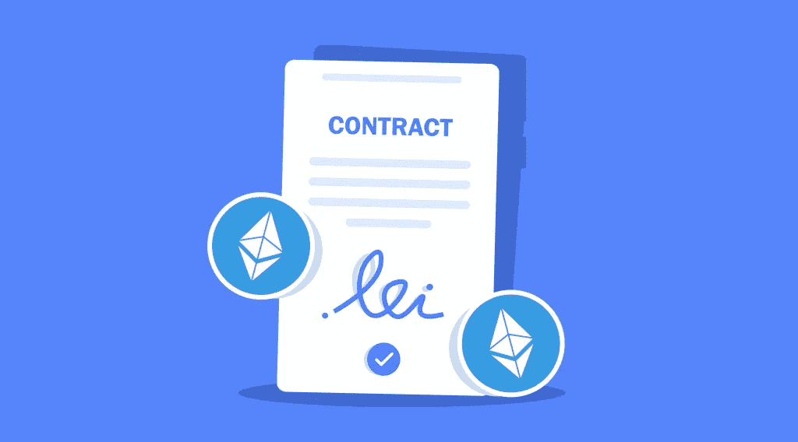

# 什么是智能合约，区块链为什么需要智能合约？

> 原文：<https://medium.com/coinmonks/what-are-smart-contracts-and-why-does-blockchain-need-them-409b39b3fbf3?source=collection_archive---------33----------------------->

不管怎样，合同规范着我们职业和个人生活的大部分方面，它们对现代社会的运转至关重要。就区块链而言，所谓的“智能合约”发挥着重要作用。它们有助于使交易更加安全，并以有组织的方式运作。但是它们是什么呢？

# 智能合同解释

简而言之，智能合约是许多使用区块链或分布式账本技术构建的平台和应用程序的关键组件。智能合约是用于自动交易的计算机程序或协议，存储在区块链上，并在满足特定条件时运行。换句话说，智能合同可以自动执行协议，这样所有参与者都可以尽快确定结果，而无需中介或时间延迟。

在智能合约中，买卖双方协议的内容被直接写入代码行。他们不需要任何行为或其他人的存在。它们本质上是执行合同条件的计算机化交易协议。所有类型的金融协议都可以使用智能合同进行编程，包括衍生品合同、托管协议、保险单和拍卖合同。一旦部署了智能合约并使其可操作，就不需要人工干预来执行交易。使用智能合约使交易可追踪、透明且不可逆转，这正是区块链所需要的，也是它的基础。

# 简要的历史总结

大约 20 年前，计算机科学家和密码学家 Nick Szabo 在华盛顿大学读研究生时首次提出了“智能合同”这个术语。在将智能合同与纸质合同进行比较时，Szabo 将这些协议称为“智能”。智能合同可能比纸质合同“更智能”，因为它们可以自动执行某些预编程的步骤，但它们不应被视为可以解析合同更主观要求的智能工具。

今天的智能合约起源于李嘉图合约，这是 Ian Grigg 和 Gary Howland 在 1996 年发表的一个概念，作为他们在李嘉图支付系统转移资产工作的一部分。

# 智能合同:优势

使用智能合约有多种优势。除其他优势外，智能合同还包括:

*   准确、快速、高效。当条件满足时，合同立即执行。因为智能合同是数字化和自动化的，所以不需要处理手写文档。你不需要花任何时间来纠正在填写文书过程中可能出现的错误。
*   值得信赖和透明。智能合同确保您的信息不会因为个人利益而被篡改，因为没有第三方参与。加密的事务日志仅在参与者之间交换。
*   安全。因为区块链的交易记录是加密的，所以极难破解。分布式分类账上的每个条目都与它之前和之后的条目相关联，黑客必须改变整个链才能改变单个记录。
*   自给自足。智能合约消除了中介机构处理交易的需要，以及随之而来的时间延迟和费用。智能合约的一个主要优势是消除了认证和促进交易的可信中间人。

# 智能合同:缺点

智能合同的缺点可以部分归因于区块链的性质，这些缺点可能是实质性的:

*   缺乏知识和人为错误。签约方可能不知道如何编写智能合同代码，因此，他们将不得不依赖于那些有技术专长的人。总有人为失误的风险。
*   缺乏法律帮助。解决双方争议的传统方式是寻求法律咨询。然而，当涉及到智能合同时，法律专家也帮不上什么忙。他们无法检查纯代码协议来确定是否存在违约行为。除此之外，区块链和智能合约还不是主流条款，法院可能会发现很难解决关于它们的纠纷。
*   难以修改或终止合同。即使所有的当事人都想修改他们的智能合同，他们也可能会因为区块链的不可改变性而失败。试图修改代码会增加交易成本。同样，当一方注意到可能损害其利益的错误时，他们不能终止智能合同。没有办法更改或改变区块链中的数据。
*   智能合约中的错误不容易修复。随着智能合约现在促进了数百万美元的交易，它们已经进入了欺诈者的雷达范围。由于合同设计中的缺陷，大多数智能合同都容易受到黑客攻击。

# 智能合同示例

让我们来看看智能合同如何在日常生活中帮助人们。让我们假设艾米在机场，但是她的航班延误了。她的保险公司 TravelSafe 利用[以太坊智能合约](https://stealthex.io/blog/list-of-the-best-smart-contract-platforms/)提供航班延误保险。他们补偿了 Amy 带来的不便:智能合同链接到记录航班状态的数据库，因为它是基于某些条款和条件创建的。保险单规定的条件是延迟两小时或更长时间。

根据代码，智能合同持有公司的资金，直到满足特定条件。智能合约被提交给 EMV(执行智能合约代码的运行时编译器)上的节点进行评估。网络上执行代码的所有节点必须得到相同的结果。该结果记录在分布式分类账中。因此，如果航班延误超过两个小时，智能合同会自动执行，Amy 会得到补偿。

除此之外，还有很多情况下可以使用智能合约。它们可以用于简单的经济交易，如将资金从 A 点转移到 B 点，以及共享经济中的智能访问管理。银行、保险、能源、电信、音乐业务、旅游、艺术、教育——所有这些都为智能合同提供了一系列机会。

# Cardano、以太坊和 Fantom 智能合约

通过智能合约，开发人员可以创建链上 dApps。它们使得区块链可编程，因此被加密项目所利用。

1.  例如，Cardano 智能合同可以用于投票、保险、政府项目、会计、记录保存等。
2.  所有智能合约的鼻祖以太坊为它们提供了许多用例。以太坊支持的智能合约可以用于支持多签名账户、现实世界协议甚至存储。与以太坊网络相关的智能合约可用于构建分散的应用程序，这些应用程序可以有多种实际应用。在以太坊上，契约是用它的 Solidity 编程语言写的，这是图灵完备的。这意味着智能合约的规则和限制被嵌入到网络的代码中，没有骗子可以操纵这些规则。理想情况下，这些限制将减少诈骗或隐藏的合同变更。
3.  另一个加密项目 Fantom DeFi platform 提供了一个基于 DAG 的生态系统。Fantom 与众不同之处在于，它提供了一种更安全、更兼容 EVM 的定制利益相关证明机制，使智能合约部署变得简单明了。DAG 架构使 Fantom 可扩展且快速，而与网络相关的智能合约可用于支持 DeFi 应用。

# 比特币智能合约

智能合约可以用在最著名的加密货币上。比特币智能合约可以规定，一旦一项令人满意的任务完成，就应该从一个人向另一个人发送 BTC 付款。智能合约扩展了比特币背后的基本理念，使之有可能安全地自动化和分散几乎任何类型的交易或交易，无论多么复杂。不仅仅是在中间没有银行这样的‘可信中介’的情况下，进行资金的收发。

许多项目都在用比特币智能合约更进一步。例如，互联网计算机区块链正计划推出与比特币网络的直接整合。与此同时，Sonic、InfinitySwap 和 ICPSwap 等下一代 DeFi 项目正准备利用升级。

# 结论

尽管智能合同在被广泛用于复杂商业关系中的生产用途之前还需要发展，但它们可以激励决定各方未来如何签订合同的结构。随着时间的推移，智能合同可能会成为组织不可或缺的一部分，用户将慢慢转向更加分散、透明和可审计的现实。这只是区块链可能不可避免地引发的一个巨大变化。

不要忘记，你可以用 StealthEX 购买加密货币和数字代币用于投资或任何其他目的，并享受我们通常向客户提供的低佣金率。

[StealthEX](https://stealthex.io/) 可以帮你购买一种或多种流行的加密货币。你可以私下做这件事，不需要注册服务。我们的加密收藏有超过 450 种不同的硬币，您可以立即和毫无问题地进行钱包到钱包的转账。

完成购买后，只需前往 [StealthEX](https://stealthex.io/) 并遵循以下简单步骤:

1.  选择要兑换的货币对和金额。例如，BTC 到瑞士联邦理工学院。
2.  按下“开始交换”按钮。
3.  提供要将您的加密传送到的收件人地址。
4.  处理交易。
5.  接收您的加密硬币。

在 [Medium](https://stealthex-io.medium.com/) 、 [Twitter](https://twitter.com/Stealthex_io) 、 [Telegram](https://t.me/StealthEX) 、 [YouTube](https://www.youtube.com/channel/UCeES_XBesX76ge7xf1meuSw) 和 [Reddit](https://www.reddit.com/user/Stealthex_io) 上关注我们，了解关于 [StealthEX.io](https://stealthex.io/) 和其他秘密世界的最新消息。

在购买任何密码之前，不要忘记做自己的研究。本文表达的观点和意见仅代表作者个人。

> 交易新手？试试[加密交易机器人](/coinmonks/crypto-trading-bot-c2ffce8acb2a)或者[复制交易](/coinmonks/top-10-crypto-copy-trading-platforms-for-beginners-d0c37c7d698c)