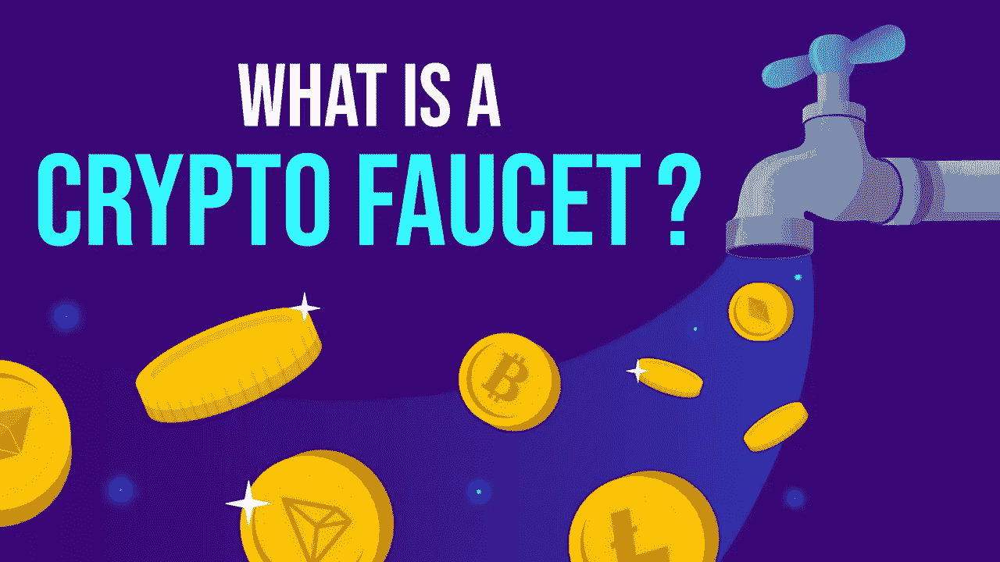
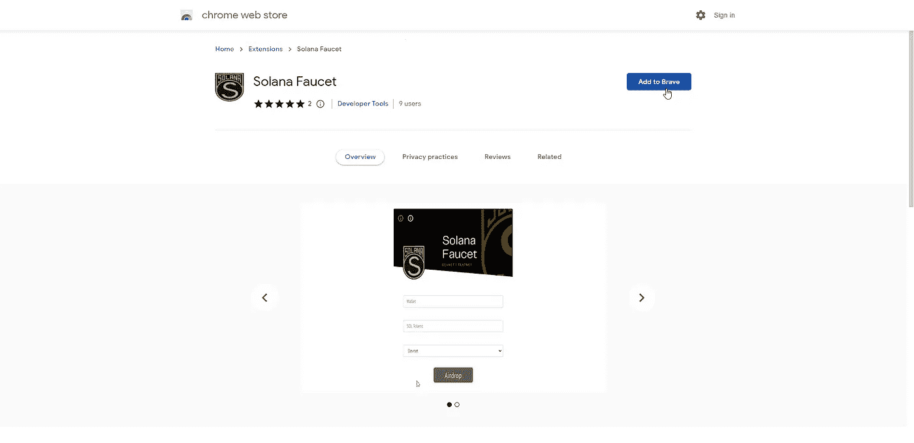
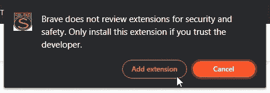
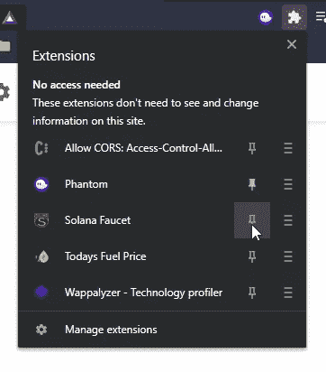
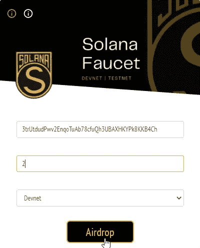
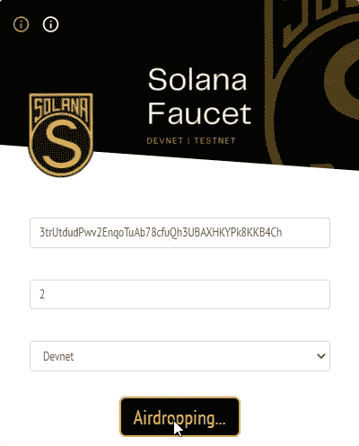
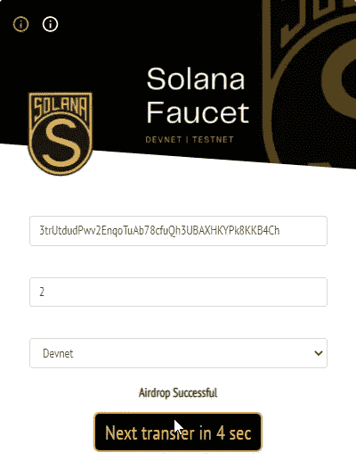
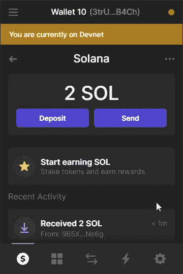
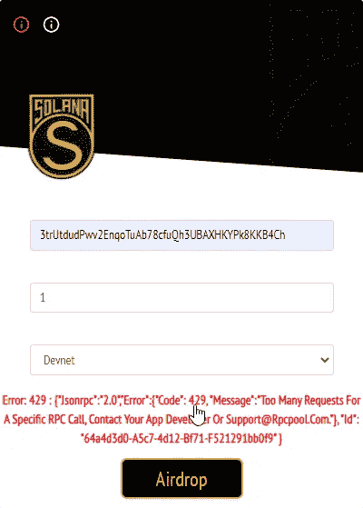

# 什么是索拉纳水龙头？

> 原文：<https://medium.com/coinmonks/what-are-solana-faucets-24f6025440d8?source=collection_archive---------26----------------------->

加密龙头是一个应用程序或网站，分发少量加密货币作为完成简单任务的奖励。他们被命名为“水龙头”，因为回报很小，就像从漏水的水龙头里滴下的小水滴一样

在索拉纳区块链，为了便于在 **Devnet** 和 **Testnet** 上开发，我们需要使用这些工具将 SOL 令牌放入我们的钱包，以便在**索拉纳区块链**上执行**交易**

目前在 **Solana Devnet** 上，我们可以每 10 秒向钱包传送 2 个 SOL

目前在 **Solana Testnet** 上，我们可以每 10 秒向钱包传输 1 个 SOL

**我们心目中的索拉纳水龙头？**

我们已经使用 **Angular framework** 和 **bootstrap** 开发了一个 Solana 水龙头 chrome 扩展来创建一个现代的交互 UI

我们已经使用 **Solana web3 库** airdrop 端点来制作工具的核心功能

**如何下载工具？**

 [## 索拉纳水龙头

### 这个扩展帮助索拉纳区块链开发者快速转移 sol 到 devnet 或 test net wallet！！

bit.ly](https://bit.ly/3zuq1yb) 

**如何使用工具？**

点击**“添加到 Chrome”**按钮

点击**“添加扩展”**按钮

点击**拼图图标**，然后点击图钉图标将扩展图钉到顶部

点击**扩展标志**

1.  输入您的 Devnet 或 Testnet 钱包的地址
2.  输入要转移的令牌数量，最多 2 个
3.  从下拉列表中选择网络
4.  点击空投按钮

在**成功空投后，将显示信息**

您可以在您的**钱包**中登记溶胶转移

有时**由于高流量，这种错误会显示**，你需要**重新打开索拉纳扩展，并再次尝试**来规避这种错误

**即将推出的项目？**

我们计划创建一个扩展来创建您自己的加密货币，用于开发者网络上的学习目的，并了解加密货币是如何制作和分发的，例如比特币、索拉纳等。

> 加入 Coinmonks [电报频道](https://t.me/coincodecap)和 [Youtube 频道](https://www.youtube.com/c/coinmonks/videos)了解加密交易和投资

# 另外，阅读

*   [加拿大最佳加密交易机器人](https://coincodecap.com/5-best-crypto-trading-bots-in-canada) | [Bybit vs 币安](https://coincodecap.com/bybit-binance-moonxbt)
*   [阿联酋 5 大最佳加密交易所](https://coincodecap.com/best-crypto-exchanges-in-uae) | [SimpleSwap 点评](https://coincodecap.com/simpleswap-review)
*   购买 Dogecoin 的 7 种最佳方式
*   [最佳期货交易信号](https://coincodecap.com/futures-trading-signals) | [流动性交易所评论](https://coincodecap.com/liquid-exchange-review)