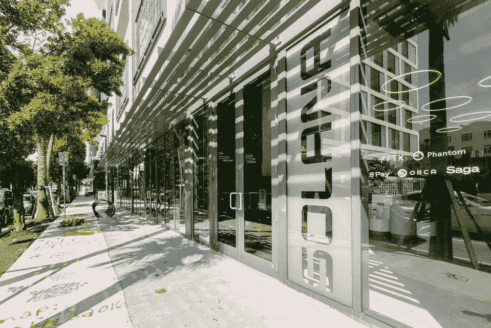

# 索拉纳(SOL)的下一步是什么？

> 原文：<https://medium.com/coinmonks/what-are-solanas-sol-next-steps-f1af246e850c?source=collection_archive---------31----------------------->

Photo by [GuerrillaBuzz Blockchain PR Agency](https://unsplash.com/@guerrillabuzz_blockchain_pr_agency?utm_source=medium&utm_medium=referral) on [Unsplash](https://unsplash.com?utm_source=medium&utm_medium=referral)

在 Solana 在里斯本举行的被称为“断点 2022”的整体生态系统聚会期间，受欢迎的区块链做出了许多重要声明，这些声明能够导致其大规模采用的增加。

索拉纳的计划包括推出智能手机、分散应用商店以及与谷歌云的合作。

索拉纳断点发生在 11 月 4 日至 7 日，作为参考，它**吸引了 13，000 人**到同时运行的四个场馆之一。

索拉纳联合创始人**拉杰·戈卡尔**以及索拉纳实验室联合创始人**阿纳托利·亚科文科**出席了此次活动。

# GeoNFTs

Solana Spaces 的首席执行官兼创始人 Vibhu Norby 透露，迈阿密的 Solana 商店接待了大量的游客，并补充道:

“现在任何人、任何地方都可以建立自己的索拉纳专卖店。”

尽管如此，Norby 还是发布了 GeoNFTs，这是在他们城市的某个区域突出显示标签的地理标记上发现的，并进一步解释道:

*“如果你有 GeoNFT，你可以用 1 换 1 的方式获得在该地区开设 Solana 专卖店的独家权利。”*

通过 GeoNFTs，Solana 旨在为希望参与其网络的企业提供支持。

# 智能手机

据报道，索拉纳的智能手机将于 2023 年初开始预购。

索拉纳的移动团队在宣布即将推出的智能手机时说:“它是为人们制造的。”。

Solana 手机的一个与众不同的特点在于它能够安全地存储加密钱包的私钥，并将具有很高的生产率。

# Solana dApp 商店

在为 Web3 做准备时，Solana 推出了 Solana 应用商店。会议期间，Solana 的一名代表强调了在 Web3 中创造良好用户体验的必要性。

为了支持这项事业，索拉纳的 dApp 商店承诺取消费用、收入和收费。此外，该公司证实，参与者的提交将于 2023 年 1 月开放。

# 谷歌云

虽然上述声明标志着索拉纳的一系列里程碑，但生态系统与谷歌云的合作显然抢了风头。

Google Cloud 将构建一个 Solana 验证器，它可以生成块来加入和验证网络。

谷歌云于 10 月 27 日首次公布的区块链节点引擎将于 2023 年出现在索拉纳链上。这种整合将允许用户在云中启动一个专用的 Solana 节点。

此外，谷歌云将索引 Solana 数据，并将其迁移到 big query——一个完全托管的无服务器数据仓库——使 Solana 开发者更容易访问历史数据。

*原载于 2022 年 11 月 8 日*[*【https://bitnewsbot.com】*](https://bitnewsbot.com/what-are-solanas-sol-next-steps/)*。*

> 交易新手？尝试[加密交易机器人](/coinmonks/crypto-trading-bot-c2ffce8acb2a)或[复制交易](/coinmonks/top-10-crypto-copy-trading-platforms-for-beginners-d0c37c7d698c)