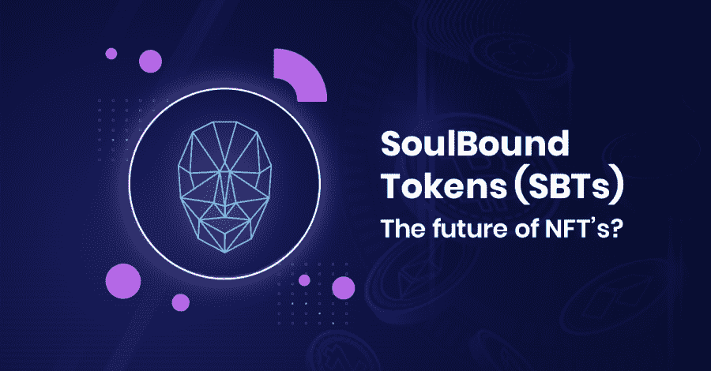

# 什么是绑定令牌？

> 原文：<https://medium.com/coinmonks/what-are-souldbound-tokens-f7304469efc4?source=collection_archive---------31----------------------->

非常好的密码阅读器，你可能很清楚，Web 3 是一个专注于资产编码而不是社会关系的系统。但是，有些经济活动是建立在不能转移的社会关系基础上的。在本文中，我们将讨论“灵魂绑定”令牌(SBT)，它代表承诺、凭证和从属关系，以及这些如何能够创建信任网络。

> NTF 有哪些不可转让的优势？

根据[的说法，未来围绕着这些代币..SBT 是 NFT，在您收到它们后不能转移。一旦你获得了 SBT，你会把它永远保存在灵魂钱包里。](https://twitter.com/VitalikButerin)

⚫ **这些代币的一些潜在应用如下:**

*➖* 确立出处
*➖* 通过声誉打开无担保借贷市场。
*➖* 启用分散密钥管理。
*➖* 用权利、许可和共享创造新市场。

⚫ **一些真实世界的用例可能是:**

➖例 1: 教育机构(如大学)可以以校本培训的形式授予学生学位。由于这些不能被转让或出售(像 NFT)，这将是一个伟大的反假冒使用案例。

*➖* **例 2:** 一家公司想招聘参加过某个会议的人。会议向与会者发放了 SBT 徽章，以便公司可以筛选经过验证的与会者候选人。由于 SBT 令牌不能出售，这将是另一个很好的真实用例。

*➖* **例 3:**NFT 市场目前给艺术家带来的一个问题是，他们可能面临假冒，实际上使用 NFT 的用户无法证明艺术品没有被盗窃或抄袭。艺术家们可以更进一步，发布一个存储在他们灵魂中的链接 SBT 来证明 NFT 的所有权。在这种情况下，SBT 将是一个很好的来源证明。

> **目前使用 SB 代币的项目**

*[**金翅雀:**](https://twitter.com/goldfinch_fi) 本协议提供小额担保贷款。借款人不是过度抵押，而是根据其他参与者的集体评估来显示信用。每个参与活动的人都必须通过“单一实体验证”。这是通过一个不可转让的 NFT 形式的 SBT 来实现的，表示它已经通过了 KYC 进程和/或美国投资者认证。*

**

**➖* [**人性证明**](https://twitter.com/proofofhumanity) **:** 人性证明是一个确保网络上每个人都是真实存在的人的系统。每个申请人必须有一个已经确认的身份证明。*

**

**➖**[**币安**](https://twitter.com/binance) **:** 币安创造了一种叫做 BAB 的新代币，可以用来作为经历过币安 KYC 程序的人的身份证明。BAB 可以通过参与币安链上的项目获得。**

****

**Web 3 可以帮助改变互联网，对整个社会产生更大的影响，而不仅仅是对金融系统。要做到这一点，我们需要创造在虚拟世界中表现人类及其关系的方法。否则，信任、合作和财产权等东西就会受到限制。**

**用 Vitalik Buterin 自己的话说，SBTs 提供的潜力似乎不仅值得我们为应对这些困难挑战付出代价，而且可能是确保我们生存所必需的。阿尔伯特·爱因斯坦在 1932 年的裁军会议上说，“人类的组织能力”无法跟上“技术进步”的步伐，这让“一个 3 岁的孩子手里拿着一把剃刀。”在一个他的观察似乎比以往任何时候都更加准确的世界里，学会规划编码社会性的未来(而不是写关于信任的文章)似乎是人类在这个星球上持续生活的必要课程。**

> **总之，Souldbound 令牌代表了现实世界中的一个优秀用例，无论是试图出售其作品的艺术家、提供贷款的金融机构还是教育机构，能够拥有防止冒名顶替的机制并发布人们声誉的可靠证据都是社会的一大进步。虽然这项技术是最近才出现的，而且正在开发中，但在我看来，它的潜力是巨大的。**

> **交易新手？试试[加密交易机器人](/coinmonks/crypto-trading-bot-c2ffce8acb2a)或者[复制交易](/coinmonks/top-10-crypto-copy-trading-platforms-for-beginners-d0c37c7d698c)**