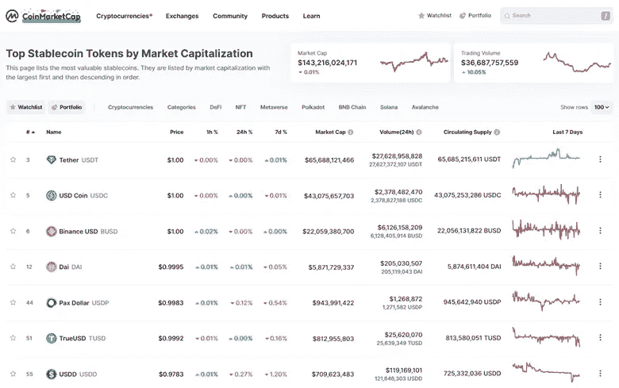

# 什么是 stablecoins？

> 原文：<https://medium.com/coinmonks/what-are-stablecoins-7737dc9c5f30?source=collection_archive---------27----------------------->

为什么重要？

What are stablecoins

稳定货币可能是最著名的加密货币类别，其价值与另一种货币、商品或金融工具挂钩，以保持价格稳定。Stablecoins 的创建有一个明确的目标，那就是“对抗”市场的波动性，这样人们就可以利用它来实现投资组合的多样化。这使得加密投资对大多数人来说更合适，风险更小。你可以交易任何加密货币，然后转换成任何稳定的货币，享受小额利润。

稳定的硬币在当前市场上是一种很好的交易媒介，比市场上的大多数硬币都有用。与保持价格稳定的稳定货币相比，市场上的大多数加密货币往往价格波动较大。

市场上主要有三类稳定的硬币:

**菲亚特抵押债券:**

法定抵押稳定货币通过与法定货币如美元或欧元挂钩来保持价格稳定。

**加密抵押稳定账户:**

加密抵押的稳定货币由任何其他加密货币支持。由于储备加密货币也可能具有高波动性，这种稳定的货币被过度抵押。

**算法稳定积分:**

其他类别之间的主要区别是保持稳定点数值稳定的策略。这是通过算法控制其供应来实现的，本质上是运行公式的计算机程序。

Top stablecoins 加入了我今天的市值。

> ***不是所有的稳定点都是稳定的。***

我怎么知道这个？

因为我经历了 UST 崩盘的大悲剧。2022 年 5 月 11 日，这枚硬币的交易价格是 0.30 美分。通常情况下，硬币的价格保持在 1.00 美元。TerraUSD (UST)与 Luna crypto 有关。崩溃是由其连接引起的，即 Terra 网络的算法稳定连接。在脱钩之前的几天里，价值超过 20 亿美元的 UST 被分拆(从当时生态系统中最大的锚协议中剔除)，数亿美元被迅速清算。

这就是为什么监管机构越来越关注密码监管，尤其是稳定密码。许多人在这种情况下可能永远失去了他们的钱，并且不能去任何实体寻求保护。他们的钱一去不复返了。

作为加密生态系统的一部分，我们需要稳定的密码来使交易更加安全，并通过它们保持稳定值的能力来对抗波动性。我的观点是，如果监管机构对该行业有良好的意愿，并且他们不会制定一个阻止人们使用稳定硬币的框架，而是扩大它的规模，那么他们非常欢迎加入并创建一个适当的监管框架。

> 交易新手？试试[加密交易机器人](/coinmonks/crypto-trading-bot-c2ffce8acb2a)或者[复制交易](/coinmonks/top-10-crypto-copy-trading-platforms-for-beginners-d0c37c7d698c)