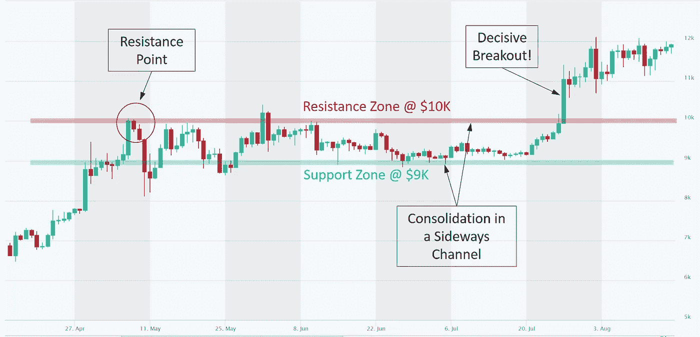

# 什么是支撑位和阻力位？

> 原文：<https://medium.com/coinmonks/what-are-support-and-resistance-levels-ebc057de7809?source=collection_archive---------32----------------------->

**支持和阻力是资产**技术分析中使用的关键概念，包括加密资产。

支撑位是一个价格水平，由于需求或购买兴趣的集中，下降趋势可以预期会暂停。随着加密资产价格的下降，对该资产的需求增加，从而形成了支持区。反之亦然。当价格上涨时，由于抛售兴趣，阻力区出现。

请注意下面的比特币图表(2020 年 4 月至 8 月)，价格一直在上涨，达到$10K(阻力点)并向下反转。这是上涨遭遇抛售阻力的水平。在这个水平上，卖家和买家一样强大，咄咄逼人，阻止了前进。当卖方(供给)变得比买方(需求)更强大时，价格会从最高点下跌(本例中为 10K)。

Source: altfins.com

当一个以上的阻力位以大致相同的价格出现时，一个阻力位就变成了一个阻力区。当然，价格很少上涨并停留在同一水平。

支撑点与阻力点相反，因为它是一个单独的槽。在这里，买家变得和卖家一样强大或咄咄逼人，并阻止价格下跌。

**支撑位和阻力位的概念假设，在未来，价格将停止在这些水平或区域**，它们代表了一个记忆中的价格心理障碍。

此外，一旦这些水平被突破，它们就会转换功能(之前的阻力变成支撑，反之亦然)，这是一个被称为[极性](https://altfins.com/knowledge-base/polarity-principle/)的重要概念。

# 为什么会出现支持和阻力？

你有没有买过一枚硬币，看着它贬值，然后希望卖出你买的钱？你有没有卖过一个硬币，卖了之后看着它涨，恨不得有机会再买？你并不孤单。人类有一些常见的反应，它们会通过制造支持和阻力而出现在价格图表上。(吉勒，1962)。

# 整数呢？

整数通常代表支撑位和阻力位。这是买卖通常增加的地方。注意，比特币的价格是$10K，$20K，…(见[博客文章，点击](https://altfins.com/bitcoin-analysis-approaches-50k-whats-next/))。寻找整数的倾向是人类心理的一部分。这也是为什么零售商使用 19.95 美元而不是 20 美元的价格的原因。人们潜意识里会联想到 19 岁而不是 20 岁。

# 如何寻找支撑和阻力？

找到这些关键级别可能很棘手。一般来说，支撑区域在前期价格低点附近形成，而阻力区域在前期价格高点附近形成。

一旦确定了支撑或阻力区域，这些价格水平可以作为潜在的进场点或出场点。这里有[如何交易突破和进场](https://altfins.com/how-to-trade-resistance-and-support-breakouts-and-resistance-approaches/)。价格突破阻力位意味着卖家在该价位已经满足，买家已经焦虑。参见上面比特币图表中的向上突破。

如果在刚刚被打破的区域上方存在另一个阻力区域，价格通常会交易到下一个更高的区域。因此，在一个上涨的市场中，一旦一个较低的阻力区被突破，一个阻力区就会成为一个价格目标。这个逻辑也适用于支持区域，反之亦然。

**我们的平台** [**自动识别**](https://platform.altfins.com/tpatterns) **一个支撑位或阻力位，在特定价位至少有三个接触点。**关键关卡最多可以有 10 个接触点。一个价格水平的接触点越多，这个价格水平就越重要。这是支撑和阻力理论的发展方向，但也符合逻辑。每当一个水平被测试或触及，但没有被打破，市场就确认它不准备低于这个价格。它发生得越频繁，似乎就越有可能再次发生。

# **支撑位和阻力位是怎么画出来的？**

要画一个支撑位和阻力位，简单地画一条水平线穿过每个重要的波谷(支撑位)或波峰(阻力位)。

这些线可以穿过棒线低点(支撑)或棒线高点(阻力)，或者使用棒线的收盘价(收盘价)，因为大多数投资者看收盘价。将这些线延伸到过去，看看早期的价格下跌是否停止在相同的价格水平。

价格水平停止之前的上涨或支撑之前的下跌的次数越多，未来的阻力或支撑就越强。

**结论**。支撑位和阻力位是交易者腰带上的重要工具。这是很多信号和交易发生的地方，它们往往是简单的交易设置，胜率很高。这些关键水平通常由行为因素(人类心理)建立，是买家(需求)和卖家(供应)之间互动的明确指标，最终决定了加密货币的价格。你可以在 [altFINS 平台](https://platform.altfins.com/)上找到[交易设置](https://platform.altfins.com/tpatterns)的支撑位和阻力位。

> 交易新手？试试[加密交易机器人](/coinmonks/crypto-trading-bot-c2ffce8acb2a)或者[复制交易](/coinmonks/top-10-crypto-copy-trading-platforms-for-beginners-d0c37c7d698c)