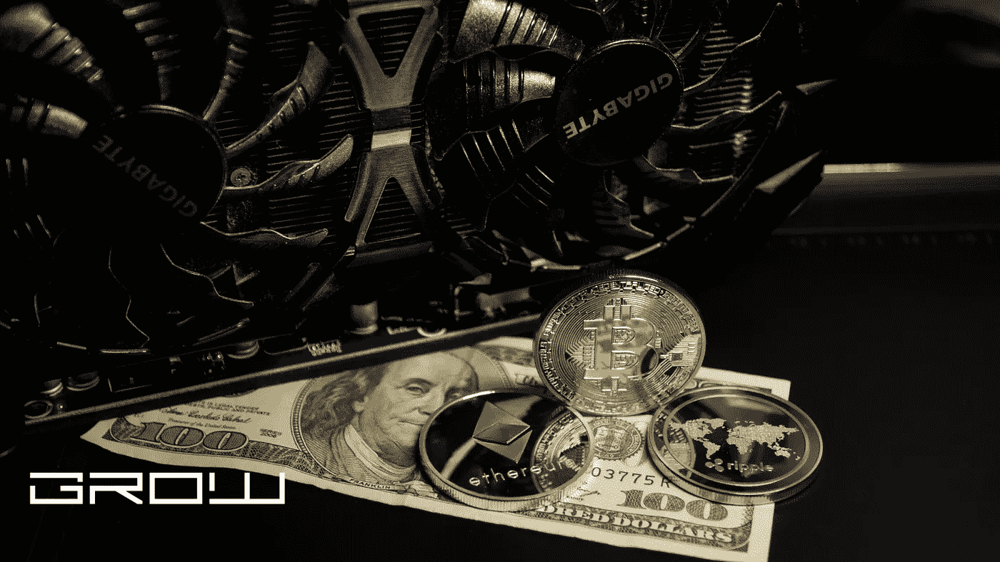

# 区块链在金融方面有什么好处

> 原文：<https://medium.com/coinmonks/what-are-the-benefits-of-blockchain-in-finance-c73efa1d90c5?source=collection_archive---------24----------------------->

benefits of blockchain in finance

如果你是一名投资者，想知道区块链将对金融业的未来做些什么，你并不孤单。当然，在这种技术是什么以及它是如何工作的方面存在如此多的混乱，很难预测任何事情。下面的文章将涵盖区块链对金融界最重要的好处，以及如果您正在寻找开始投资比特币或以太网等加密货币的方法，对该技术的简单介绍可以让您入门。

# 区块链在金融方面有什么好处？

关于区块链，我们必须了解的第一件事是，尽管它是一个新兴市场，但它已经对全球市场产生了巨大影响。在某些情况下，它已经被用来改善服务和提高金融交易的速度。许多专家表示，区块链将存在很长一段时间，它有可能通过提供新的可行的解决方案来打破传统的经济模式。

那么，区块链技术在金融领域有什么好处呢？下面的文章将概述你需要知道的关于这项技术的所有内容，以及它如何能立即开始让你的金融投资组合受益。

# 1.降低成本

区块链技术最有趣的好处之一是它消除了金融交易中的中间人。由于区块链是一个自动化的自给自足的系统，因此不需要第三方来验证交易并保护用户免受欺诈或诈骗者的侵害。区块链为任何人向世界任何地方汇款提供了一种安全的方式，而不会产生银行收取的过高费用或像西联汇款这样昂贵的服务。此外，发送加密货币比发送现金更加匿名，因为你可以使用比特币钱包/交易所，而无需提供任何个人信息。

# 2.新的投资机会

得益于比特币等加密货币的高度普及，许多人开始寻找新的方式投资这项技术。大多数人都转向云挖掘平台，如 Genesis Mining 或 Hashflare，这些平台为投资者提供了负担得起的方式来开始投资加密货币，并从投资中获利。尽管加密货币市场最近暴跌，但专家仍然对其未来持乐观态度，并表示加密货币再次上涨的可能性很大。

> 交易新手？试试[加密交易机器人](/coinmonks/crypto-trading-bot-c2ffce8acb2a)或者[复制交易](/coinmonks/top-10-crypto-copy-trading-platforms-for-beginners-d0c37c7d698c)

# 3.安全性

区块链是一种加密技术，使用数学算法存储信息，黑客几乎不可能侵入并窃取用户在交易所交易或使用比特币或以太等数字货币的任何信息。这是区块链的主要优势之一，使其成为投资者和加密货币用户的一个伟大工具。

此外，由于其作为加密技术的本质，区块链可以防止任何网络欺诈或数据损坏的威胁。

# 4.速度和效率

区块链技术提供的安全性反映在它处理交易的速度和效率上。大多数人倾向于使用金融服务，因为他们希望他们的钱尽快从一个地方转到另一个地方，而不必为每笔交易支付高额费用。幸运的是，区块链已经完全消除了现有的这些问题，并提供了一个优秀的解决方案，交易可以立即完成，交易中的任何一方几乎不需要任何成本。

# 5.透明度

这意味着，虽然大多数金融交易是在隐藏信息的银行进行的，但区块链技术使其完全透明，因为公共信息存储在账本上。这使得用户可以利用加密货币交易所提供的工具，准确地查看他们的金融投资组合，并跟踪他们的交易。用户还可以实时查看他们的投资组合，并知道他们每天或每周赚多少钱。

# 6.可实现的区块链项目

有这么多不同的加密货币存在，在这一点上，几乎不可能在区块链找到一个无人认领的区块。尽管如此，一些用户希望进入区块链科技，但如果没有大笔初始成本，他们没有投资该市场的手段。幸运的是，有许多区块链项目，参与者可以为这些加密货币的开发做出贡献，并以类似于首次公开募股的方式开始从中获利。其中一些项目，如 Storj，甚至提供了一个本地令牌，可用于交易或支付其平台上的服务。

# 7.大型投资

如果你正在寻找大型投资，也有很多初始硬币发行(ico ),允许用户投资这些区块链项目，并以股息支付或硬币增值的形式获得投资回报。此外，许多 ico 为早期投资者提供与投资期限相关的巨额奖金。这些奖励代币可以在以后出售获利，因为它们通常被认为是优秀的长期投资，因为它们在市场上仍然具有潜在价值。

# 8.提高透明度

区块链技术的另一个有趣的好处是，它提供了数据的透明度，使任何类型的腐败都不可能发生。这是该技术的一个关键要素，因为它是使用安全算法构建的，每十分钟更新一次区块链上的块。因此，每个区块都包含所有先前区块的信息，使得黑客无法窃取用户或其金融投资组合的任何信息。

# 9.更快的交易

除了比传统方法更高效、更快速、更便宜之外，区块链技术还允许用户在几分钟内完成安全交易，而不是像银行转账那样需要几天时间。这对于个人用户以及公司和企业来说都是一个巨大的好处。

# 10.不需要第三方

如上所述，区块链技术可用于向世界任何地方汇款，而无需支付任何费用，也无需使用西联汇款或速汇金等昂贵而缓慢的服务。这不仅能帮你省钱，还能让你实时查看你的金融投资组合，准确知道你每天或每周赚了多少钱。这使得用户可以相对容易地密切监控他们的利润，从而根据《区块链纪事报》提供的可靠信息做出更好的投资决策。

# 11.长期投资

区块链技术也非常适合长期投资，因为它自 2010 年以来一直存在，并已成为最受欢迎的汇款替代方法之一。尽管比特币等加密货币的价格最近大幅下跌，但专家们仍然对其未来持乐观态度，因为它会随着时间的推移适应和改善。

# 12.出色的贬值保护

因为区块链技术专注于安全性，所以很难逃脱黑客攻击或数据损坏。这是该技术的另一个巨大好处，因为它保护用户免受信息欺诈和破坏。大多数每天使用区块链技术的人都这样做，因为他们想避免支付高额费用和完全隐藏的费用。

# 13.出色的安全交易媒介

区块链技术是一种安全的系统，可以轻松地在长期投资或交易中使用比特币或以太坊等数字货币，而不需要任何第三方支持，如银行或经纪人，他们经常对使用他们的服务收取高额费用。因此，用户可以在世界任何地方汇款，并每天跟踪他们的财务状况。

# 14.一个绝佳的激励机会

加密货币市场提供了一个绝佳的激励机会，因为用户可以通过参与各种公司提供的区块链项目，以及简单地持有比特币或以太坊等长期硬币来赚取大量金钱，因为它提供了大量的安全性，而不必担心市场崩溃。

# 15.没有第三方干涉

区块链的工作方式是，所有交易都存储在一个共享的分类账中，以防止它们被以任何方式更改或操纵。因此，用户可以保持自己的财务隐私，并从这项技术中受益，而不必担心第三方的干扰。

# 16.传统方法的绝佳替代方案

使用区块链技术的方法对用户有很多好处，因为它允许他们在几分钟内使用比特币或以太坊等数字货币兑换货币。对于那些想投资但初始成本不高的个人来说，这是一个巨大的优势。此外，数字货币交易允许投资者从这些硬币的增值中获利，因为它们提供了很高的安全性和透明度，使用户更容易在任何给定时刻监控他们的金融投资组合，而不会产生任何费用或成本。

# 17.保持交易私密的良好记录

区块链技术允许用户以加密货币进行交易，并实时查看他们的金融投资组合。这为个人提供了一个保持其财务私密的完美平台，并提供了一个安全、无欺诈或操纵的交易记录。

# 18.投资未来的绝佳机会

今天使用区块链技术的最有趣的好处之一是，它允许用户通过购买一种资产或硬币来投资未来，这种资产或硬币会随着时间的推移而增值。这使得之前没有加密货币经验或知识的用户可以进行投资，而不必担心任何类型的欺诈或腐败，这些年来，传统方法一直受到欺诈或腐败的困扰。

# 19.快速换钱的好方法

区块链技术提供了一种伟大的方式来交换金钱，同时随着时间的推移增加其价值。这为用户提供了一个绝佳的投资机会，并在快速增值的硬币上赚取大量金钱。

# 20.监控投资增长的绝佳方式

区块链技术的最大好处之一是，它允许用户每天监控他们的金融投资组合，因为交易每十分钟被验证和更新一次。因此，用户可以在任何给定的时间点准确地看到他们有多少钱，并做出相应的调整。

# 21.监控投资增长的绝佳方式

区块链技术的最大好处之一是，它允许用户每天监控他们的金融投资组合，因为交易每十分钟被验证和更新一次。因此，用户可以在任何给定的时间点准确地看到他们有多少钱，并做出相应的调整。

# 22.客户服务解决方案的出色扩展

区块链技术允许客户通过区块链的安全分布式账本“账本”提供关于他们与公司或服务提供商的体验的即时反馈这为公司提供了一种廉价、高效且安全的方法，以向客户提供更多关于产品或服务的信息，并为他们提供更具创新性的方式来提供客户支持。

# 23.通往未来的绝佳方式

使用区块链技术的最有趣的好处之一是，它允许用户进入未来，作为一种保持财务隐私的方式，因为它提供了很多安全性和透明度。

# 24.投资未来的绝佳方式

使用区块链技术的最有趣的好处之一是，它允许用户进入未来，作为一种保持财务隐私的方式，因为它提供了很多安全性和透明度。

# 25.保护身份和货币的绝佳方式

区块链技术作为保护用户身份和货币的一种方式越来越受欢迎。这使得用户可以安全可靠地存储他们的 id 和钱包，而不必担心第三方的干扰。

# 26.提供嵌入式安全性的绝佳方式

随着区块链技术越来越受欢迎，越来越多的公司将它集成到他们的服务中，以提供嵌入式安全性，保护用户免受黑客和其他类型的黑客攻击，这就是为什么许多公司将它作为为客户提供安全性的最佳方式。

# 27.一种极好的换钱方式

区块链技术也为个人提供了一种出色的货币兑换方式，允许他们将钱存储在安全可靠的数字钱包中。此外，用户可以使用加密货币进行购买或转移资金，而不必担心第三方的干扰。

# 28.提供安全银行解决方案的绝佳方式

区块链技术的另一大好处是，它允许银行通过使用比特币、以太坊或其他加密货币来提供创新服务和更好的储蓄机会。这为用户提供了一个安全可靠的银行解决方案的大好机会。

# 29.创造独特公司标志的绝佳方式

区块链技术还提供了创建独特公司标志的最佳方式，因为它要求用户创建一个可以安全存储在区块链账本上的签名。

# 30.提供点对点交易解决方案的绝佳方式

区块链技术的另一个巨大优势是，它提供了点对点交易解决方案，允许用户直接相互交易以换取加密货币，而不必处理第三方干扰或腐败。这为交易提供了巨大的机会，使其成为许多国际市场的优秀工具。

# 31.提供安全而廉价的支付解决方案的绝佳方式

通过区块链技术，企业和消费者可以通过安全和廉价的支付解决方案进行交易，而无需银行。这使得企业可以提供创新的支付方式，而不必担心任何形式的腐败或欺诈。

# 32.提供安全融资解决方案的绝佳方式

区块链技术的另一个巨大优势是，它允许用户提供安全的融资解决方案，用户可以在无需担心第三方干涉或腐败的情况下进行购买。这使得企业能够安全可靠地提供创新的融资解决方案。

# 33.提高透明度的绝佳方式

区块链技术还提供了一种很好的方式，可以在支付时提供更多的透明度，鼓励人们进行道德购买，或者只是确保资金用于预期目的。这使得它成为希望确保客户资金安全无虞的企业的绝佳工具。

# 34.提供廉价快捷的国际支付的绝佳方式

区块链技术的另一个好处是，它提供了廉价和快速的国际支付，这可以在点对点的基础上进行，而不需要像银行或其他金融机构这样的中介。这使得企业能够廉价而安全地提供国际支付。

# 35.提供不可破解解决方案的绝佳方式

区块链技术的另一个巨大优势是，它在支付时提供了不可破解的解决方案，鼓励人们进行道德购买，或者只是确保资金用于预期目的。这使得它成为希望确保客户资金安全无虞的企业的绝佳工具。

# 36.提供安全存储解决方案的绝佳方式

区块链技术的另一个好处是，它为那些希望安全可靠地存储他们的文档或其他重要文件而不必支付与银行或其他金融机构相关的高额费用的人提供了一个安全的存储解决方案。这使得它成为企业防止欺诈和腐败的绝佳工具。

# 37.降低消耗的绝佳方法

区块链技术的另一个巨大优势是，它允许人们通过加密货币购物来减少消费，与信用卡或现金等更传统的方法相比，加密货币可能相当昂贵。这使得它成为希望鼓励健康生活方式和降低成本的企业的一个极好的工具。

# 38.消除对中间商需求的绝佳方式

使用区块链技术的最有趣的好处之一是，它通过简单地鼓励人们直接相互交易来交换金钱或其他有价值的产品，从而消除了对中间人的需要。这使得减少欺诈和腐败成为可能，这也是当今世界各地的企业转向区块链技术的主要原因之一。

# 39.为公司提供经济高效解决方案的绝佳方式

区块链技术的另一个好处是，它为需要改善服务的公司提供了一个经济高效的解决方案，降低了他们的成本，并通过更快、更安全的支付方式为客户提供了更好的服务。这使得它成为希望在降低成本的同时提供更好服务的企业的绝佳工具。

# 40.提供更快捷国际转账的绝佳方式

区块链技术的另一大好处是，它使企业能够廉价而安全地进行快速的国际转账。这使得它成为许多国际市场的优秀工具，在这些市场中，支付速度是必须的。

# 41.为世界上的穷人提供更简单的解决方案的绝佳方式

区块链技术的另一个巨大好处是，它为世界上的穷人提供了一个更简单的解决方案，使他们能够以合理的成本安全地汇款。这使得银行或其他金融机构能够为这部分人群提供创新的解决方案和服务，帮助他们实现财务目标，让生活变得更加轻松。

# 42.使用区块链技术支持和发展新创业公司的绝佳方式

区块链技术的另一个巨大好处是，它可以用来支持和发展新的创业公司，这使得区块链技术在支持经济方面发挥了重要作用。这使得它成为当今许多企业的绝佳选择，尤其是那些想要投资新创业公司并确保获得公平利润份额的企业。

# 43.降低交易成本的绝佳方式

使用区块链技术的主要好处之一是它降低了交易成本，这有助于企业提供更好的服务，同时也使消费者能够进行道德购买。这使得它成为所有经济部门的优秀工具，也是大多数投资者的强大投资机会。

# 44.缩短结算时间的绝佳方式

区块链技术的另一个巨大优势是，它缩短了结算时间，使交易更容易、更快、更便宜。这使得它成为企业改善服务和为客户提供更好服务的绝佳方式。

# 45.提高效率的绝佳方法

区块链技术的另一个好处是，它全面提高了效率，并帮助企业创造一个更具竞争力的环境，比传统支付方式具有更高的安全性和透明度。这使得它成为一个优秀的工具，可以提高任何企业的效率，当他们想提供创新的解决方案，同时降低成本。

# 46.提高数据安全性的绝佳方式

区块链技术的最大好处之一是它提高了数据安全性。它通过提供所有事务的不可变记录来做到这一点，该记录显示谁拥有哪些信息。这使它成为希望保护其信息的公司的强大工具，也是希望确保做出最佳投资的投资者的强大投资机会。

# 47.消除中介需求的绝佳方式

区块链技术的另一个巨大优势是，它消除了对中介的需求，从而降低了运营成本，提高了企业所有部门的效率，包括制造、供应链管理等。这使得它成为那些希望改善运营同时降低成本的公司的绝佳工具。

# 48.防止身份盗窃的绝佳方法

区块链技术的另一个好处是，它可以防止身份盗窃和其他形式的欺诈，这使得交易更加安全，消费者在购买时更有信心。这使得它成为那些希望在提供更好服务的同时保护消费者的企业的绝佳工具。

# 49.提高客户忠诚度的绝佳方法

使用区块链技术最有趣的好处之一是，它允许人们通过购买所需产品或通过加密货币进行其他有价值的购买来获得奖励，从而提高客户忠诚度。这使得它成为提高客户忠诚度的绝佳方式，这也是当今许多企业所追求的。

# 50.利用区块链技术进行医疗保健的绝佳方式

更实惠、更容易获得使用区块链技术的最有趣的好处之一是，它提供了一个优秀的解决方案，让世界上最贫穷和最弱势的人群更实惠、更容易获得医疗保健。这使得它成为银行或其他金融机构的优秀工具，这些机构希望在降低成本的同时提供创新的解决方案，从而帮助他们为有需要的社区服务。

# 51.利用区块链技术改善食品供应链管理的绝佳方式

使用区块链技术的最有趣的好处之一是，它可以改善食品供应链管理，这使其成为希望改善其运营的企业的绝佳解决方案。这使得它成为公司的一个极好的工具，这些公司希望确保他们有一个循序渐进的过程，为他们的业务的最重要的方面提供高质量的产品。

# 52.利用区块链技术改善旅游业的绝佳方式

使用区块链技术的最有趣的好处之一是它可以改善旅游业，这使它成为任何寻求新客户并为他们提供独特旅游体验的企业的绝佳工具。这对于寻求更多客户的企业来说是一个绝佳的投资机会，同时也让它们能够改善经营方式。

# 53.在教育中使用区块链技术的绝佳方式

使用区块链技术的一个最有趣的好处是，它可以用来提高教育水平和增加学生的成绩。这使得它成为致力于帮助人们学习和提高知识水平的企业的优秀工具，可以帮助他们找到新的市场，并随着时间的推移获得更好的利润。

# 54.使用区块链技术创造金融的绝佳方式

包容性使用区块链技术的最有趣的好处之一是，它为在发展中国家建立金融包容性提供了一个极好的机会。这使得它成为银行或其他金融机构改善运营、为潜在客户创造更多机会的绝佳工具。

# 55.使用区块链技术改善电子商务的绝佳方式

使用区块链技术的最有趣的好处之一是，它为增加全球电子商务活动提供了一个优秀的解决方案，这使它成为任何希望扩大市场份额和为客户提供更多服务同时随着时间的推移提高利润的企业的优秀工具。

# 56.利用区块链技术提升旅游业的绝佳方式

使用区块链技术的最有趣的好处之一是它可以促进旅游业，这使它成为任何寻求扩大市场份额和为客户提供独特服务的企业的优秀工具。这使得它成为改善世界任何地区旅游业的一个极好的方法，尤其是对那些在经济上挣扎的地区。

# 57.使用区块链技术提供隐私的绝佳方式

使用区块链技术的最有趣的好处之一是它提供了隐私，这使它成为希望拥有自己交易和其他业务操作的私人记录的企业的一个极好的工具。对于那些想保护自己的信息不被公众发现的人来说，这是一个绝佳的投资机会。

# 58.使用区块链技术作为数字货币交换工具的绝佳方式

使用区块链技术的最有趣的好处之一是，它是一种优秀的数字货币交易工具，这使其成为买卖各种数字货币的优秀方式，可以提高对这些类型交易的整体兴趣。对于那些有兴趣参与市场并从该技术提供的各种机会中获利的人来说，这是一个极好的投资机会。

# 59.在云存储中使用区块链技术的绝佳方式

使用区块链技术最有趣的一个好处是，它为想要使用云存储的企业提供了一个极好的选择。对于那些希望让业务更加数字化、并随着时间的推移提高利润率的公司来说，这是一个绝佳的投资机会。

# 60.使用区块链技术提供更健康

生活使用区块链技术的一个最有趣的好处是，它可以用来提供更健康的生活，这使它成为一个优秀的工具，教育人们如何吃得更健康，过上更好的生活，有更好的营养，体育活动和其他健康的习惯。