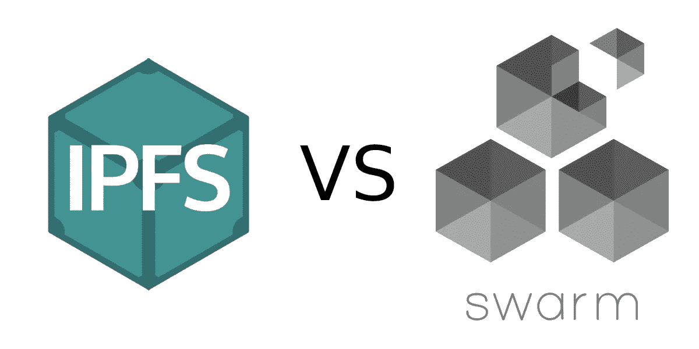

# IPFS 和以太坊群有什么区别？

> 原文：<https://medium.com/coinmonks/what-are-the-differences-between-ipfs-and-ethereum-swarm-c0e11f9a928b?source=collection_archive---------3----------------------->

在区块链上存储数据非常昂贵，因此如果您需要以“区块链风格”(不可变、无权限、分布式的方式)在其上存储大量数据，您必须使用外部存储解决方案。最常见的选择是使用 [IPFS](https://ipfs.tech/) ，但市场上还有其他一些玩家。其中之一是[以太坊群](https://www.ethswarm.org/)。在本文中，我将向您介绍 Swarm 和 IPFSs 之间的异同，以帮助您为您的下一个项目选择正确的存储解决方案。

IPFS(星际文件系统的首字母缩写)由 Protocol Labs 于 2014 年创建。它是一种分布式文件系统协议，使用内容寻址来唯一标识全局命名空间中的每个文件。IPFS 没有真正的激励系统，这就是为什么 Protocol Labs 在 2017 年制造了 [FileCoin](https://filecoin.io/) ，这是它自己的以存储为中心的区块链。

以太坊群的想法来自于以太坊的创始人之一加文·伍德(Gavin Wood)。2015 年，维克多·特伦和丹尼尔·纳吉接管了基金会 Geth 团队的项目。在一次成功的 ICO 之后，他们开始了自己的旅程，成为以太坊基金会支持的自主项目。如今(2022 年)Swarm 或多或少功能齐全，并且正在积极开发中。

这两个系统都提供了一个分布式的、不可变的和内容可寻址的系统，具有自己的激励系统和加密货币，并且都基于 [libp2p](https://hackernoon.com/writing-decentralized-applications-in-javascript-libp2p-basics) 。在接下来的内容中，我将对这两个系统进行逐步的比较。

## 存储逻辑

**IPFS** 基本上是一个存储提供商社区，其中的节点发布其内容哈希所引用的内容。散列的存储节点列表存储在一个 [DHT](https://curriculum.pl-launchpad.io/curriculum/libp2p/dht/) 中。如果您想要检索内容，第一步您必须通过内容散列在 DHT 中找到对等列表。在第二步中，必须将[对等体 id](https://docs.ipfs.tech/concepts/libp2p/) 转换为 IP 地址，在第三步中，您可以从 IP 地址上的给定对等体下载内容。

**以太坊群**有一个不同的逻辑，因为它将内容本身存储在 DHT 中。他们把这个系统叫做 DISC(块的分布式不可变存储)，整个系统就是为了让这个 DHT 高效。例如，当一个节点选择其他节点进行连接时，它为每一个邻近顺序(即，距离它自己的地址的数量级距离)选择对等体。由于 Kademlia 的连接性，在这个系统中找到一个块真的很快。当一个节点想要检索一个块时，它会询问它的对等节点。如果一个对等点有内容，它就返回，如果没有，它就请求它的对等点，等等。内容总是存储在距离 Kademlia 很近的节点上，由于 Kademlia 的连通性，总是可以找到对数长度的路径。当 storer 节点收到检索请求时，它将内容返回给发出请求的节点，发出请求的节点再将内容转发给发出请求的节点，依此类推。直到它到达请求的来源。Swarm 将这种方法称为转发 Kademlia，它提供匿名性。节点只知道内容的请求对等点，但是没有人知道谁是请求或内容的来源。这与 [Tor 网络](https://www.torproject.org/)匿名化请求的做法类似。但匿名只是转发 Kademlia 的一个好处。它也有助于内容的分发，但我将在以后写这一点。

> 从顶级交易者那里复制交易机器人。免费试用。

## 可变内容

如果你想在 **IPFS** 上存储可变内容(比如一个频繁变化的网页)，你可以使用 [IPNS](https://docs.ipfs.tech/concepts/ipns/) 。在 IPNS 上，可变内容的地址是一个公钥，底层不可变内容的地址由它的私钥部分签名。公钥- >签名的内容分配在分布式哈希表中公布。如果内容发生变化，内容所有者会对新的内容哈希进行签名，并将其发布为公钥，这样检索器就可以从中刷新内容分配。

在**以太坊群**上，有两种类型的组块。一个是“通常的”内容寻址块，另一个是单一所有者块。单一所有者块的地址是所有者和唯一 ID 的散列。这些单一所有者的块也是不可变的，但是您可以从主题名称和序列号创建 ID。当您更改内容时，您只需增加序列号并发布一个新的块。检索器可以轮询系统，如果有序列号更高的新块可用，那么它们可以刷新其中的内容。Swarm 称这些为序列号结构饲料。

## 激励系统

如果你想在 **IPFS** 上存储内容，你有更多的选择。你可以简单地选择一个像 Infura 或 Pinata 这样的集中提供商，上传你的内容，并支付存储费，使你的内容在 IPFS 上可用，或者你可以简单地在你的机器上运行一个 IPFS 节点，然后自己发布它。

另一种方法是使用 FileCoin，这是 IPFS 的“官方”区块链(也是由开发 IPFS 的 Protocol Labs 开发的)。FileCoin 基本上是一个存储提供商的市场，你可以在这里签订存储内容的合同。FileCoin 网络的机制保护您的内容安全，并惩罚不保存或不提供您的内容的签约提供商。如果您检索内容，并且达到数据传输阈值，您必须付费。

**以太坊群**使用自己的支付系统，而不是区块链，这有点类似于支付渠道，如 L [照明网络](https://en.wikipedia.org/wiki/Lightning_Network)，但有一点点不同。当一个节点向另一个节点付款时，它用支票支付。这些支票类似于真实世界的支票，可以用来从节点的支票簿合同中提取资金的签名文档。

在 Swarm 上，数据传输是要收费的。如果一个节点向它的对等节点发送数据，那么会收取少量费用。每个对等连接都有一个余额，如果这个余额达到一个极限，节点就给对方一张支票。一切都失控了。只有兑现支票需要区块链行动。

如果你想检索内容，你必须向给你内容的同行付费。如果它有内容，它可以保留全部费用，但如果没有，它必须为提供内容的对等方付费。这种逻辑激励节点在本地存储流行内容，因此 Swarm 充当自适应 CDN。

在 Swarm 网络上，没有单独的提供者。内容总是存储在与散列的 Kademlia 距离最小的节点上(Swarm 称这些节点为邻域)。保持分布式哈希表的有效可搜索性是 Swarm 的一个基本特性。您可以在任何节点上发布内容，这将把它推送到最近的对等点，这将把它推送到最佳存储位置。该方法与内容检索非常相似，但方向相反。如果你想在网络上存储你的内容，你必须贴上邮票。邮票就像一张支票，只有当你能证明你保留了内容时才能兑现。

## 以太坊互操作性

以太坊互通是以太坊群真正强大的领域。作为以太坊的“官方”存储，一切都是“以太坊兼容”。

例如，节点地址是从所有者的以太坊地址导出的。因此，我们可以使用块转发系统向给定的节点发送加密的消息。Swarm 称这种技术为 PSS，它是以太坊消息协议 Whisper 的继承者。

单个所有者 chunks 的所有者也是以太坊地址，签名方法与以太坊使用的相同，因此您可以简单地在智能合同上检查它，或者使用它在提要中分配元数据。当我构建 [MyETHMeta](https://myethmeta.org/) (一个类似 Gravatar 的以太坊账户元数据系统)时，我必须使用一个智能契约来存储以太坊地址- >元数据 URL 映射。有了 Swarm，不需要区块链就可以通过简单的饲料来完成。

群体块是 [Merkle 树](https://en.wikipedia.org/wiki/Merkle_tree)。这意味着块地址是内容的 Merkle 根。如果您在智能合约中检查它们，这将非常有用，因为您可以轻松地为内容创建包含证明。例如，如果您想要存储一个长的(> 1000 个元素)白名单，您可以将它存储在 Swarm 上而不是区块链上，并通过使用 Merkle 证明的智能合约来检查成员资格。或者您可以在 Swarm 上创建完整的汇总，其中状态根也是整个状态的内容地址。

## 结论

如您所见，这两种存储解决方案各有优缺点。

**IPFS** 是更老的系统(从某种意义上来说)。它有许多使用案例，记录良好，应用广泛。有许多集中的 IPFS 提供商，你也可以使用 FileCoin 来存储你的内容。

以太坊群相对较新，还在开发中，但它有一些非常令人兴奋的特性。匿名的内容存储和检索、高效的 DHT 管理和强大的以太坊兼容性是该解决方案的独特之处。

> 交易新手？尝试[加密交易机器人](/coinmonks/crypto-trading-bot-c2ffce8acb2a)或[复制交易](/coinmonks/top-10-crypto-copy-trading-platforms-for-beginners-d0c37c7d698c)
> 
> 多样化的密码持有，了解[币安替代品](https://coincodecap.com/binance-alternatives)
> 
> 加入 Coinmonks [电报频道](https://t.me/coincodecap)和 [Youtube 频道](https://www.youtube.com/c/coinmonks/videos)获取每日[加密新闻](http://coincodecap.com/)

# 另外，阅读

*   [复制交易](/coinmonks/top-10-crypto-copy-trading-platforms-for-beginners-d0c37c7d698c) | [加密税务软件](/coinmonks/crypto-tax-software-ed4b4810e338)
*   [网格交易](https://coincodecap.com/grid-trading) | [加密硬件钱包](/coinmonks/the-best-cryptocurrency-hardware-wallets-of-2020-e28b1c124069)
*   [密码电报信号](/coinmonks/top-3-telegram-channels-for-crypto-traders-in-2021-8385f4411ff4) | [密码交易机器人](/coinmonks/crypto-trading-bot-c2ffce8acb2a)
*   [最佳加密交易所](/coinmonks/crypto-exchange-dd2f9d6f3769) | [印度最佳加密交易所](/coinmonks/bitcoin-exchange-in-india-7f1fe79715c9)
*   [开发人员的最佳加密 API](/coinmonks/best-crypto-apis-for-developers-5efe3a597a9f)
*   最佳[密码借贷平台](/coinmonks/top-5-crypto-lending-platforms-in-2020-that-you-need-to-know-a1b675cec3fa)
*   [免费加密信号](/coinmonks/free-crypto-signals-48b25e61a8da) | [加密交易机器人](/coinmonks/crypto-trading-bot-c2ffce8acb2a)
*   杠杆代币的终极指南

> 加入 Coinmonks [电报频道](https://t.me/coincodecap)和 [Youtube 频道](https://www.youtube.com/c/coinmonks/videos)了解加密交易和投资

# 另外，阅读

*   [AscendEx Staking](https://coincodecap.com/ascendex-staking)|[Bot Ocean Review](https://coincodecap.com/bot-ocean-review)|[最佳比特币钱包](https://coincodecap.com/bitcoin-wallets-india)
*   [霍比审核](https://coincodecap.com/huobi-review) | [OKEx 保证金交易](https://coincodecap.com/okex-margin-trading) | [期货交易](https://coincodecap.com/futures-trading)
*   [电网交易机器人](https://coincodecap.com/grid-trading) | [Cryptohopper 审核](/coinmonks/cryptohopper-review-a388ff5bae88) | [Bexplus 审核](https://coincodecap.com/bexplus-review)
*   [7 个最佳零费用加密交易平台](https://coincodecap.com/zero-fee-crypto-exchanges)
*   [氹欞侊贸易评论](https://coincodecap.com/anny-trade-review) | [霍比融资融券交易](/coinmonks/huobi-margin-trading-b3b06cdc1519)