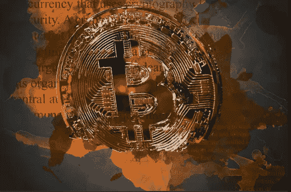

# 加密货币有哪些缺点？

> 原文：<https://medium.com/coinmonks/what-are-the-disadvantages-of-cryptocurrency-368570402792?source=collection_archive---------9----------------------->

任何人都知道加密货币的好处，但这并不能掩盖其弊端。

在本文中，我们检查了加密货币的缺点，并在彻底检查文献后确定了五个主要缺陷。让我们马上开始。

**1。网络安全问题**

加密货币可能没有依赖集中式中间人的风险，但这并不意味着它们完全安全。如果你拥有加密货币，你有可能会丢失提供你访问一切的私钥。此外，还有各种不同的获取控制权的恶意方法，如黑客攻击、网络钓鱼等等。与更容易成为这类陷阱受害者的新手投资者相比，有经验的投资者很清楚这一点。

大多数交易所存储用户的钱包数据，以正确操作他们的用户 ID。威胁参与者可能会窃取这些信息来访问多个帐户。这些威胁参与者一旦获得访问权限，就可以迅速从这些账户转移资金。近年来，价值数亿美元的比特币从 Bitfinex 和 Mt. Gox 等交易所被盗。今天的交易通常非常安全，但新的黑客攻击总是有可能的，因为威胁行为者正在夜以继日地设计新的技术来窃取数据。

**2。极度不稳定的投资**

加密货币的价格可能会迅速飙升至惊人的高度，给投资者带来相应的回报，然后暴跌至可怕的低点。因此，如果你想获得持续的利润，这可能不是最好的选择。

比特币市场尤其容易受到价格波动的影响，因为其规模相对较小，而且依赖于投机。对硬币价值的潜在灾难性影响是加密货币的基本缺点之一。

**3。可扩展性**

加密货币的可扩展性问题是担忧的主要原因之一。尽管数字硬币的增长和采用越来越多，但世界上最大的支付处理器 VISA 每天处理的交易量比数字货币多得多。此外，除非提供这些技术的基础设施得到极大扩展，否则交易速度是加密货币无法与万事达卡和维萨卡等重量级公司竞争的另一个关键领域。这样的改变是具有挑战性的，艰难的，并且无疑不是无缝的。

**4。耗时**

完全理解加密货币可能需要一些时间。对于不是数字母语的人来说，加密货币的概念(更不用说区块链了)可能不太自然。试图投资你不完全了解的东西也是有风险的。

尽管有丰富的在线资源可供您支配，但您仍然需要花时间来充分了解加密货币投资的优势和劣势。

**5。缺乏适当的法规**

当沃伦·巴菲特(Warren Buffet)强调加密货币的负面影响时，这位经验丰富的投资者强调，这个市场缺乏任何负责管理资产的监管机构。用巴菲特的话来说，这个体系注定要“内爆”，因为似乎没有监督管理。即使底层技术很完善，除非加密货币被监管机构接受，否则仍然会有风险。

**外卖**

考虑到广泛采用的所有潜在障碍，像沃伦·巴菲特这样知识渊博的投资者更愿意稳妥地使用这项技术是有道理的。然而，我们确信加密货币(以及区块链技术)将会持续下去。它们提供了当今客户在货币中寻求的许多好处，其中最重要的是去中心化、开放性和灵活性。通过将对话扩展到涵盖区块链技术在许多行业中的所有能力，这一概念得到了进一步强化。

我们已经到了这篇精彩文章的结尾。我相信你喜欢这篇文章，所以我建议你在这个平台上与我们的内容保持联系；如果你喜欢，也可以分享给你的朋友。如果你的个人需求或业务需要这类内容，请随时通过电子邮件与我联系:【amaprosperjr@gmail.com】T4。下期帖子再见！

> 交易新手？尝试[加密交易机器人](/coinmonks/crypto-trading-bot-c2ffce8acb2a)或[复制交易](/coinmonks/top-10-crypto-copy-trading-platforms-for-beginners-d0c37c7d698c)