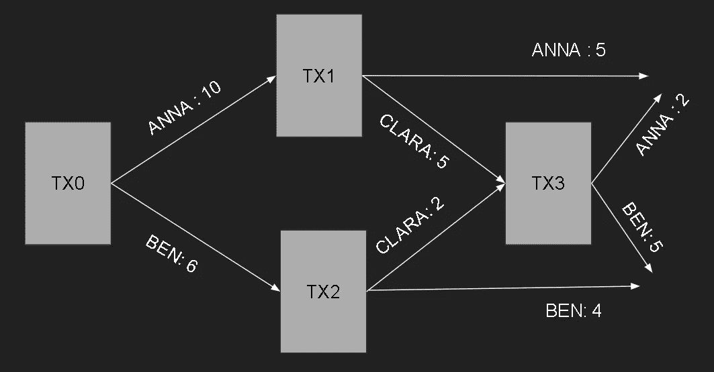

# 潜在的区块链组件有哪些？

> 原文：<https://medium.com/coinmonks/what-are-the-potential-blockchain-components-6d821b01e6f8?source=collection_archive---------19----------------------->

## 区块链系列

本文将介绍区块链及其基本组成部分，包括节点、分类账、钱包、会计模型和共识。

# 什么是区块链？

区块链是一个分布式账本，它以一种不能被更改或篡改的方式记录每一笔交易。区块链，顾名思义，就是一串连接的区块。每个块包括一些数据以及它自己的散列和它之前的块的散列。哈希始终是唯一的，它标识块及其包含的数据。下图演示了区块链中各块的连接方式。

credits: [IG EN](https://www.ig.com/en/trading-strategies/what-is-blockchain-technology--200710)

区块链的主要成分如下。

# 1.节点

区块链由节点组成。节点负责存储、共享和保存区块链。它们相互连接，作为网络用户的代表。一个节点可以由任何人运行，可以随时来来去去。

有两种类型的节点:

## **1.1 完整节点**

完整节点存储区块链自创建以来的事务历史的完整副本。它们从其他完整节点接收块和事务，验证块中包含的事务，然后将这些数据传递给其他完整节点。这需要大量的带宽、计算机能力和千兆字节甚至兆兆字节的数据来保持网络运行。

完整节点以冗余方式存储区块链。有备份以防一个节点消失。这确保了网络的可靠性。要创建一个新的块，挖掘器将始终运行一个完整的节点。如果没有完整的历史记录，它无法可靠地决定哪些提议的交易是有效的。

## **1.2 部分节点**

由于完整节点可以存储的数据量，大多数用户不需要运行完整节点。部分节点的使用如下。它也被称为轻量级节点。它手头没有一份完整的区块链账本。而是简单地保存事务的哈希值。这个哈希值是获得整个事务的唯一方法。与完整节点相比，这些节点提供的处理能力和覆盖范围更小。

**Blockchain Nodes** (Credits: Author)

# 2.分类帐

分类账是一种保存所有已核实交易的数据库。
存在不同种类的分类账:

## 2.1 集中分类账

中央节点完全控制集中的分类帐。一个中心节点处理所有数据的发送和接收，并且它是唯一可以改变分类帐的节点。

## 2.2 分散分类账

分散式分类帐可以被认为是集中式分类帐的分布式网络。多个节点可以控制、更新和验证这些分类帐。每次进行交易时，每个节点都会获得一份更新后的分类帐副本。只有当大多数节点已经批准交易时，分类帐才会被更新。

## 2.3 分布式分类账

分布式分类帐中的每个节点都保留一份分类帐副本。他们可以共同验证和添加新的块。比特币等加密货币的分布式账本中只保存余额信息。任何类型的信息，包括健康和房地产数据，都可以使用以太坊这样的区块链平台存储在分布式账本中。

## 2.4 公共分类账

公共分类账对每个人都是透明的。没有中央权力机构负责控制对分类账的访问。网络上的任何人都可以读取或写入数据。它也被称为**无许可**分类账。

## 2.5 私人分类账

如果中央机构控制对分类帐的访问，则分类帐被称为私有分类帐。它也被称为**许可**总账。

**Different Types of Ledgers** (Credits: [DCXLearn](https://dcxlearn.com/blockchain/what-are-the-different-types-of-ledgers-centralized-decentralized-and-distributed-ledgers/))

# 3.加密钱包

本质上，加密钱包是包含公钥和私钥的计算机程序或软件。公钥可以与任何人共享，这样他们就可以将令牌转移到您的钱包中。您的私钥不得透露给任何其他人。为了处理加密货币支付，我们使用私钥。

加密钱包分为两种:**热**和**冷**钱包。

## **3.1 热门钱包**

热钱包通过其他公司或你自己的电脑与互联网相连，可以在线或通过应用程序访问。它们通常用于日常在线交易。如果我们正在挖掘加密货币，并希望立即将收益发送出去，可以使用像比特币基地这样的热门钱包。在线攻击更有可能针对热门钱包。**软件**钱包可以认为是热门钱包。

## 软件钱包

软件钱包主要基于像比特币基地或币安这样的互联网交易所。在这种情况下，公钥和私钥保存在它们的服务器上。通过您的帐户，您可以访问它们。他们可以不恰当地使用您的私钥，因为他们完全知道它。

**Software wallets** (Credits: [sourceforgenet](https://a.fsdn.com/con/app/proj/coinbase-wallet.s/screenshots/wallet-image.png/1000/auto/1) & [exodus](https://www.exodus.com/binance-coin-bnb-wallet))

## **3.2 冷钱包**

冷钱包要么写在纸上，要么通过 USB 连接到电脑。你也可以把这些钱包称为离线钱包。冰冷的钱包带来的最大危险是忘记或丢失密码的可能性。如果你打算投资加密货币，就使用 Ledger Live 这样的硬件钱包，这样你就可以拔掉 USB，并验证没有黑客可以访问你的私钥。

## **3.2.1 基于纸张**

纸质钱包有写在纸上的公钥和私钥，以及简化加密货币交易的可选二维码。这种皮夹的一个主要缺点是我们经常放错地方或不小心毁坏这张纸。这是储存密码最不可行也是最安全的方法。

**Bitcoin Paper Wallet** (Credits: [masterethereum](https://masterethereum.com/que-es-una-wallet-blockchain/paper-wallet-master-blockchain-online/))

## **3.2.2 硬件钱包**

硬件钱包只是存储公钥和私钥的 u 盘。如果你拔掉了你的私人钥匙，没有人能得到它们。他们真的很安全。例如，Ledger Live 需要 24 个关键短语才能登录系统。但是，没有恢复程序。如果你忘记了密码，你无疑会丢失你的密码。此外，它们比普通钱包更贵。

**Ledger Hardware Wallet** (Credits: [Toshitimes](https://toshitimes.com/wp-content/uploads/2018/03/Is-the-Ledger-Hardware-Wallet-Vulnerable-1.jpg))

# 4.会计模型

为了让数字货币变得有用，它必须是可转移的。区块链上的资金转移是由所有者发起的，创建了一个交易。这项交易通知网络有多少钱被转手，新的主人是谁。这种转移机制通过采用以下 3 种会计模式中的任何一种来实现:

## 4.1 账户模型

帐户模型更类似于传统的银行系统。系统检查资产负债表以确定用户是否有足够的资金进行交易。交易一完成，金额就被记入收款人的贷方。以太坊使用帐户模型，每个节点必须管理 70 亿个帐户，并且每秒更新一次，以便帐户模型可以扩展。

将安娜、本和克拉拉视为三个用户。安娜和本最初分别从交易 tx0 收到 10 和 6 BTC。安娜在事务 tx1 中发送克拉拉 5 BTC，本在事务 tx2 中发送克拉拉 2 BTC。在稍后的事务 tx3 中，克拉拉将 2 个 BTC 发送给安娜，将 5 个 BTC 发送给本。最后，本拥有 9 个未用完的比特币，而安娜拥有 7 个比特币。下图清楚地描绘了这张资产负债表。

**Example of Account Model** (Credits: Author)

## 4.2 UTXO(未用交易输出)

UTXO 范式构建了一个过去事务输出的链，并使用它们来构建将在后续事务中使用的新输出。资产的转移在 UTXO 模型中被记录为有向非循环图，其中节点是事务，边是事务输出，每个额外的事务消耗一些 UTXO，同时添加新的事务。UTXO 是一个数字整数，表示货币或令牌的抽象。UTXO 可以比作实际的硬币或纸币。

未用完的产出在每个用户的钱包中进行跟踪。所有未用输出的总和用于计算钱包余额。比特币采用的 UTXO 范式不包含账户管理的思想。它只是在发送者或接收者不知情的情况下验证交易脚本。

客户模型中给出的示例在下图中被描述为 UTXO 模型。

**Example of UTXO model** (Credits: Author)

## 4.3 eUTxO(扩展未用交易输出)

eUTXO 是 UTXO 的扩展实现。eUTXO 架构旨在提供更具表现力的可编程性，同时保留比特币 UTXO 机制的所有优势。通过在交易中加入额外的数据，即所谓的数据，eUTXO 扩展了比特币的概念。该数据与验证逻辑一起保留任意特定于合同的数据，支持区块链事务状态的变化。在 eUTXO 模型中，事务上下文数据也被提供给验证逻辑。这使得交易具有确定性，并考虑到合同的连续性。

# 5.共识；一致

共识机制指的是用于在分散的计算机网络上实现一致、信任和安全的方法。公开共享的分类帐需要一种机制来确保网络上发生的所有交易都是真实的，并且所有参与者对分类帐的状态达成共识。这就是所谓的共识。这是一套规则，决定了区块链的各种参与者所作的改变的合法性。有许多共识机制。但是 PoW 和 PoS 是最常见的。

## 5.1 PoW(工作证明)

在工作证明(PoW)机制中，矿工通过破解密码问题来竞争验证交易。该块被认为是真的，一旦问题得到解决，就会被张贴到区块链。猜出谜语的人也将获得奖励。比特币使用的是幂共识。以太坊最近从 PoW 切换到 PoS。

PoW 存在某些缺陷。首先要注意的是，随着矿工人数的增加，谜题的难度也在增加。因此，矿工和采矿企业有动力花钱购买昂贵的计算机硬件，以便在交易验证中保持竞争力。这样一来，挖矿就变得更贵了，计算机的权力也就集中了。此外，与其他共识流程相比，挖掘比特币等主要加密货币的能耗在 PoW 中相对较大。

## 5.2 PoS(股权证明)

在赌注证明(PoS)中，区块验证取决于下注的硬币数量。当一个人拥有更多的赌注货币时，被选为验证者的可能性增加。他将因成功验证交易而获得奖励。PoS 引入了一些公平性，因为验证器是随机选择来验证的。PoS 可伸缩性也比 power 好得多。PoS 用于以太坊和卡达诺。

要详细了解不同的共识，请参见 [101 区块链](https://101blockchains.com/consensus-algorithms-blockchain/)。

**Consensus Mechanisms** (Credits: 101 Blockchains)

# 摘要

到目前为止，我们已经讨论了区块链技术及其关键组件。区块链无疑是一场技术革命，它的许多组件对其运行至关重要。自己探索区块链宇宙。

> 交易新手？试试[加密交易机器人](/coinmonks/crypto-trading-bot-c2ffce8acb2a)或者[复制交易](/coinmonks/top-10-crypto-copy-trading-platforms-for-beginners-d0c37c7d698c)