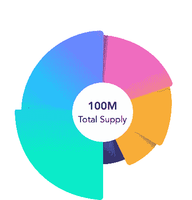

# 加密货币的令牌学是什么？—符号组学解释

> 原文：<https://medium.com/coinmonks/what-are-the-tokenomics-of-a-cryptocurrency-tokenomics-explained-fb0e708b0b5c?source=collection_archive---------47----------------------->

**关键见解**

*   令牌经济学对于理解你投资的是什么至关重要。
*   有许多不同类型的令牌，包括安全令牌、实用令牌、治理令牌和支付令牌。
*   令牌组学的一个主要方面是令牌发行。
*   加密货币的令牌组通常是不可调整的。

**简介**

Tokenomics 是一个关于 token 的经济特征的综合术语，这个词来源于 token 和 economics。

‍

加密货币的令牌组学涵盖了使特定加密货币成为投资者有价值和感兴趣的投资的所有元素。

‍

**Tokenomics 可以洞察你正在调查的加密货币项目的用例以及供需情况。理解加密货币的令牌学应该是你在加密行业投资决策的核心。**

‍

加密货币的代币组学归结为两件事，代币能做什么，以及现在有/将来会有多少代币。

‍

令牌组学项目的细节通常在项目白皮书或总结网站上的项目概述中概述，您可以在这里找到研究加密项目的最佳位置。

‍

**什么是代币？**

在我们深入令牌组学之前，让我们看看什么是令牌以及它们之间有什么不同。

‍

**代币可以被视为加密项目本身的货币形式。令牌在自己的网络上几乎总是有特定的用例。**

‍

在初始硬币发行(ICOs)中，加密项目正在为他们的项目寻找资金支持。为了筹集这些资金，加密项目在 ICOs 上提供了一个令牌。然而，投资者必须以某种方式激励购买代币，加密货币的代币经济学提供了这种激励。

‍

令牌可用于各种用途，但可分为三类:安全、实用或治理令牌。

**安全令牌**

证券代币可以被视为公司股票的同义词。包括比特币在内的许多加密货币都是货币资产或价值储存手段。

‍

相比之下，证券令牌的使用方式与股票、债券证书或其他投资资产相同，只是为了展示公司或资产的股份。

‍

安全令牌是一种投资资产，一种以令牌形式代表公司所有权的数字资产，因此必须得到美国证券交易委员会(SEC)的批准。

‍

截至目前，市场上没有多少安全令牌。

‍

**公用事业代币**

公用事业令牌为投资者提供了购买和投资令牌的用例激励。

‍

公用事业令牌的核心目的是最初向投资者发行，投资者通过令牌在项目本地生态系统中的用例获得价值。

‍

数字令牌的效用因数应为令牌提供项目生态系统用户的持续需求。

‍

公用事业代币的一个例子是币安的 BNB 硬币，它可以用来减少币安交易所的汽油费。

‍

效用令牌的另一个例子是 Axie Infinity 网络上的平滑爱情药剂(SLP)令牌。SLP 打算支付 Axie Infinity 游戏的交易费。除了在 Axie Infinity 元宇宙上，SLP 没有其他用例。

‍

**治理令牌**

治理令牌使投资者/令牌持有者能够在给定的社区内做出选择。

‍

这些社区可能包括分散的应用程序项目(Dao)。使用令牌治理令牌，您可以对 DAO、分散式应用程序(Dapp)或分散式财务(DeFi)项目的工作进行投票。

‍

**开发人员通常会提出一些他们下一步开发工作的选项，治理令牌持有者可以投票决定他们希望项目下一步开发什么。**

‍

持有较大股份的代币持有者被视为拥有较大的投票权，这可能会使决策权偏向最富有的持有者。

‍

治理令牌本质上允许项目将他们的决策权分配给社区。这样，项目就能确保他们的目标不会偏离投资者和代币持有者的目标。

‍

社区决策权的这种分散化被用来避免集权和只对少数人产生积极影响的决策。

‍

**支付令牌**

‍

支付令牌是另一种类型的令牌，代表最纯粹的加密货币形式。这种令牌的主要/唯一用途是作为支付媒介。

‍

**使用这种代币作为支付媒介的动机是，支付发生在他们自己的分散式区块链上，并且通常只需要几秒到几分钟就可以转账。**
‍

通常，支付令牌没有进一步的功能或与其他开发项目的链接。比特币就是这种加密货币的一个例子。

‍

目前，比特币没有真正的用途，除了它的通缩性质和它保证提供的极其安全的区块链支付网络。

‍

**为什么标记组学很重要？**

理解一个项目的记号组学让你了解记号是多么有用和稀有。如果一个代币是无限的，那么它的价值自然会比一个代币的供应量有限时低很多。

‍

**因为任何东西的价值都是由给定产品的供给和需求决定的，所以代币经济学对于购买和持有代币的财政激励是必不可少的。**

令牌组学还让您深入了解令牌的用例是什么。如果投资者和用户有购买代币的功利动机，代币的价格更有可能上涨。

‍

**代币发行(供应)**

代币发行是发行新代币的过程，新代币随后被添加到加密货币的总供应量中。

‍

在加密货币项目的开发过程中，开发人员对令牌的供应进行编程。最初的发行目标写在代码中，可以在加密货币的白皮书中查看。

‍

**通常，代币发行由复杂的算法程序来监管，这些程序决定区块链生态系统正常运行所需的代币数量。**

‍

例如，比特币的白皮书详细说明了永远只会有 2100 万枚 BTC 代币。新代币发行流通的唯一方式是通过采矿块奖励。每个区块的采矿奖励也在不断减少，每 210，000 个区块(大约每四年)减少一半。

‍

关于代币组学，需要了解的一些基本信息包括:目前存在多少硬币或代币，未来可能会增加多少，谁拥有大部分硬币，硬币可能会留在一边，以供未来向开发商发放，大量硬币可能已经丢失或烧毁。

‍

*图片提供:茄属*

‍

‍

**调整记号组学**

加密货币的令牌组学通常在任何情况下都不会改变。只有未对供应进行编程的项目才能通过印刷更多来调整供应，这始终是一个危险信号。

‍

大部分项目只能通过硬[叉](https://www.thebalance.com/what-is-a-bitcoin-fork-4684459)来调节自己的供给。硬分叉意味着他们复制令牌的历史和代码，并在新令牌的代码中进行所需的调整。

‍

**虽然，通过硬分叉令牌，令牌将是不同的完全不同的令牌。**

‍

例如，比特币经历了自己的分叉。2017 年，有相当多的开发商希望调整人民币的牵引限制(区块大小)。所以在 2017 年 8 月 1 日，比特币网络经历了一次硬分叉，产生了比特币现金。

‍

进行了调整，最初比特币区块链的所有历史都被转换到新的分叉链上。在比特币现金分叉过程中发生的令牌变化丝毫没有影响比特币的原始链条，两者自 2017 年以来一直分开运行。

‍

*叉图作者:比特币基地*

‍

‍

**结论**

总之，研究令牌组学应该是你评估加密货币投资的一个主要因素。

‍

确保您了解您投资的任何加密项目，以便您在未来不会遇到意外。

‍

任何项目最重要的信息都可以在项目白皮书或包含项目分析信息的网站上找到。更多关于这些研究方法的信息可以在[这里](https://www.boomish.org/blogs/where-to-do-crypto-research)找到。

访问 BOOMISH.ORG，提升你的市场知识

 [## 及时发现金融趋势

### BOOMISH 的目标是为交易者、投资者和商业人士带来透明性和对加密经济的理解

www.boomish.org](https://www.boomish.org/) 

> 交易新手？试试[密码交易机器人](/coinmonks/crypto-trading-bot-c2ffce8acb2a)或[复制交易](/coinmonks/top-10-crypto-copy-trading-platforms-for-beginners-d0c37c7d698c)