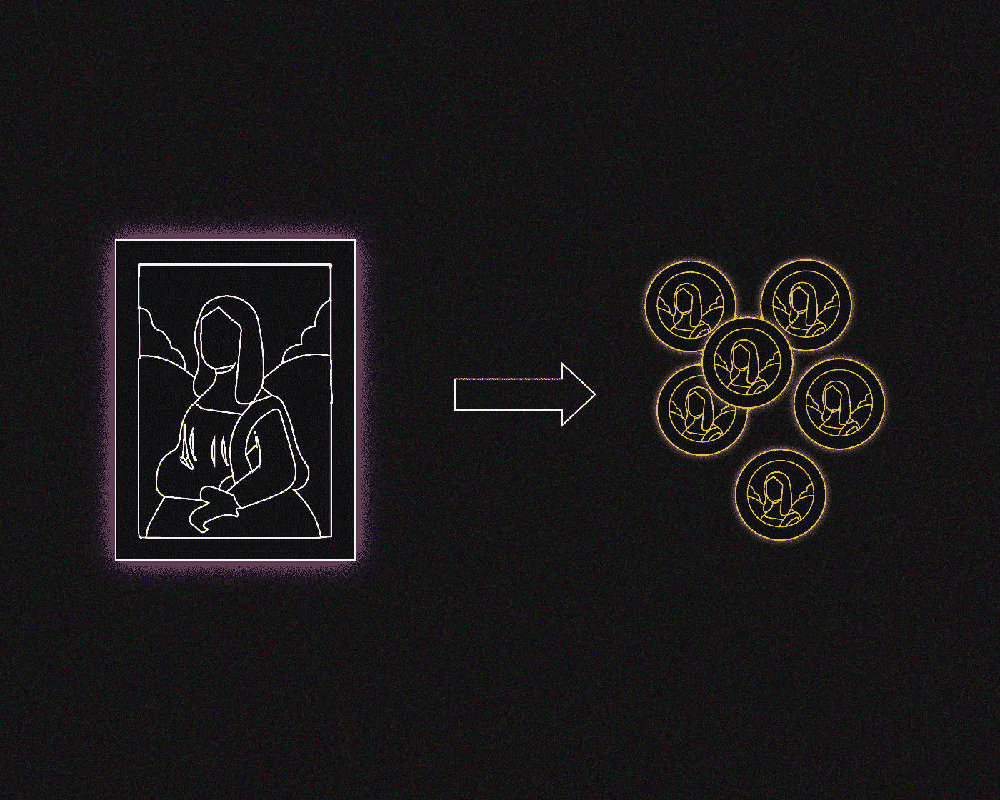
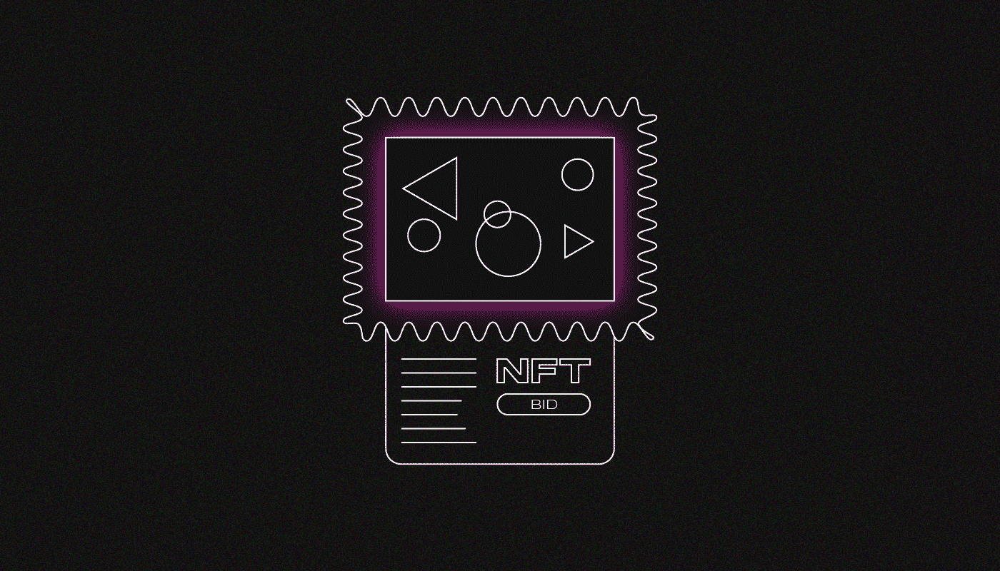

# 什么是令牌化资产？

> 原文：<https://medium.com/coinmonks/what-are-tokenized-assets-2e25f3b5be77?source=collection_archive---------22----------------------->

***它们是由标的资产决定价值的代币:证券、商品、衍生品、房地产或艺术品，它们为什么存在，又是如何运作的？让我们来了解一下！***

交易令牌化资产和传统资产会产生相同的结果:如果 **BABA(阿里巴巴集团)**股票的价格上涨**2 美元，**那么令牌化 [BABA.cx](https://currency.com/ru/tokenized-alibaba-shares-price?utm_source=forklog&utm_campaign=cards) 股票的价值也会以相同的价值上涨。

此外，令牌化资产的持有者会定期收到费用:股息、债券息票和其他费用的调整。

# **加密交换如何创建令牌化资产？**

传统的资产发行人在登记处创建所有权记录，并拍卖物品。他们在交易过程中改变资产所有者的记录。

令牌化资产以类似的方式创建，但发行者使用区块链。

标记化可以通过两种方式完成:

*   **购买** —代币持有者可以将其兑换为基础资产。这类资产在 FTX 平台上交易。
*   **未购买—****代币持有者不能将其兑换为标的资产。在这种情况下，资产价值由加密货币或法定货币担保。这种代币在 Currency.com 交易所和其他一些平台上交易。**

**投资者可以在现货市场上购买令牌化资产，将它们提取到外部钱包中，并利用杠杆进行交易，没有提取选项。**

# ****令牌化资产是非金融资产吗？****

****

**不完全是。NFT 是具有唯一标识符和特殊内容的不可替代的令牌。两个相同的 NFT 的价格可能不同。**

**令牌化资产，如股票市场份额或原材料供应合同，是可替代的和等价的。**

**然而，表明物理对象所有权的 NFT 也可以被认为是令牌化的资产。**

# ****如何控制令牌化资产？****

**加密交易所被授予经营数字资产的许可证，并与经纪人签订报价供应协议。如果发行交易所购买资产用于令牌化，经纪商会存储这些资产并充当托管人。**

**对监管者来说，交易令牌化资产与交易加密货币没有什么不同。**

# ****交易传统资产和令牌化资产有什么区别？****

**如果你想在传统的交易所进行交易，你必须首先与经纪人签订合同，这可能需要纸质版本。经纪人经常为资产交易设定固定佣金，如交易价值的 0.1%，但不得低于 50 美元。账户维护、资产保管、限价单撤单都有隐性费用。**

**交易令牌化资产需要注册加密交易所并完成 KYC 程序。加密货币平台上的佣金**透明**。没有隐藏的费用:当提取资金到外部钱包时，用户支付交易金额的百分比以及交易费用。**

**传统券商的资产组合有限。他们交易国有公司的股票、地方共同基金、法定货币和黄金等热门商品。其原因是增加外国资产的法律困难。**

*   **加密交换为用户提供了广泛的令牌化资产，例如:**
*   **美国、欧洲和亚洲受欢迎公司的股票；**
*   **[商品](https://currency.com/tokenized-securities-overview)从黄金到橡胶；**
*   **按指数和行业分类的交易所交易基金；**
*   **股票指数、法定货币和政府债券。**

# ****哪里可以交易令牌化资产？****

**以下是一些可以交易令牌化资产的平台:**

*   **[Currency.com](https://currency.com/tokenized-shares)—1800 多项资产:1700 只股票、30 种大宗商品、50 种股指和 ETF、16 种法定货币，以符号化的形式存在于各个市场；**
*   **[FTX](https://ftx.com) — 100 个资产证券化交易对；**
*   **[bit trex](https://bittrex.com)—50 多种与比特币、USDT 和美元成对的令牌化股票；**
*   **[Bitpanda](https://www.bitpanda.com/en) — 212 令牌化股票、ETF、贵金属；**
*   **[镜像协议](https://www.mirror.finance) — 30 股含加密货币超额抵押品的令牌化股票；**
*   **[Synthetix](https://synthetix.io) — 7 种辅币化法定货币。**

# ****购买令牌化资产前需要了解什么？****

1.  ****平台上的代币化条款** —有无购买。第一种情况，代币可以换资产；第二，它们只能被交易。**
2.  **获得定期支付的方法，如向持有人账户支付股息或修正资产利率。**
3.  ****交易对**——与比特币、USDT 或代币化法定货币进行交易。例如，在 Currency.com，日本股票与符号化的日元 JPY.cx 交易，而美国股票与符号化的美元 USD.cx 交易**
4.  ****交易时段**要么是连续的，要么是有限的。平台可以根据证券交易所的时间表暂停交易。**

> **在跟踪更新方面，订阅我们的[媒体提要。](https://medium.com/sunflowercorporation)敬请期待！**
> 
> **您也可以在我们的平台[向日葵公司](https://sunflowercorp.com/)上尝试使用加密货币。**

****

# ****谁应该交易令牌化资产？****

**对于寻找新交易工具的交易者来说。比特币汇率经常被加密货币跟随。同时，股票、指数、原材料和其他资产的价格可以独立上涨和下跌。**

**令牌化资产还可以用于多样化加密货币投资组合，而无需在第三方平台上注册或签订合同。**

> **交易新手？尝试[加密交易机器人](/coinmonks/crypto-trading-bot-c2ffce8acb2a)或[复制交易](/coinmonks/top-10-crypto-copy-trading-platforms-for-beginners-d0c37c7d698c)**