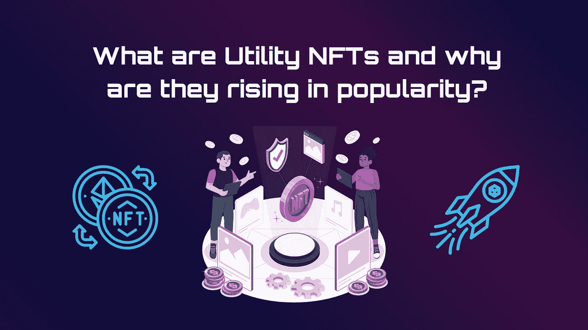
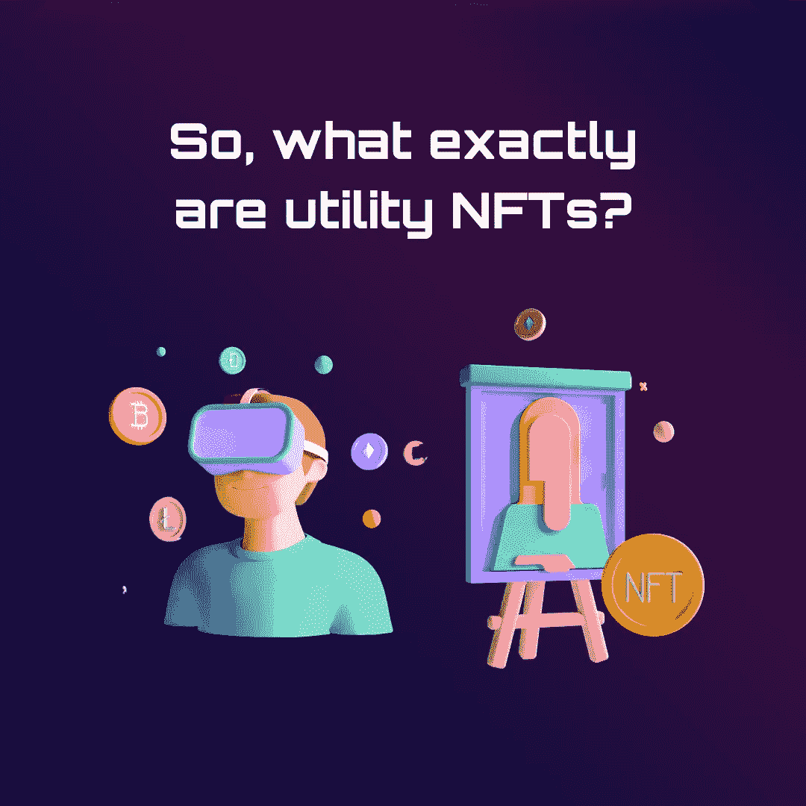
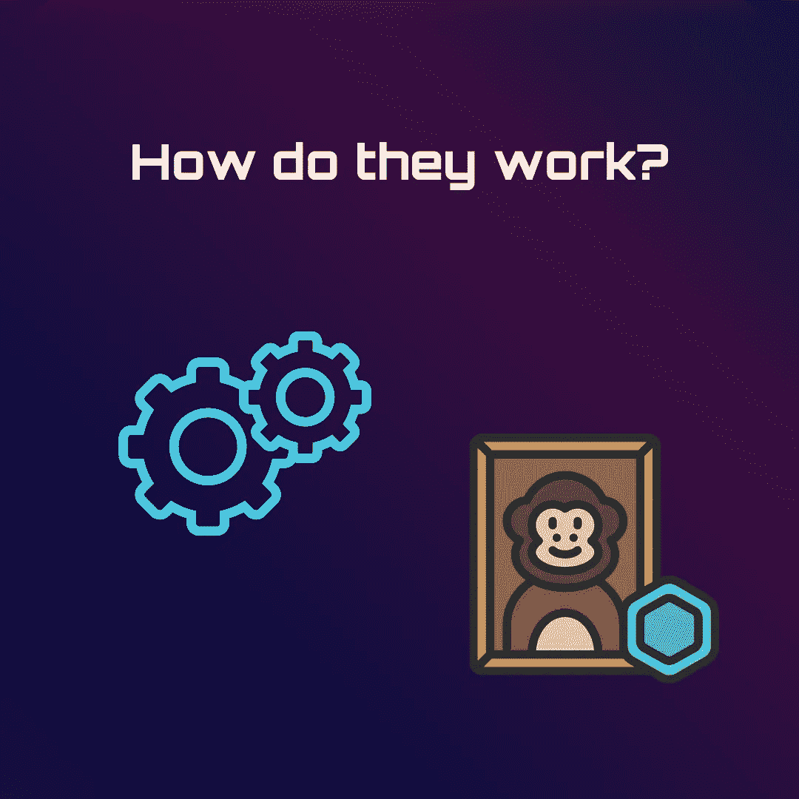
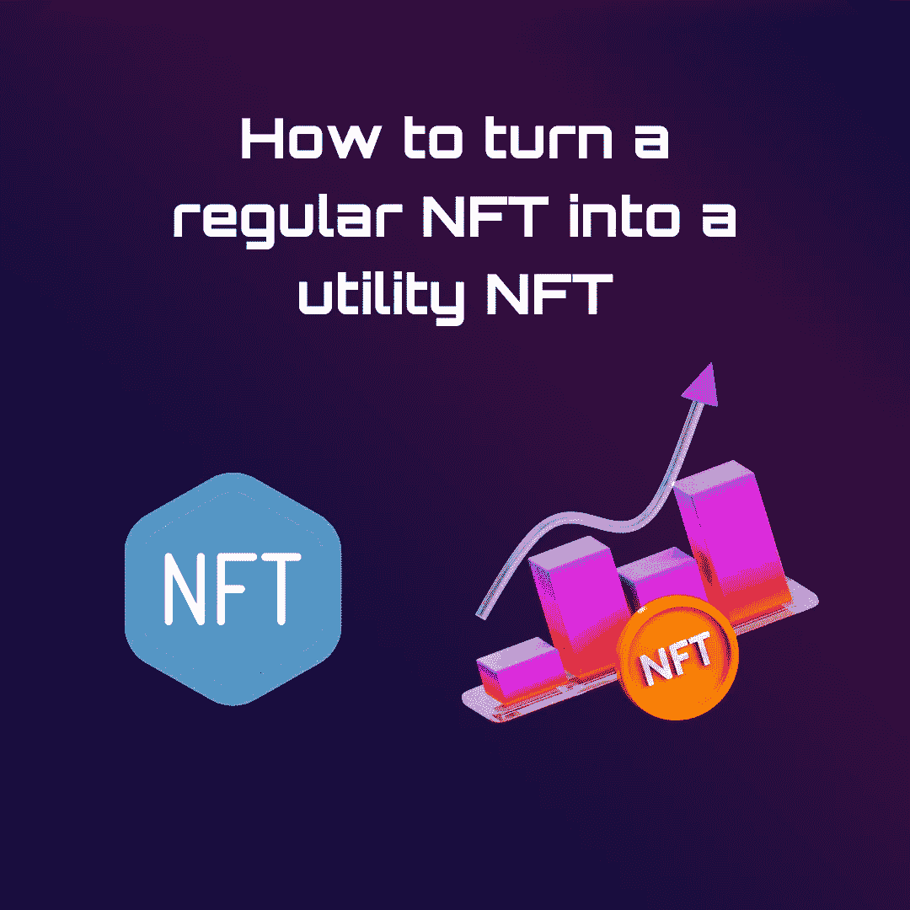
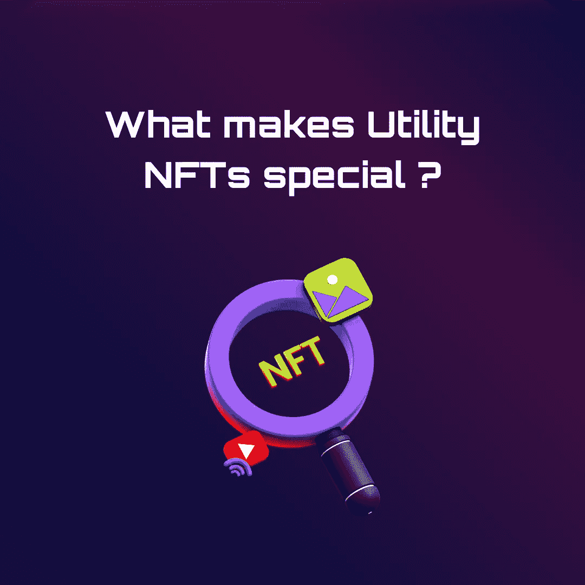
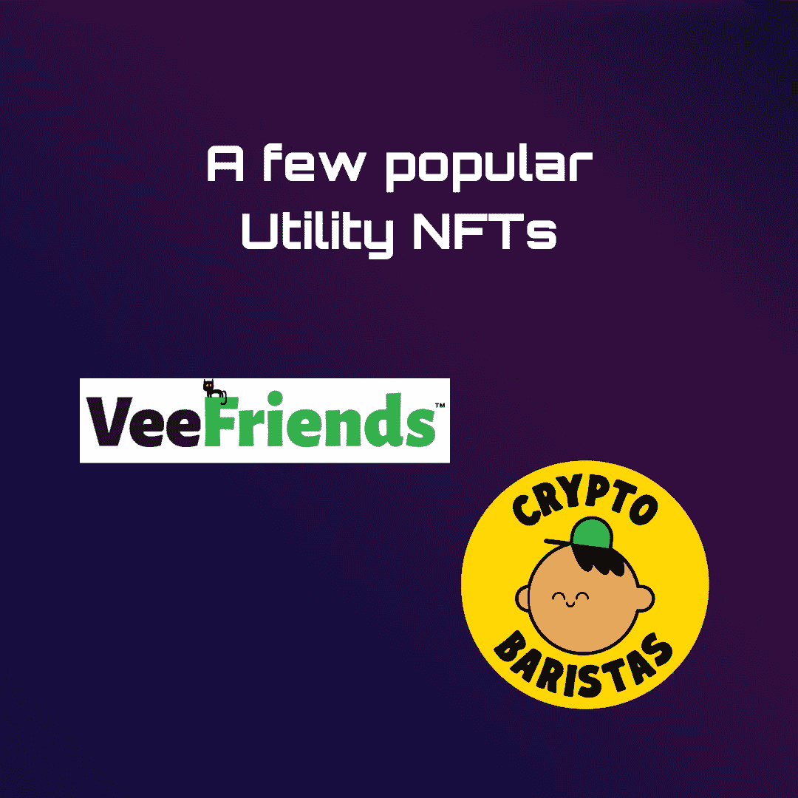
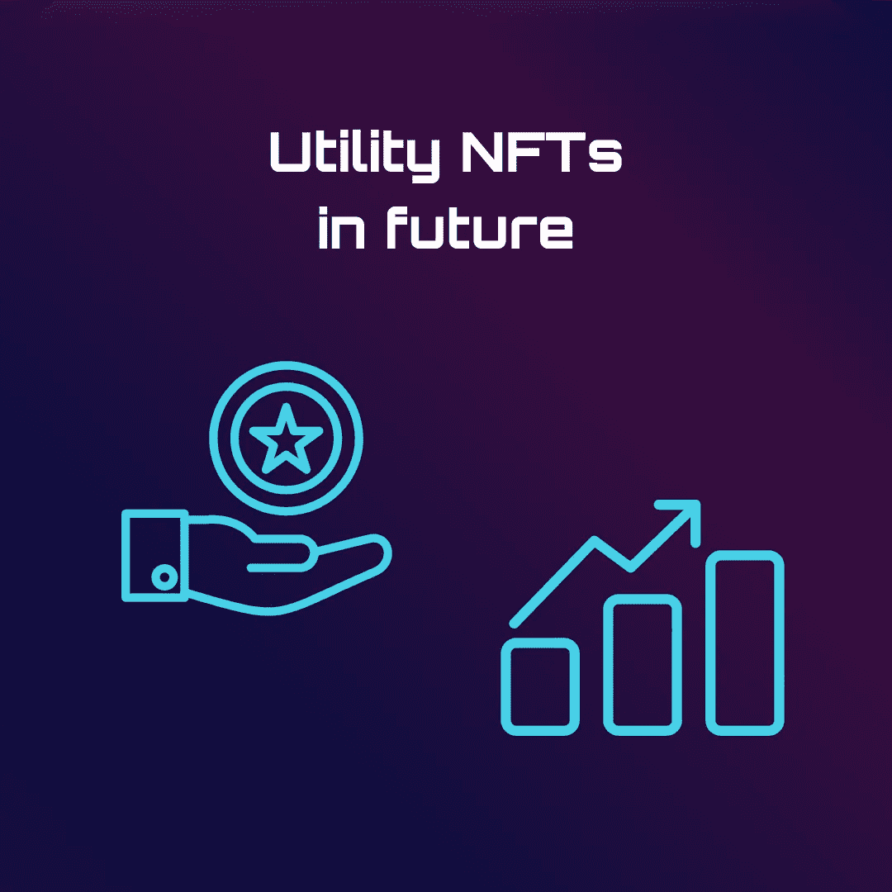

# 什么是公用事业 NFT，为什么它们越来越受欢迎？

> 原文：<https://medium.com/coinmonks/what-are-utility-nfts-and-why-are-they-rising-in-popularity-30d7f033cc59?source=collection_archive---------34----------------------->

2022 年第一季度，全球 [NFT](/@orbis86/the-beginners-guide-to-nfts-fe66dc769dd2?source=user_profile---------24----------------------------) 市场的总价值从 2020 年的 2 亿美元增长到 120 亿美元。NFT 的成功今天已经引发了很多关于其潜在应用的争论。专家们现在正在争论公用事业 NFTs 是否代表 NFT 环境的下一个重大发展。公用事业 NFTs，或具有现实世界应用的 NFTs，可能会成为 NFTs 从投资媒介向全新的互动、娱乐和工作模式转变的催化剂。

# **那么，什么是实用 NFT？**

具有公用事业用例的 NFT 不仅仅是独一无二的数字资产。它们是 NFT，让所有者获得他们可能无法获得的利益、特权或奖励。例如，你可以为一场有 800 个空位的演出派发 800 张纸质门票。由于每张票都有一个唯一的票号，它们都是不可替换的。然而，每张纸质票都有同样的好处。在这种情况下，效用就是对表演的承认。

活动发起人可能会分发 800 张纸质门票中的 800 张公用事业 NFT。即使这些 NFT 中的每一个都是独特的和不可替换的，就像门票一样，它们都可以用来获得对活动的访问。

# **它们是如何工作的？**

从技术上来说，公用事业 NFT 的运作方式与其他 NFT 一样。它们是独特的数字资产，经过加密编码并保存在区块链上。[区块链](/@orbis86/how-blockchain-technology-can-revive-the-global-economy-af2338d363dd?source=user_profile---------13----------------------------)技术的不变性和透明性使得 NFT 的所有者可以很容易地证明 NFT 只存在他们的钱包里，而不在其他人的钱包里。

公用事业 NFTs 和游戏行业自然是相辅相成的。例如，NFT 可以代表玩家可以在游戏中购买和使用的虚拟产品，如枪支或游戏中的资产。在此期间，品牌可以利用公用事业 NFT 来创造新的收入来源和独特的客户参与方法。

# **如何将普通的 NFT 变成实用的 NFT**

一个 NFT 或一组 NFT 可以通过多种方式变得更有用；实际的技术不如如何使用技术重要。以音乐领域为例，2021 年 3 月，Kings of Leon 发行了他们的专辑“[当你看到自己](https://opensea.io/assets/ethereum/0x557430421f8f3ed0a92aca211f1c05ad7b606288/0)”作为一系列 NFT，这是第一个这样做的乐队。

这张专辑除了以 NFTs 的形式发行外，还以传统格式在 Spotify 和 iTunes 等渠道发行。各种各样的实用 NFT 被包括在专辑发行中。其中一张除了提供专辑的插图和音频的数字版本之外，还可以换取专辑的限量版黑胶唱片，另一张可以换取莱昂国王音乐会的前排座位。

莱昂国王乐队在发行“当你看到你自己”几天后，已经从 NFT 的销售中获得了 200 万美元，这部电影部分作为 NFT 代币发行。超过 500，000 美元被捐赠给 Crew Nation，这是一个慈善基金，用于新冠肺炎疫情爆发期间和之后的音乐工作人员。仅仅通过思考列昂国王的例子，就可以很容易地想象出其他种类的实用 NFT 也能发挥同样的作用。为什么 NFTs 不能承诺足球比赛的全年门票，从而取代季票，如果他们能保证摇滚音乐会的特定席位？

# 什么使公用事业 NFTs 特别？

在企业和流行文化领域，非功能性产业正迅速变得越来越突出。此外，以前非实用的 NFT 收藏逐渐成为实用的 NFT 收藏。例如，广受欢迎的[无聊猿游艇俱乐部](https://boredapeyachtclub.com/)曾经只是作为 NFT 照片的集合而存在。但是今天，无聊的猿 NFT 已经演变成特殊活动的通行证，如聚会，甚至开始提供奖励，如铸造新鲜 NFT 的能力。

不可替换令牌的使用超出了视觉艺术的范畴，这是实用 NFTs 的一个关键特征。未来，NFTs 不仅仅是用来炫耀个人收藏的一种手段，而是会进一步发展。尽管非功能性技术仍处于起步阶段，但很明显，在几个领域有扩大其价值的机会。

# **几款流行的公用事业 NFT**

公用事业非功能性技术的潜力不仅仅局限于特定的几个部门和领域，而是存在于一系列实际应用中。随着其在市场中的日益普及和需求，组织将能够开发各种用例，并利用它们来推动业务。以下是一些目前最流行的实用 NFT:

*   **vee friends:**[vee friends](https://veefriends.com/)是加里·维纳查克的 NFT 集合，空投持有 VeeCon 大会通行证的人。
*   **秘密咖啡师:** NFT 持有者有权通过[秘密咖啡师](https://cryptobaristas.com/)提供的“全方位咖啡体验”在即将开业的咖啡馆、在线商店和商品上享受折扣。
*   **妇女的世界:**这是 NFT 的一项倡议，旨在赋予妇女权力和信息，同时促进她们参与 Web3 和 NFTs。所有者可以通过[女性世界](https://worldofwomen.art/)获得特权，如拥有原创作品和受邀参加现场活动。
*   **GainForest:** 这是一家总部位于瑞士的全球慈善组织，希望利用区块链技术来帮助保护雨林。捐赠者将获得代表真正森林面积的 NFT，测量森林的健康状况，并产生治理令牌。

# **未来的公用事业 NFTs**

公用事业 NFT 仍处于起步阶段。然而，每天都有新的、新颖的用例出现。未来的 NFT 持有者可能能够获得医疗保健、折扣或活动门票，取代从保险卡到顾客忠诚卡和季票的任何东西。在未来几年，企业可能会鼓励使用 NFT 进行销售，这些 NFT 可以兑换成未来的折扣或赠品，而纸质折扣令牌将成为过去。

对于所有者来说，NFT 的效用只是增加了他们对特殊 NFT 资产的所有权。未来，NFT 开发商和平台可以继续发布额外的实用程序，以支持 NFT 业主群体的增长。随着 [Web 3.0](/@orbis86/interoperability-in-web3-0-106716fdb74?source=user_profile---------10----------------------------) 的发展，NFTs 的重要性将会增加，对开发者和所有者都有好处。如果你是一个投资者，正在考虑将 NFT 作为你投资组合的一部分，请记住，这些代币比可收藏的代币更有用、更有价值。

随着元宇宙的扩散，公用事业 NFTs 也可能出现，在共享的虚拟世界中为所有者提供优势，例如访问游戏或其他独特的虚拟设置。公用事业 NFTs 可用于展示和奖励所有权，促进社区发展，以及鼓励环境保护。在如何使用现有技术方面，只有我们的想象力受到限制。

> 交易新手？尝试[加密交易机器人](/coinmonks/crypto-trading-bot-c2ffce8acb2a)或[复制交易](/coinmonks/top-10-crypto-copy-trading-platforms-for-beginners-d0c37c7d698c)