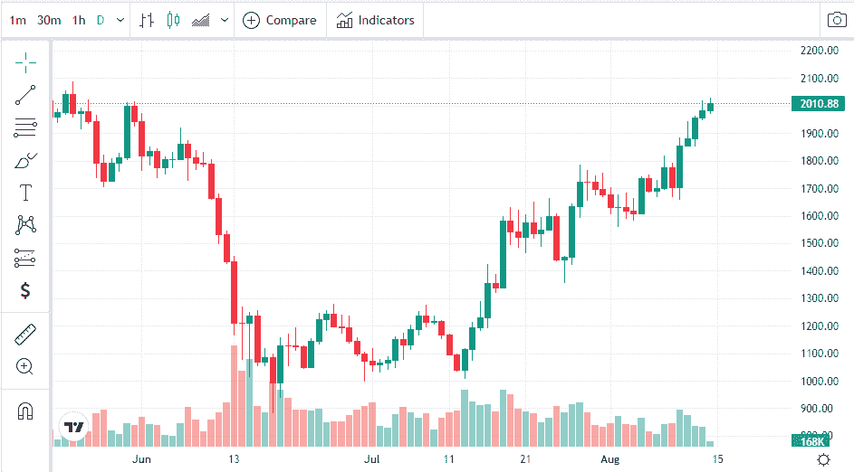
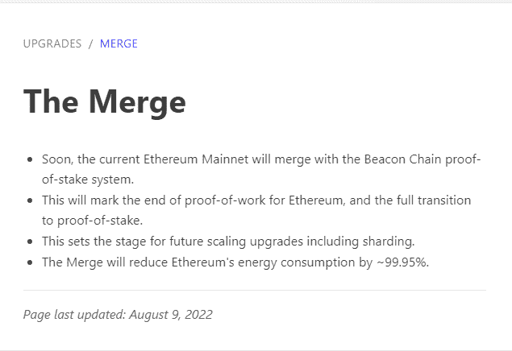
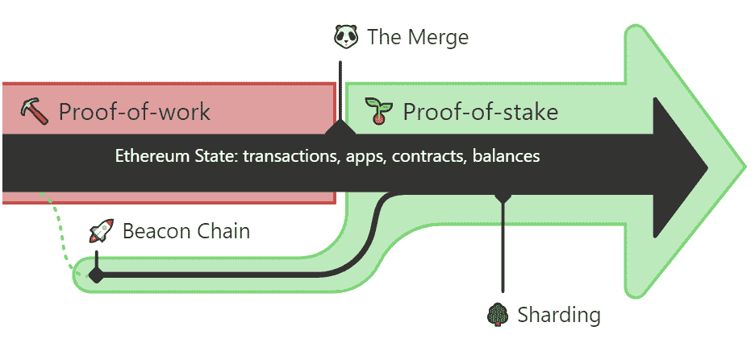

# 以太坊合并中等待我们的是什么？

> 原文：<https://medium.com/coinmonks/what-awaits-us-in-the-ethereum-merge-47bfd67ad29a?source=collection_archive---------25----------------------->

根据以太坊开发者今天的呼吁，合并预计将在 9 月 15 日或 16 日进行。

最近被寄予厚望的以太坊合并继续全速进行。世界第二大加密货币已经攀升至 2000 美元，这是自 6 月初以来的最高水平。

以太坊升级，以前称为以太坊 2.0 或 Eth2，是区块链技术世界中最受期待的升级之一，以太坊投资者不能等待。

关于 2022 年 8 月 9 日[https://ethereum.org/en/upgrades/merge/](https://ethereum.org/en/upgrades/merge/)的更新，我们可能会看到升级会对以太坊的路线图产生重大影响。

工作证明(PoW)和利益证明(PoS)有什么区别？

以太坊主网将与信标链股份证明系统合并。在这一点上，必须注意，信标链通过充当一致层来协调网络。

工作证明(PoW)和利益证明(PoS)之间的区别

PoW

*   最好集中起来，提供更好的安全性，但交易速度较慢，验证交易的成本较高，能耗较高

PoS

*   能耗更低、财务机会更多、交易速度更快，但更难真正分散网络，安全性不如 PoW

什么是利害关系证明和工作证明？

“工作证明”和“利益证明”是加密货币用于验证新交易、将其添加到区块链和创建新代币的两个主要共识机制。

首先由比特币开创的工作证明利用挖掘来实现这些目标。Cardano、ETH2 区块链和其他公司使用的利益相关证明使用利益相关来完成同样的事情。

PoW 和 PoS 哪个好？

利害关系证明(PoS)是解决密码问题的所谓更好的方法。少数加密货币使用 PoS 模型，比 PoW 更快更安全。利益证明(POS)使用随机选择的矿工来验证交易。

在利益证明系统中，赌注的作用类似于工作证明的挖掘，在这个过程中，网络参与者被选择将最新一批交易添加到区块链中，并作为交换获得一些密码。

具体细节因项目而异，但总的来说，作为股份的证明，区块链雇佣了一个“验证者”网络，他们贡献(或“股份”)他们的密码，以换取验证新交易、更新区块链并获得奖励的机会。

工作证明(POW)使用竞争性验证方法来确认交易并向区块链添加新区块。矿工们与自己竞争破解密码之谜，以获得区块奖励。

工作证明和挖掘是密切相关的概念。之所以称之为“工作证明”,是因为网络需要巨大的处理能力。世界各地的虚拟矿工竞相成为第一个解决数学难题的人，他们对工作证明区块链进行保护和验证。

每个 PoS 币都有一个在开始时确定的年回报。

权力没有固定回报。随着网络中交易和节点数量的增加，采矿场数量的增加，单个用户获得回报的机会减少。

> 加入 Coinmonks [电报频道](https://t.me/coincodecap)和 [Youtube 频道](https://www.youtube.com/c/coinmonks/videos)了解加密交易和投资

# 另外，阅读

*   [什么是保证金交易](https://coincodecap.com/margin-trading) | [美元成本平均法](https://coincodecap.com/dca)
*   [支持卡审核](https://coincodecap.com/uphold-card-review) | [信任钱包 vs 元掩码](https://coincodecap.com/trust-wallet-vs-metamask)
*   [Exness 回顾](https://coincodecap.com/exness-review)|[moon xbt Vs bit get Vs Bingbon](https://coincodecap.com/bingbon-vs-bitget-vs-moonxbt)
*   [如何开始通过加密贷款赚取被动收入](https://coincodecap.com/passive-income-crypto-lending)
*   [BigONE 交易所评论](/coinmonks/bigone-exchange-review-64705d85a1d4) | [电网交易机器人](https://coincodecap.com/grid-trading)