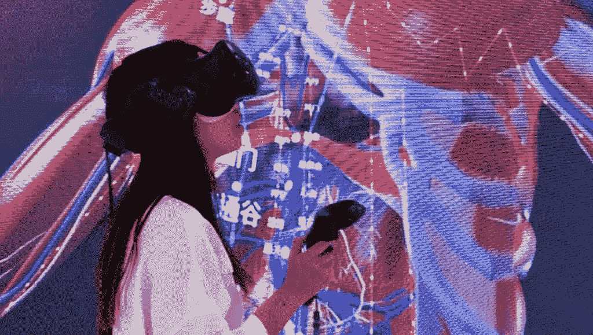
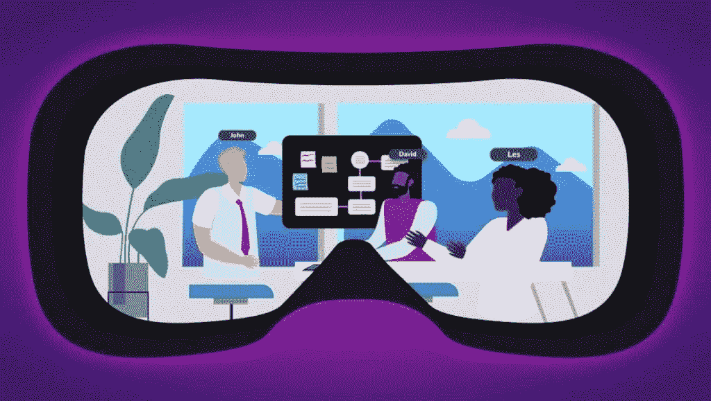

# 元宇宙给教育部门带来了什么好处？

> 原文：<https://medium.com/coinmonks/what-benefits-is-the-metaverse-offering-to-the-education-sector-935cba52524a?source=collection_archive---------45----------------------->

# 教育部门？

> 一些专家认为，人们仍然不清楚元宇宙到底是什么，以及它是否存在。然而，一些学院和大学已经加入了元宇宙的行列。他们在现场和远程视频学习中加入了游戏化互动虚拟世界、虚拟现实和混合现实等功能。十所美国学校和大学与美国科技公司 Meta 和爱尔兰虚拟现实门户网站联手，进行了迄今为止最伟大的尝试之一。他们的目标是创建 3D 数字版本的校园。他们称之为“元多样性”。学生将在使用沉浸式虚拟现实耳机的同时进行学习。

***不过，元宇宙会给学校、学院以及教育部门提供一些福利。先说其中的六个。***

# 1.降低教育资源的成本

大学资金不足，获得重要教学资源的机会有限。元宇宙可以帮助他们克服这些限制。

[**田纳西州纳什维尔市的菲斯克大学**](https://www.fisk.edu/) **，**举例来说，由于过高的价格和维护问题，该大学没有购买尸体。该机构正在用虚拟现实尸体扩展其医学预科课程，这是一种更便宜的选择。

在虚拟现实实验室中，人类的心脏可以从尸体的胸腔中提取出来。它给学生的印象是，他们可以感觉和评价手中脉搏的沉重。他们可以把它变大。学生们可以看到和触摸心室壁。学生们可以通过比较不同的心脏来理解人们在世时做出的健康决定的结果。他们争论并就准确的诊断达成一致。

虚拟尸体不会腐烂，并且易于保存。随着时间的推移，可以引入其他元素，如医疗程序和人-动物比较学习。

# 2.提高学生成绩

虚拟培训是一种很好的方式，可以直观地解释概念，并使用逐步说明来说明任务。它们为实践学习提供了可能性。沉浸在游戏中可以促进学习活动的参与。

亚特兰大的莫尔豪斯学院 正在试验一种“元大学”，包括全球历史、生物和化学课程。与传统和在线形式相比，虚拟现实项目提高了学生的满意度、参与度和成就，以及学业成绩。例如，与前一年通过缩放和面对面授课的相同课程相比，虚拟现实全球历史课将学生的 GPA 提高了 10%。

# 3.创建更加真实的虚拟交互

互联网有效地将电子邮件、电子表格和 pdf 从一个设备传输到另一个设备，以进行独立和异步的检查或修改。它不是为一对一的现场互动交流而设计的，尤其是在有大量用户的情况下。类似地，像 Zoom 这样的虚拟场所只能进行一次对话。物理事件的参与者可以从一个讨论无缝过渡到下一个讨论。

为了解决互联网和视频会议工具的限制，一些大学正在利用元宇宙技术。与元宇宙相关的技术让人们更自然地参与，弥合了现实生活和虚拟互动之间的差距。

Gather 是一个模拟现实生活互动的虚拟聚集区，由芝加哥大学**和宾夕法尼亚大学[**的学者和学生使用。**](https://www.upenn.edu/)**创建虚拟角色，用户在反映物理区域(如建筑物)的虚拟地图上旅行。亲密聊天功能给用户的感觉是他们正在走廊里与其他学生和讲师擦肩而过。****

****用户可以看到和听到来自附近参与者的视频和音频。当他们离开时，噪音和视觉变得听不见。与 on Zoom 不同，参与者不需要参与单个讨论。他们可以很容易地在听众和演讲者的角色之间转换。****

****宾夕法尼亚大学计算机和信息科学系使用 Gather 来重建该系的所在地 Levine Hall。虚拟建筑的布局复制了教室、实验室、电梯、楼梯间和莱文大厅的其他方面。由学生管理的技术创新中心 Weiss Tech House 也进行了虚拟重建。****

****聚会室可以容纳 200 名学生，同时主持许多对话。有六个人工区域，分别对应建筑的六层。小团体可以分成小组专注于任务或交谈。****

# ****4.允许研究难以创造的现象****

********

****在现实世界的场景中学习，比如化学分析和驾驶飞机，在某些情况下可能是危险的。在这种情况下，虚拟现实耳机、软件和触觉手套等专业技术可以产生真实世界环境的沉浸式模拟。学习者相信数字世界是存在的。****

****这些技术有能力创造在现实世界中难以或不切实际复制的环境。****

****菲斯克大学提议的面对面历史课的学生将戴上虚拟现实耳机，探索具有历史意义的地方。蒙哥马利巴士抵制活动、阿拉巴马州的埃德蒙·佩特斯大桥、孟菲斯、田纳西州的洛林汽车旅馆和华盛顿特区的国家广场都在其中。****

****化学讲座中的虚拟现实帮助学生了解原子在蛋白质中是如何组合的。这一知识有助于药物研究。****

# ****5.提高生活在偏远地区的学生的可及性****

********

****农村和城市地区的高等教育差距很大。****

****2015 年，[生活在美国农村地区的 25 岁及以上人群中，18%的男性和 20%的女性获得了学士学位或更高学位，而在大都市地区，这一比例分别为 32%和 33%。](https://pnpi.org/rural-students-in-higher-education/)****

****元宇宙技术有潜力通过向偏远地区的学生提供教育资源来弥合这一差距。 [**南达科他州立大学**](https://www.sdstate.edu/) 预计其“元大学”将帮助该州偏远地区的学生。****

# ****6.吸引年轻观众****

********

****年轻人和儿童是知名游戏相关元诗的主要群体。****

****大约一半的 Roblox 玩家不到 13 岁，大多数不到 16 岁。同样，在 2021 年，三分之二的堡垒之夜游戏玩家是年轻人。这一群体比前几代人更注重经验，在元宇宙看到了新的、有趣的学习机会。****

****大学正在吸引学生使用元宇宙。西南俄勒冈社区学院的领导相信“元大学”将会增加入学人数。这是因为更大比例的年轻一代，如 Z 世代，是伴随着虚拟现实技术长大的。****

****年轻一代对元宇宙越来越感兴趣。美国的许多 Z 世代受访者表示有兴趣拥有一个数字化身。超过一半的人想参加元宇宙的音乐活动。****

****虚拟现实等元宇宙技术提供的特殊体验对年轻一代非常有吸引力，并有可能成为吸引他们进入大学的重要工具。****

******结论******

********

****虽然元宇宙创建了一个虚拟世界，众多教育机构在其中展示服务，但它们都需要被称为 NFTs 的项目。想要寻找一个创造元宇宙[的平台，KOOP360](https://koop360.com/) 可以帮助你。分散的开源 [KOOP360](https://koop360.com/) 系统是定制元宇宙和 NFT 环境的理想选择。在人工智能/人工智能工具的帮助下，任何人都可以很容易地实现他们的想法。****

> ****交易新手？尝试[加密交易机器人](/coinmonks/crypto-trading-bot-c2ffce8acb2a)或[复制交易](/coinmonks/top-10-crypto-copy-trading-platforms-for-beginners-d0c37c7d698c)****