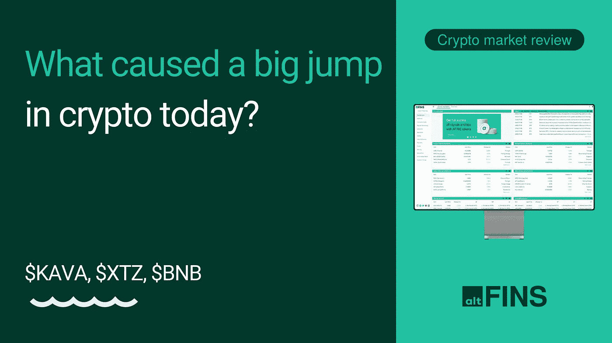

# 是什么导致了今天加密技术的巨大飞跃？

> 原文：<https://medium.com/coinmonks/what-caused-a-big-jump-in-crypto-today-e2a2abd63c48?source=collection_archive---------43----------------------->

是什么导致了今天密码价格的暴涨？。观看视频:[https://youtu.be/wzPiCyj_qqY](https://youtu.be/wzPiCyj_qqY)

主题:

1.是什么导致了今天密码价格的暴涨？
2。回顾一下我们上周的交易:卡瓦，自那以后上涨了 10%
3。回顾另外两种硬币:泰佐斯(XTZ)和币安(BNB)

是什么导致了今天密码价格的暴涨？

公布了 7 月份的最新通货膨胀数据，显示通货膨胀率有所下降

-这表明美国中央银行美联储不必像预期的那样大幅加息。

-这对包括科技股和加密货币在内的所有风险资产都是积极的

-在过去的 1-2 个月里，我们已经看到非常积极的趋势反转迹象，这种趋势很可能会继续，当然会有一些起伏

重要提示——我们明天将发布另一个**硬币选择**——我们大约每隔几周就做一次，最近的选择表现非常好，自我们的报告以来**利多上涨 108%** ， **ETH 上涨 49%** ， **Uniswap 上涨 20%** 。**我们的支持者——订阅者和霍德勒可获得这些报告，所以不要错过。**

欲了解更多信息，请访问 altFINS.com