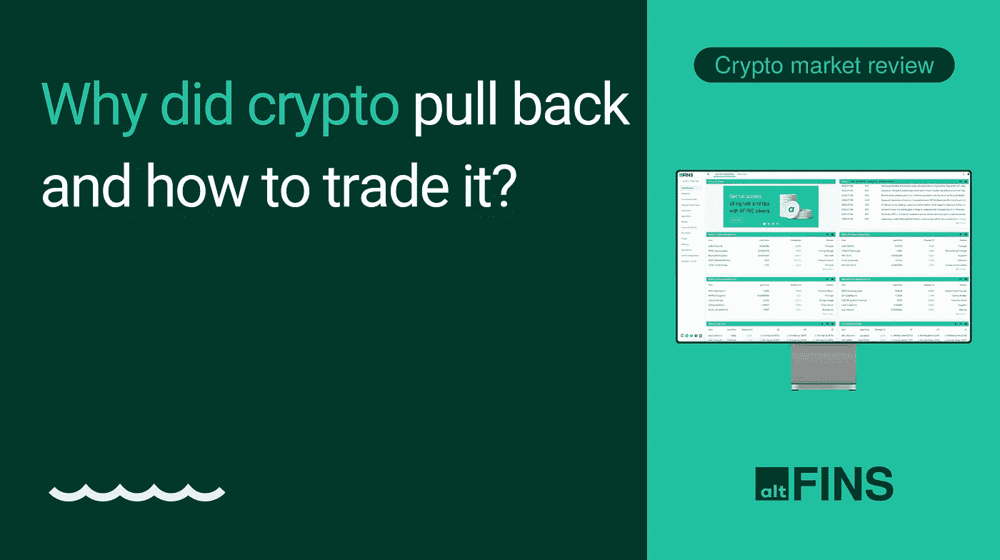

# 是什么导致了最近加密的回落，如何交易？

> 原文：<https://medium.com/coinmonks/what-caused-recent-pullback-in-crypto-and-how-to-trade-it-909a7e97496?source=collection_archive---------40----------------------->

[**看视频**](https://youtu.be/h_C5oC6oYck) **与 altFINS CEO &创始人 Richard Fetyko。**

在[视频](https://youtu.be/h_C5oC6oYck)中，他讲述了三个话题:

1.  **是什么导致了 crypto 最近的回调？**
2.  **交易渠道:FTX、利奥、KSM**
3.  **交易回调:UNI 等**

此外，上周我们在我们的平台上增加了一个很棒的部分，叫做 [**研究中心**](https://platform.altfins.com/research) **。**它有我们自己的关于具有巨大上升潜力的硬币的专有研究报告，但也有来自第三方的大图、专题报告。看看吧。

上周的加密性能下降了两位数。但请记住，我们在过去几周看到了巨大的收益，有些情况下达到了 100%。连 ETH 都从 900 美元涨到 2000 美元了！所以看到获利回吐并不奇怪。

**宏观影响:**美联储利率预期上周再次发生变化，倾向于更大幅度的加息 0.75%，而此前的预期为 0.50%。发生这种变化有两个原因:

*   美联储会议纪要于上周出台。这些是 7 月美联储会议的记录，当时利率提高了 75 个基点。
*   美联储成员詹姆斯·布拉德(James Bullard)表示，他倾向于在 9 月份加息 75 个基点，而不是 50 个基点。他是 FOMC(联邦公开市场委员会)12 名决定利率变化的成员之一。

回想一下，7 月份的 CPI 利率显示美国的通胀率从 6 月份的 9.1%下降到 7 月份的 8.5%，这让投资者希望我们已经看到了通胀的峰值，美联储将不必再积极刺激经济(即通过加息进行量化紧缩)。

*   再过 3 周，我们将于 9 月 13 日发布另一份 8 月份 CPI 数据。
*   距离下一次美联储会议决定下一次加息还有 4 周时间——那将是 9 月 21 日。
*   在此之前，可能会横盘整理。

**在** [**视频中学习**](https://youtu.be/h_C5oC6oYck) **:横盘行情如何交易？**

横盘市场非常适合摇摆交易者市场。有两条规则:在支撑附近买入，在阻力附近卖出。

在 altFINS 上找到这些交易机会的例子:

*   在[策划图](https://platform.altfins.com/curatedCharts)中:横向通道-新兴市场:FTX、利奥、KSM 的例子。
*   在[仪表盘](https://platform.altfins.com/)上:上升趋势中的回调:硬币 UNI 等的例子。

或者，摆动交易者也可以消除长期和/或增加 H2 寻找硬币，在中期基础上处于上升趋势，他们的势头再次转向看涨:BNB，QNT。

你喜欢我们的视频吗？🌙订阅、点赞&开启通知铃声:【https://www.youtube.com/c/altFINS 

> 加入 Coinmonks [电报频道](https://t.me/coincodecap)和 [Youtube 频道](https://www.youtube.com/c/coinmonks/videos)获取每日[加密新闻](http://coincodecap.com/)

# 另外，阅读

*   [折叠 App 回顾](https://coincodecap.com/fold-app-review) | [Kucoin 交易机器人](/coinmonks/kucoin-trading-bot-automate-your-trades-8cf0ca2138e0)
*   [如何匿名购买比特币](https://coincodecap.com/buy-bitcoin-anonymously) | [比特币现金钱包](https://coincodecap.com/bitcoin-cash-wallets)
*   [币安 vs FTX](https://coincodecap.com/binance-vs-ftx) | [最佳(索尔)索拉纳钱包](https://coincodecap.com/solana-wallets)
*   [比诺莫评论](https://coincodecap.com/binomo-review) | [斯多葛派 vs 3Commas vs TradeSanta](https://coincodecap.com/stoic-vs-3commas-vs-tradesanta)
*   [Capital.com 评论](https://coincodecap.com/capital-com-review) | [香港的加密借贷平台](https://coincodecap.com/crypto-lending-hong-kong)