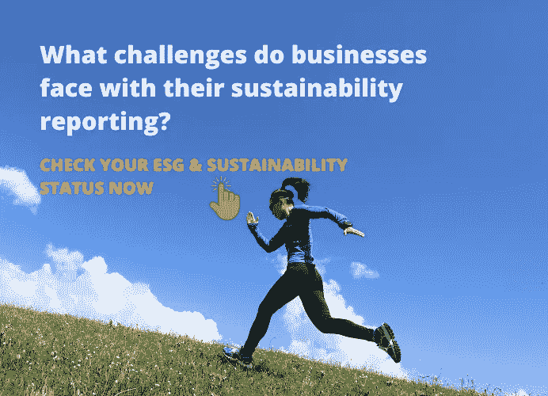

# 企业在可持续发展报告方面面临哪些挑战？

> 原文：<https://medium.com/coinmonks/what-challenges-do-businesses-face-with-their-sustainability-reporting-58db1b46ebea?source=collection_archive---------43----------------------->

> [立即查看您的 ESG &可持续发展报告状态，并在两分钟内找到您在 ESG &可持续发展报告旅程中的位置。](https://bit.ly/3cOZRPv)

[https://bit.ly/3cOZRPv](https://bit.ly/3cOZRPv)

最近，我们向客户询问了他们在 ESG 和可持续发展报告方面的挑战。他们告诉我们，不仅要通过营销和公关来讲述他们的 ESG 故事，而且还要展示利益相关方信任的全面的 ESG 和可持续发展数据，这一点变得越来越重要。

尽管 ESG 和可持续发展报告对许多企业来说是一个相对较新的工作流程，但投资者、客户和监管机构等外部利益相关者渴望获得特定格式的可比非财务数据。

我们确定了以下六个在大多数对话中重复出现的 ESG 和可持续发展报告挑战:

1.  知道遵循哪个框架
2.  规划流程
3.  收集和管理数据
4.  了解最佳实践
5.  跟上不断变化的形势
6.  不断发展的法规

通过与客户的交谈，我们想到了在我们的订阅计划中添加一个免费的 ESG 报告评估和咨询服务包。它为您当前方法的优势和劣势提供了一个独立的视图，并提供了一个逐步改进的计划。我们的高级 ESG 分析师将与您合作，了解您的优先事项，并为实现这些事项提供指导。 [**这是一项免费服务，你可以在这里了解更多。**](https://bit.ly/3TK7EyN)

此外，如果您想检查您的 ESG 和可持续发展状态，我们准备了即时 [**ESG &可持续发展评估工具**](https://bit.ly/3cOZRPv) **。**两分钟后，您将了解您在 ESG &可持续发展报告之旅中所处的位置。

或者，您可以 [**提交您的电子邮件** **来安排与我们的高级 ESG 分析师**](https://bit.ly/3x3apRX) 的通话。

#ESG #ESG 报告#碳会计#可持续发展#可持续发展报告#影响#区块链

> 交易新手？试试[加密交易机器人](/coinmonks/crypto-trading-bot-c2ffce8acb2a)或者[复制交易](/coinmonks/top-10-crypto-copy-trading-platforms-for-beginners-d0c37c7d698c)