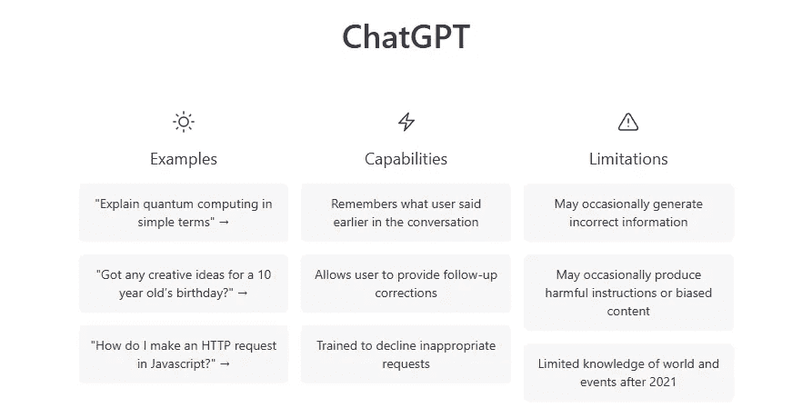

# ChatGPT 认为加密货币是一项好的投资吗？

> 原文：<https://medium.com/coinmonks/what-chatgpt-says-about-are-cryptocurrencies-a-good-investment-55e39d4a8ad2?source=collection_archive---------32----------------------->

Source photo [New Chat (openai.com)](https://chat.openai.com/chat)

像比特币和以太坊这样的加密货币，由于其作为投资的潜力和底层技术区块链，近年来获得了很多关注。但是加密货币是一种好的投资吗？答案并不简单，取决于多种因素。