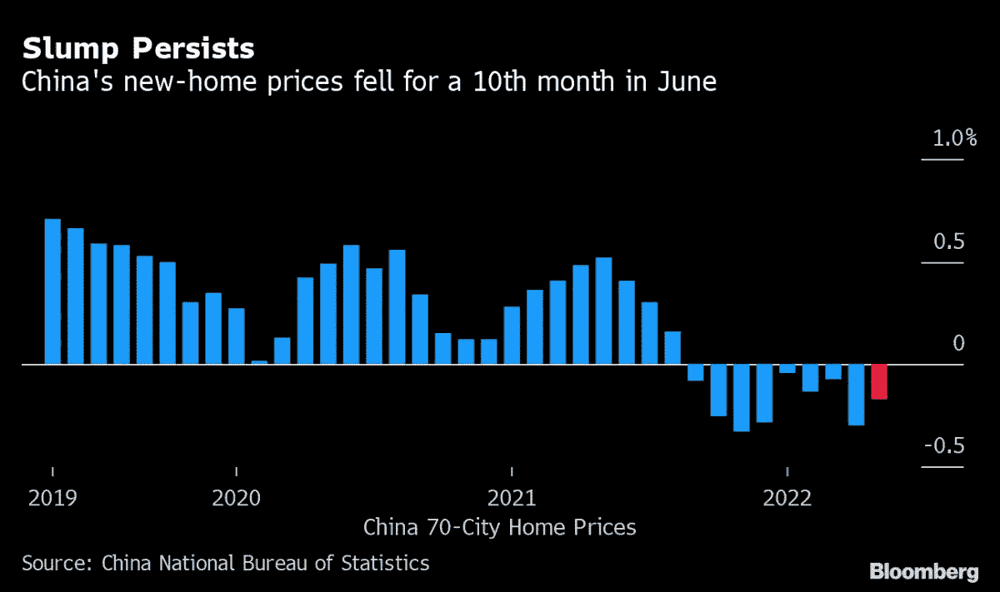
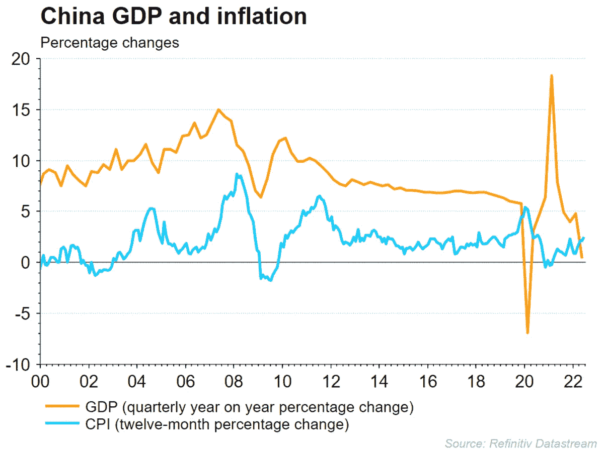
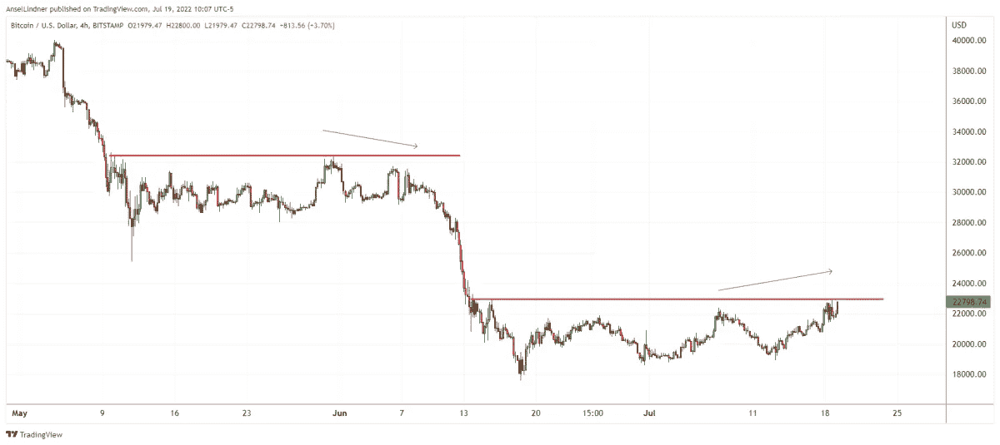
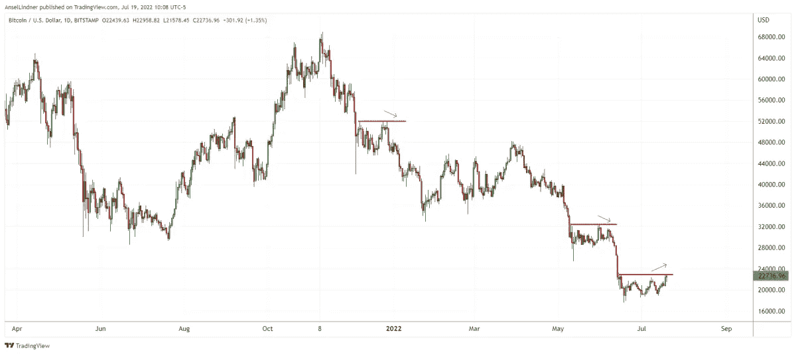
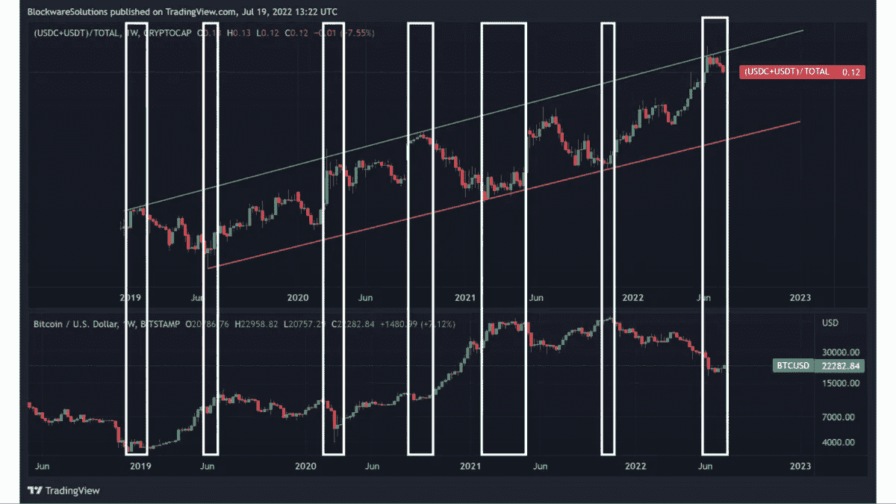
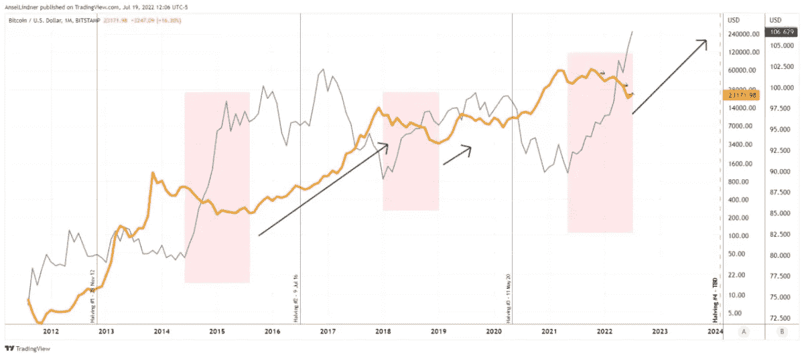
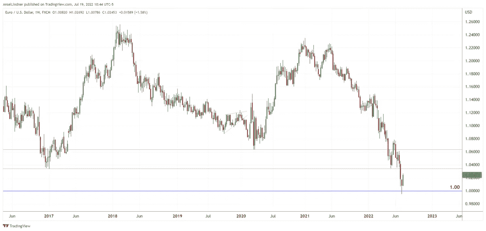

# 中国令人担忧的金融危机和美元走强对比特币意味着什么

> 原文：<https://medium.com/coinmonks/what-chinas-alarming-financial-crisis-and-a-strengthening-us-dollar-means-for-bitcoin-dc01b9962ad7?source=collection_archive---------52----------------------->

中国的银行面临资不抵债的风险，抵押贷款遭到广泛抵制。美元正在走强，并在此过程中压低比特币。

《美联储观察》是一个宏观播客，具有真实叛逆的比特币性质。在每一集里，我们都通过审视全球各地的时事来质疑主流和比特币叙事，重点是央行和货币。

听听这一集:

*   [苹果](https://podcasts.apple.com/de/podcast/the-powell-pivot-ft-dylan-leclair-fed-77/id1543640492?i=1000548375330)
*   [Spotify](https://open.spotify.com/episode/7JSYduSIGR7r3ji6bYWVI1?si=4271451ef783459d)
*   [谷歌](https://podcasts.google.com/feed/aHR0cHM6Ly9mZWR3YXRjaC5saWJzeW4uY29tL3Jzcw/episode/YmEwYjgzYWUtYzE3NS00YjNlLTlkOWQtNTFhOWY5NzQ0YjMy?sa=X&ved=0CAgQuIEEahcKEwjYxcqm_7_1AhUAAAAAHQAAAAAQLA)
*   [Libsyn](https://fedwatch.libsyn.com/the-powell-pivot-ft-dylan-leclair-fed-77)
*   [阴天](https://overcast.fm/+m2acPUM10)

在这一集里，我和克里斯蒂安·克罗勒(Christian Keroles)回顾了这一周的情况，回顾了中国金融危机的最新发展，讨论了为什么今天的法定货币应该被正确地称为基于信用的货币，以及这一事实的副作用。最后，我们深入比特币图表。

你可以点击这里或下面的[查看这一集的幻灯片。](https://docs.google.com/presentation/d/1G-1tR7QKxk1Y-xrMZ03CL8DTIcGGEEZFHhkppqxhJ9w/edit?usp=sharing)

# 中国

首先是中国经济的形势。他们正面临着房地产市场、经济和银行体系的一些重大问题。目前，前 100 名房地产开发商中有 28 家已经违约或重组债务。“抵制抵押贷款”的现象越来越严重，由于疫情、开发商的财务状况和国家的零抵押贷款政策，一些项目中未建住房单元的购买者拒绝支付抵押贷款。抵制从 20 个项目开始，现在已经增长到 235 个项目。

围绕这场抵押贷款危机的言论与美国 2007 年的言论惊人地相似。借口，如，“这是一个小数目的抵押贷款”和“影响得到控制”正在提供。

由于开发商和抵押贷款问题，中小型银行正面临偿付能力问题。中国的银行在房地产上有 9 万亿美元的敞口。如果房价持续下跌出现问题，可能会很快引发银行的偿付能力问题。事实上，这正是我们所看到的。

2022 年 6 月，中国新的单位房价连续第 10 个月下跌。

*(*[*Source*](https://assets.bwbx.io/images/users/iqjWHBFdfxIU/iZku8dpePkDQ/v0/-1x-1.png)*)*

Q2 2022 年国内生产总值暴跌至 0.4%。

*(*[*Source*](https://a.c-dn.net/c/content/dam/publicsites/igcom/uk/images/platform-article-images/GDP_AND_CPI_CHINA_150722.PNG.png)*)*

GDP 图表很好地支持了我个人的宏观预测，即主要经济体将回到全球金融危机(GFC)后的“正常状态”自 GFC 以来，中国的增长一直呈缓慢下降趋势。然后是剧烈的经济混乱和经济中的鞭梢效应，随后是增长放缓的回归。

在播客中国部分的最后，我通读了日经亚洲的一篇精彩的[文章，内容是关于最近河南省银行挤兑的情况。这篇文章强调了对银行挤兑的不当反应，以及中国爆发全面金融危机的日益增长的危险。](https://asia.nikkei.com/Opinion/China-s-debt-bomb-looks-ready-to-explode)

# 比特币图表

接下来，我们来看几张比特币图表。前两个图表强调了图表中与今天的价格走势相似的时期的相似性和差异性。我指出，目前的平盘整不同，因为它有更高的高点和更高的低点，而以前的突破尝试没有。

*(*[*Source*](https://bitcoinandmarkets.com/)*)*

*(*[*Source*](https://bitcoinandmarkets.com/)*)*

Twitter 上还有一些关于对冲基金和比特币市场现金头寸的非常有趣的观察。

库皮指出，对冲基金投资组合中持有现金的比例高于 2000 年互联网泡沫以来的任何时期。当这些峰值出现时，对冲基金转而投资股票，市场触底反弹。

我们也可以在比特币市场看到这种效应。

*(*[*Source*](https://twitter.com/WClementeIII/status/1549385599609618436?s=20&t=yHeADV-sZ92gAcAb7lqBLA)*)*

这张图有点忙，但上面的面板是“稳定币优势”，我称之为稳定币市值和比特币市值之间的比率。它是比特币市场“现金头寸”的代理。底部面板是比特币价格。在稳定币比率的相对顶部，比特币价格见底，因为这些稳定币可以轮流购买比特币，反之亦然。

# 美元

人们一直在谈论美元走强。我们是过去两年中唯一明确呼吁强势美元的比特币播客，天哪，我们在这一点上是对的。

我预计美元在抛物线式上涨后不会大幅抛售，但会建立一个新的更高区间，可能在美元指数(DXY)的 100-115 之间。

我强调，比特币不需要疲软的美元来飙升。事实上，如果你看看用 DXY 绘制的比特币历史，你会发现美元确立了比特币抛售的新的更高区间。在美元上涨一段时间后，比特币往往会起飞。我没有准备在直播期间展示这一点的图表，但它包括在下面。

*(*[*Source*](https://bitcoinandmarkets.com/)*)*

粉色区域表示美元上涨和比特币下跌的时期。黑色箭头表明，在美元稳定的情况下，比特币在更高的范围内上涨。值得注意的是，比特币和美元在过去 10 年里都呈阶梯式上涨，只是时间表略有不同。

最后，我们来看看欧元，并讨论它是如何以及为什么在主要货币中处于困境。我们多次提到碎片风险。最近，我做了一集关于这个话题的播客。

*(*[*Source*](https://bitcoinandmarkets.com/)*)*

请查看 YouTube 上的[美联储观看剪辑](https://www.youtube.com/channel/UCys2N5ZksgYc4gUDt4u9oQA)频道，订阅并分享。

*这是安塞尔·林德纳的客座博文。表达的观点完全是他们自己的，并不一定反映 BTC 公司或比特币杂志的观点。*

*原载于 2022 年 7 月 22 日 https://bitcoinmagazine.com**[*。*](https://bitcoinmagazine.com/markets/chinas-financial-crisis-us-dollar-strength-and-bitcoin)*

> *交易新手？尝试[加密交易机器人](/coinmonks/crypto-trading-bot-c2ffce8acb2a)或[复制交易](/coinmonks/top-10-crypto-copy-trading-platforms-for-beginners-d0c37c7d698c)*