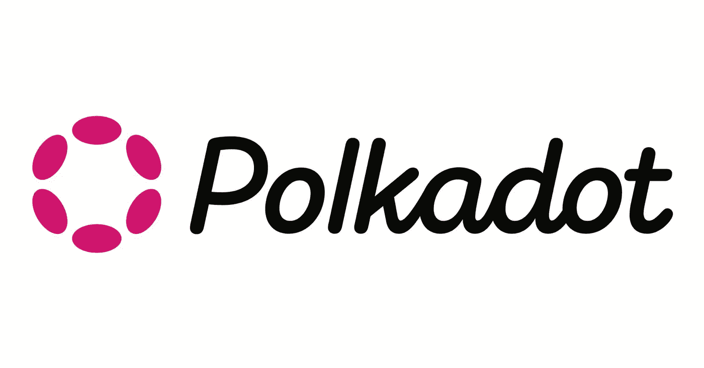
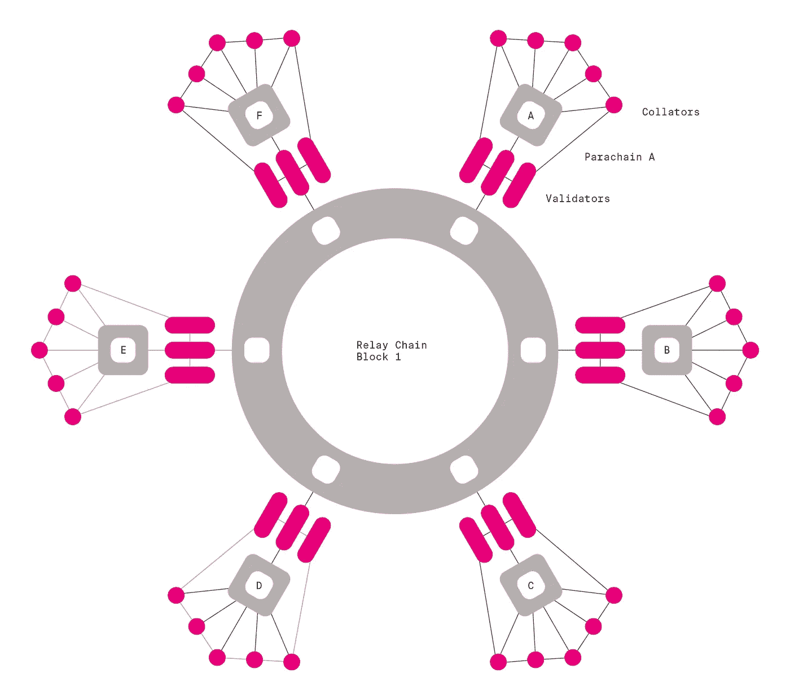
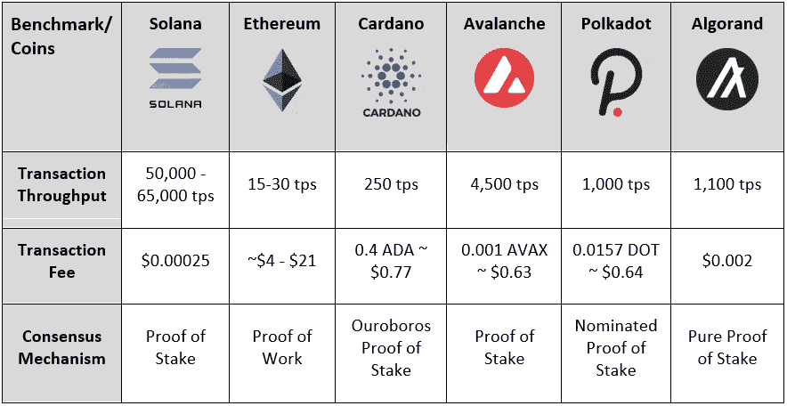
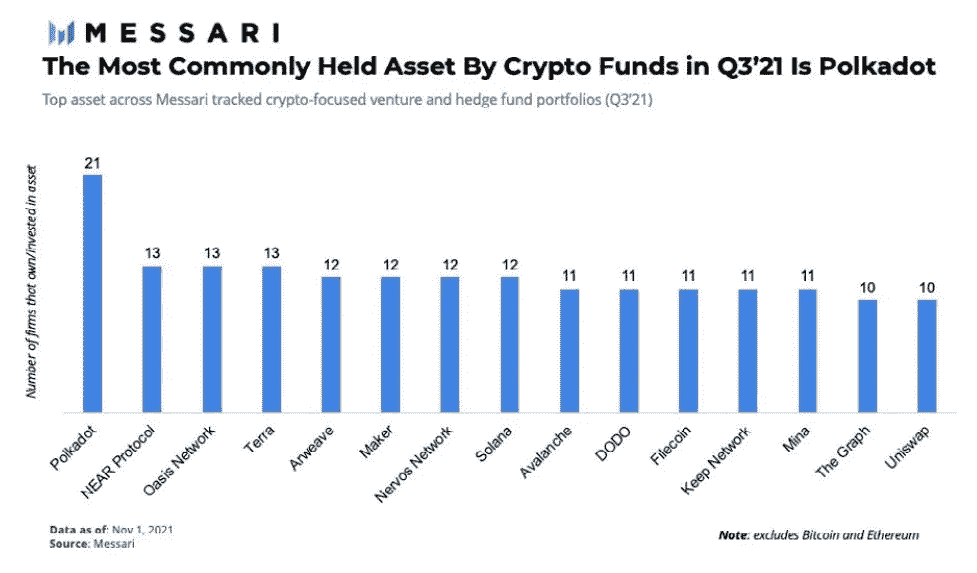

# 在熊市期间，我会积累什么硬币？(波尔卡多特)

> 原文：<https://medium.com/coinmonks/what-coins-will-i-be-accumulating-during-the-bear-market-polkadot-480bd3b69b2a?source=collection_archive---------20----------------------->

在这一系列文章中，我将讨论一些我正在考虑在未来几周和几个月内积累的加密货币的优缺点。我将以一种适合密码领域新手的方式来讨论每一个令牌，并且我会让每个人都尽可能容易地理解我想要表达的观点。我目前没有持有任何提到的代币，写这些文章是我的过程的一部分，当牛市开始时，我会决定什么是我认为回报最好的代币。

我要评估的第一个令牌是 Polkadots 的本地令牌(DOT)。Polkadot 是第一层区块链，旨在通过在其区块链生态系统中获得尽可能多的顶级项目和开发者来与以太坊和索拉纳竞争。我将评估项目的基本原理、象征经济学以及项目在未来的潜力。这并不是为了兜售所讨论的任何令牌，而是为了让您对项目的当前状态以及它们是否是可行的投资有一个公平的反映。

# **基础知识**

Gavin Wood co-founder of Polkadot

1.  加文·伍德

说到加密行业的佼佼者，没有比加文·伍德更好的了。他的履历中有很多成就，其中最大的成就是他是以太坊的联合创始人之一。

最重要的是，很明显，他知道密码领域的发展方向，他熟知的一个领域是未来法规的影响。加文投入了大量时间和精力来了解监管机构在试图取缔特定加密货币时在寻找什么。这意味着 Polkadot 将在相当长的一段时间内不受监管机构的控制，这对潜在投资者来说无疑是一个利好消息。

2.波尔卡多特生态系统的基础设施

Polkadot 的基础设施在运行方式上非常独特。它使用副链实现其智能合约功能，所有这些副链都链接到一个中继链，以确保生态系统的安全。

Image shows how the Polkadot parachains link into the relay chain

接力链由 300 个验证者和 27，000 个提名者保护。要成为一个验证者，你必须拥有 180 万个点，这大约相当于今天的 1200 万美元。这意味着验证者必须为特权付出高昂的代价，任何验证者的不良表现都将导致他们被移除。我相信这对 Polkadot 来说是积极的，因为它强制验证器在保护区块链时尽可能地做好工作，以便让它们在 Polkadot 生态系统中锁定它们的令牌时获得回报。

3.交易速度

在比较第 1 层项目时，要考虑的最重要的方面之一是它每秒可以执行多少事务。Polkadots 目前的速度是每秒 1000 次交易。乍一看，这可能听起来令人印象深刻，但当你看其他第 1 层时，这实际上是非常平均的。

Comparison of Layer 1 transactions per second

尽管比以太坊更快，但很明显，许多其他第 1 层在处理事务时具有更强的能力。Polkadot 将需要在未来缩小与其他第 1 层的差距，因为 TPS 是未来开发者和项目在决定与区块链合作时将考虑的一个关键指标。

4.点标记的使用案例

不幸的是，这是波尔卡多特基本原则中让我担心的一个方面。目前，交易费用不需要点令牌，并且所有的副链都不依赖于点来运行。就目前的情况而言，DOT 的唯一用途是作为验证者/提名者，以及在副链租赁提供(PLO)期间，副链在生态系统中获得一个位置。随着时间的推移，这种拍卖很可能会减少，这意味着 DOT 的用例将变得更加不明显，这是 Polkadot 团队需要解决的问题。

当加密货币投机时代结束时，代币的价格将由其需求和供应决定。如果 DOT 不是为了运行生态系统而被烧毁，那么它不太可能变得更加稀缺，这将对令牌的价格产生不利影响。从短期来看，上述问题不太可能成为主要问题，但从长期来看，它肯定会发挥作用。

# **记号组学**

1.  赌注奖励

目前，Polkadot 提供了一个健康的 15%的 APY，用于将你的代币作为验证者/提名者。这对于散户和机构投资者来说肯定有足够的吸引力来购买和持有他们的点令牌，从长远来看，如果公开市场上交易的点令牌减少，可能会造成供应冲击。

然而，Polkadot 的一些主要竞争对手确实提供了更好的赌注激励。Polkadot 的主要竞争对手 Atom 提供了超过 17%的赌注回报。尽管 2%听起来不是一个很大的交易，但它肯定会成为投资者决定购买哪种硬币的一个因素，并可能导致其他第一层从 Polkadot 那里拿走大量投资。

2.循环供应

Polkadot 目前的流通供应量在 11 亿左右，最高供应量为 12 亿。这可以被视为 Polkadot 的一个重大利好，因为它表明很少有令牌发布，这通常会导致价格下降，因为更多的令牌涌入市场。除此之外，55%的点代币被下注，15%的代币被锁定在副链中，这意味着只有 30%的代币仍可在公开市场上交易。随着进一步的采用和需求的增加，DOT 可能会成为一种稀缺资产，这对长期投资者来说是非常有益的。

然而，有一点被忽略了，那就是 DOT 是一种通胀资产，这可能会让投资者感到不快，他们倾向于青睐以太坊等通缩资产。尽管波尔卡多特利用通货膨胀来改善其生态系统，但如果对波尔卡多特的需求开始枯竭，那么市场上代币的增加肯定会导致价格下跌。

> 交易新手？试试[加密交易机器人](/coinmonks/crypto-trading-bot-c2ffce8acb2a)或者[复制交易](/coinmonks/top-10-crypto-copy-trading-platforms-for-beginners-d0c37c7d698c)

此外，在评估鲸鱼钱包持有代币的比例时，波尔卡多特的数字并不令人满意。DOT 超过 50%的流通供应量由 25 个钱包持有。这可能会引起投资者的关注，因为 DOT 的价格行为最终是由这些钱包决定的。如果其中一些钱包决定出售，那么 DOT 可能会看到价格大幅下跌。不过应该注意的是，这是许多顶层 1 项目的问题，并不仅仅是 Polkadot 的问题。

# **展望未来**

1.  秘密基金

没有人能够在生活的任何方面预测未来，但加密货币肯定是试图预测未来几乎不可能的领域。然而，由该领域专家管理的加密基金，肯定可以让我们一窥那些知情人士眼中未来最有潜力的硬币。DOT 是加密基金持有的第三大加密货币，仅次于以太坊和比特币。这表明大玩家认为波尔卡多特是一个长期持有的好赌注。这些专家并不总是正确的，但它展示了波尔卡多特的潜力。

Polkadot leading the way by some margin, as one of the most commonly held assets by Crypto Funds

2.其他未来积极因素

许多令人兴奋的项目正在进入 Polkadot 生态系统。2022 年 3 月，金恩发射了一个降落伞，将大约 50 万人带上了波尔卡多特系统。除此之外，引人注目的项目，如 Project Liberty(社交媒体平台)和 Klatyn 的元宇宙连锁店，正在寻求使用 Polkadot 作为启动其项目的平台。很明显，Polkadot 正在继续发展，这对于任何第 1 层的成功发展都是至关重要的。

每个人都在谈论的一个话题是气候变化问题。我相信表现出环保意愿的加密货币将有更好的机会维持其未来的发展。Polkadot 似乎在这一领域处于领先地位，因为加密碳评级机构的一份报告发现，dot 的碳足迹是所有加密技术中最低的。如果 DOT 能够保持这一信念，那么对于未来的主要机构来说，这肯定会是一个有吸引力的提议。

3.采用

采用对于任何加密货币的生存都至关重要。到目前为止，DOT 的采用还不像它与之竞争的其他一些第 1 层那样成功。到目前为止，大多数 Polkadot 的采用都是基于中国，这表明第 1 层一直在努力获得其他地方的采用。要让波尔卡多特指数级增长，这需要改变。此外，由于中国的加密方法不稳定，它不是最安全的地方之一。更广泛的采用基础将更加有益，因为如果中国开始进一步压制加密空间，这将增加风险。

# **结论**

Polkadot 肯定是一个我会密切关注的项目。它有很大的潜力，并得到了 crypto 领域最令人印象深刻的团队之一的支持。第一层空间竞争非常激烈，Polkadot 需要证明它提供了其他第一层所不能提供的“额外”东西。

我投资 DOT 的决定将归结为是否有其他第 1 层具有更好的基本面和更有吸引力的市值。Polkadot 目前的市值为 84 亿美元，远远高于其他一级项目。这确实意味着它的增长可能会更少，但它肯定是一个比低市值项目更安全的赌注，这可以非常令人放心。