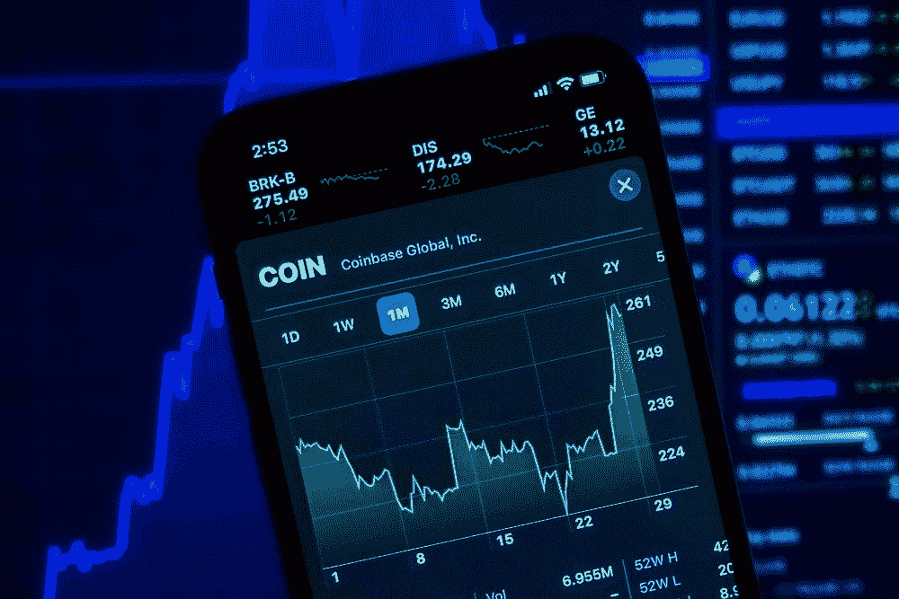
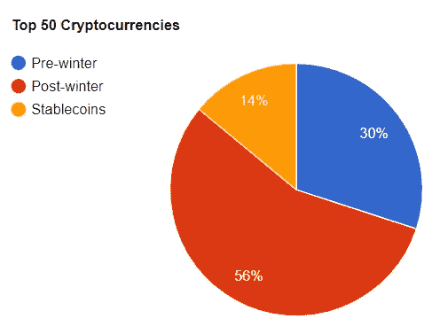

# 哪些加密货币熬过了上一个加密冬天？

> 原文：<https://medium.com/coinmonks/what-cryptocurrencies-survived-the-last-crypto-winter-d54e27f82605?source=collection_archive---------26----------------------->

## 快速浏览今天的 50 大硬币

> *本文有* [*产品*](https://shop.trezor.io/product/shamir-hodl-pack?offer_id=105&aff_id=31646&source=https://medium.com/coinmonks/what-cryptocurrencies-survived-the-last-crypto-winter-d54e27f82605) *的附属链接。我们可能会收到通过这些链接购买的佣金，以帮助支持我们的运营。*

> “历史不会重演，但它经常押韵”——马克·吐温。

好吧，我们又开始了。我们又一次处于隐秘的冬天的中期或初期。

随着加密冬天的到来，恐惧、不确定性和怀疑也随之而来，这可能会导致一些人质疑他们的投资(好吧，我确实是这样做的:()。

因此，为了减轻你的一些焦虑，我浏览了今天的前 50 种货币，看看它们中的哪一种在上次秘密冬天之前就存在并幸存了下来。

放心，这个方法很科学/s。

> 声明:这不是财务建议，仅供娱乐。

为了全面披露，以下是我用来评定/取消货币资格的标准:

*   硬币在 2017 年或之前发行并被追踪
*   今天(2022 年 7 月 8 日)必须在前 50 种货币中
*   Stablecoins 会自动排除。
*   排名纯粹是基于目前的市值。
*   包裹的硬币也被自动排除。

# 比特币(BTC)

*   于 2009 年推出
*   2021 年抵达 ATH

还有比比特币更好的加密货币熬过加密寒冬的例子吗？自 2009 年推出以来，它从未离开过市值第一的位置。

# 以太坊

*   于 2015 年推出
*   2021 年抵达 ATH
*   市值排名:1

下一个是以太坊，推广智能合约的[区块链](https://www.gemini.com/cryptopedia/crypto-smart-contracts-explained#section-ethereum-the-first-mover)一直在五大加密货币中占据一席之地。目前，它一直处于第二的位置，没有下降的迹象。

# 币安硬币(BNB)

*   2017 年推出
*   2021 年抵达 ATH
*   市值排名:5

以太坊的浪子 BNB[也一直在十大加密货币中占据一席之地，因为它是由最大的加密交易所之一币安发行的。](https://www.investopedia.com/terms/b/binance-coin-bnb.asp#:~:text=BNB%20was%20initially%20based%20on,own%20blockchain%2C%20the%20Binance%20chain.)

> 交易新手？尝试[加密交易机器人](/coinmonks/crypto-trading-bot-c2ffce8acb2a)或[复制交易](/coinmonks/top-10-crypto-copy-trading-platforms-for-beginners-d0c37c7d698c)

# 瑞波(XRP)

*   于 2012 年推出
*   2018 年到达 ATH
*   市值排名:7

尽管在 2020 年被 SEC 起诉，但 Ripple (XRP)一直保持着较高的排名，特别是前 10 名。

# 卡尔达诺

*   2017 年推出
*   2021 年抵达 ATH
*   市值排名:8

Cardano (ADA)，由以太坊联合创始人 Charles Hoskinson 创建的区块链，以及最大的使用股权证明区块链的加密货币，该加密货币被视为工作证明协议的绿色替代方案。

# Dogecoin (DOGE)

*   于 2013 年推出
*   2021 年抵达 ATH
*   市值排名:10

多亏了埃隆马斯克(Elon Musk)，世界上最大的迷因币 DOGE coin(DOGE coin)成功跻身前 10 名，尽管最初被用来取笑比特币和其他加密货币。

> [> > HODL 度过了与特雷佐·沙米尔·HODL 的秘密冬天< <](https://shop.trezor.io/product/shamir-hodl-pack?offer_id=105&aff_id=31646&source=https://medium.com/coinmonks/what-cryptocurrencies-survived-the-last-crypto-winter-d54e27f82605)

# 莱特币

*   于 2011 年推出
*   2021 年抵达 ATH
*   市值排名:20

作为比特币衍生产品的 [OG altcoin](https://en.wikipedia.org/wiki/Litecoin) 莱特币(Litecoin)出人意料地获得了相对较高的排名。

# 链环(链环)

*   2017 年推出
*   2021 年抵达 ATH
*   市值排名:23

Chainlink(链接)，[甲骨文区块链顶级](https://www.altcoinbuzz.io/cryptocurrency-news/top-5-blockchain-oracles-by-market-cap/#:~:text=Chainlink%20(LINK),of%20massive%20growth%20for%20%23Chainlink.)之一，自 2017 年上线以来排名持续靠前。

# 恒星(XLM)

*   于 2014 年推出
*   2018 年到达 ATH
*   市值排名:24

尽管无法在 2019 年达到其 ATH，但最新的牛市 Stellar (XLM)仍保持在加密货币的前 30 位。

> [>](https://shop.trezor.io/product/shamir-hodl-pack?offer_id=105&aff_id=31646&source=https://medium.com/coinmonks/what-cryptocurrencies-survived-the-last-crypto-winter-d54e27f82605)

# 莫内罗(XMR)

*   于 2014 年推出
*   2021 年抵达 ATH
*   市值排名:27

专注于安全匿名交易的加密货币 Monero 虽然不再排名前十，但仍有望在 2021 年实现 ATH。

# 以太坊经典(等)

*   于 2015 年推出
*   2021 年抵达 ATH
*   市值排名:29

以太坊经典赛(ETC)在 2015 年经历了一次艰难的分叉后，虽然没有以太坊那么大，但仍然进入了前 30 名，并在 2021 年达到了 ATH。

# 比特币现金(BTC)

*   2017 年推出
*   2021 年抵达 ATH
*   市值排名:30

另一种从硬分叉中诞生的硬币，比特币现金，于 2017 年从比特币中分离出来，并于 2021 年成功达到 ATH。

# Filecoin

*   2017 年推出
*   2021 年抵达 ATH
*   市值排名:39

名单上的第一个去中心化存储网络 Filecoin (FIL)拥有 2021 年最大的初始 coin 发行之一，并在 2021 年达到 ATH。

# 制造商(MKR)

*   2017 年推出
*   2021 年抵达 ATH
*   市值排名:48

Maker (MKR)是一个基于以太坊的 Defi 网络，于 2017 年发布，发展势头强劲，甚至在 2021 年达到了 ATH。

> [> > HODL 度过了与特雷佐·沙米尔·HODL 的秘密冬天< <](https://shop.trezor.io/product/shamir-hodl-pack?offer_id=105&aff_id=31646&source=https://medium.com/coinmonks/what-cryptocurrencies-survived-the-last-crypto-winter-d54e27f82605)

# 兹卡什(ZEC)

*   2016 年推出
*   2018 年到达 ATH
*   市值排名:50

尽管与比特币有相似之处，但 Zcash (ZEC)在 2018 年达到了 ATH，但此后一直相对稳定。

# 调查结果和结论

Data Acquired from [Coinmarketcap](https://coinmarketcap.com/) on July 8, 2022

你有它；在今天排名前 50 的加密货币中，有 15 种可以被认为是上一个加密冬天的幸存者。

在这 15 个幸存者中，大多数在最后一轮牛市中到达了他们的 ATH。

## 这是什么意思？

嗯，我不是数据分析师什么的，但听起来有 30%的生存机会。如果你把它想象成彩票，30%一点也不差。

此外，根据分析，如果硬币幸存下来，它很有可能在下一轮牛市中到达 ATH。

> 这不是一个先令的职位。这个列表纯粹基于每枚硬币满足其历史数据中特定标准的能力。
> 
> [>>【HODL 穿越密码冬】与特雷佐·沙米尔·HODL 一起打包< <](https://shop.trezor.io/product/shamir-hodl-pack?offer_id=105&aff_id=31646&source=https://medium.com/coinmonks/what-cryptocurrencies-survived-the-last-crypto-winter-d54e27f82605)