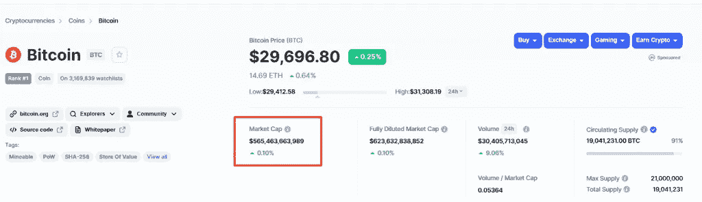

# 2022 年投资什么加密货币

> 原文：<https://medium.com/coinmonks/what-cryptocurrency-to-invest-in-2022-5fa347da78b0?source=collection_archive---------42----------------------->

**如何选择加密货币进行投资**

你可以通过技术和基本面分析来评估一种加密货币的投资价值。以下是它们的不同之处。

**基本面分析**

在基本面分析中，你需要深入研究这个主题。也就是说，您需要考虑关于资产的所有可用信息，以了解它是如何工作的。比如研究加密货币的财务，用户群体。你也可以研究一份包含项目技术和计划的技术文档。

通过基本面分析，你可以了解一项资产是被高估了还是被低估了。以以太坊为例。大多数分散式金融项目都在区块链上运行。假设 DeFi 会增长，就可以假设以太坊未来的价值会上升。

**技术分析**

技术分析考察一项资产的价值是如何变化的，以及随着时间的推移交易了多少。crypto 是上升还是下降？人们是投资还是把钱拿走？什么事件影响价格波动等等。

技术分析重在数字。它假设:市场已经将所有已知信息纳入加密货币的当前价格和销量。由于当前的价格显示了供求关系，资产的价格应该能让你了解公众现在的感受。这就是交易者预测趋势和做出投资决定的方式。

**投资哪种加密货币**

选择好的加密货币不像选择好的股票。股票赋予了一家公司的所有权，这家公司为其股东创造了利润，或者至少有潜力这样做。拥有加密货币意味着拥有内在价值为零的数字资产。

以下是 10 种最值得投资的加密货币:

比特币(BTC)是第一种也是最受欢迎的加密货币。其资本总额超过 5000 亿美元。比特币已经成为交易者的加密货币，但将其作为长期投资更有利可图。它的价格非常不稳定，例如，在 5 月 12 日它值 2.6 万美元，现在它值 3 万美元左右。2009 年，比特币一文不值，2011 年，它的价值还不到 30 美元，11 年后，它已经增长了 1000 倍。

Bitcoin capitalization. Source: CoinMarketCap

以太坊(ETH)是比特币最受欢迎的替代品。以太坊的资本超过 2000 亿美元，旨在创建一套分散的金融产品，世界上任何人都可以自由访问，无论国籍、种族或信仰如何。Vitalik Buterin 于 2015 年启动了该项目，以赋予比特币权力。

Ethereum capitalization. Source: CoinMarketCap

Litecoin 是由前谷歌工程师查理·李于 2011 年推出的。加密货币跟随了比特币的脚步，即它使用工作证明算法来确认交易。但是，与第一种加密货币不同，莱特币处理交易的速度更快。莱特币的市值约为 50 亿美元。

Litecoin capitalization. Source: CoinMarketCap

Ripple (XRP)是一种提供低交易费用和快速交易的令牌。发行 XRP 的公司与金融机构合作。它本质上是一个即时生效的资金转移网络，从而降低了汇率。它的技术被银行用来提高工作效率。在 Ripple 之前，他们必须通过中介来工作。它们非常昂贵，交易需要几天才能完成。XRP 的资本超过 200 亿美元。

XRP capitalization. Source: CoinMarketCap

美元硬币(USDC)是一种稳定的货币，因为它的价格与美元的价值挂钩。它由美国金融机构独立账户中持有的美元计价资产提供支持。USDC 以以太坊为基础，可以用于世界各地的交易。美元硬币的总价值超过 500 亿美元。

USDC capitalization. Source: CoinMarketCap

USDT 是一种稳定的硬币，其价格由法定货币支持。可以是英镑、美元或欧元。假设，硬币保留了等于这些面值之一的价值。所以系绳的价格应该是可以预测的。这就是害怕加密货币价格不稳定的投资者选择它的原因。USDT 的资本总额超过 750 亿美元。

USDT capitalization. Source: CoinMarketCap

Dogecoin (DOGE)是价格受到伊隆·马斯克行动影响的硬币之一。例如，当他决定购买 Twitter 时，硬币的价值增加了 30%。Dogecoin 是由两位软件工程师比利·马库斯和杰克逊·帕尔默在 2013 年创建的。评论加密货币市场的疯狂投机简直是个笑话。这种硬币现在被达拉斯小牛队、克罗诺斯、SpaceX 等公司接受支付。Dogecoin 的资本总额超过 110 亿美元。

Dogecoin capitalization. Source: CoinMarketCap

SHIB 是最有前景的加密货币之一。与硬币相关的最大事件是柴犬元村的宣布，人们将能够在那里购买柴犬土地上的小块土地。因此，加密货币将会升值。这枚硬币的总价值超过 60 亿美元。

Capitalization of Shiba Inu. Source: CoinMarketCap

币安硬币(BNB)是币安加密货币交易所支持的加密货币。有了 BNB，用户在交易所支付更低的费用。该令牌还被用于馈送币安链和币安智能链，两个独立的区块链网络。币安焚烧 BNB 代币以减少总发行量。这可能会提高代币的价格。

Capitalization of Binance Coin. Source: CoinMarketCap

比特币现金(BCH)是比特币的变体。这枚硬币出现在 2017 年 8 月，当时第一种加密货币的区块链分支。比特币现金针对的是点对点在线交易。它旨在让加密货币支付变得简单而廉价。如果加密货币市场增长，比特币将越来越不适合常规交易。那样的话，就换成比特币现金了。所以是投资的合理选择。硬币的资本化大约是 40 亿美元。

Bitcoin Cash capitalization. Source: CoinMarketCap

> 交易新手？试试[加密交易机器人](/coinmonks/crypto-trading-bot-c2ffce8acb2a)或者[复制交易](/coinmonks/top-10-crypto-copy-trading-platforms-for-beginners-d0c37c7d698c)