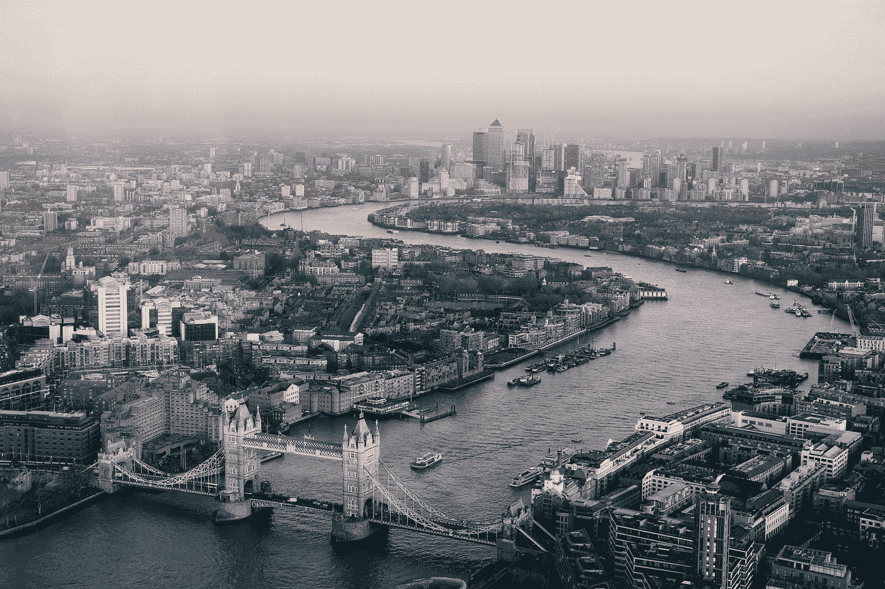

# 英格兰银行刚刚做了什么？

> 原文：<https://medium.com/coinmonks/what-did-the-bank-of-england-just-do-3f08565f2b32?source=collection_archive---------36----------------------->

Photo by [Benjamin Davies](https://unsplash.com/@bendavisual?utm_source=medium&utm_medium=referral) on [Unsplash](https://unsplash.com?utm_source=medium&utm_medium=referral)

当通货膨胀率很高，美国中央银行已经提高利率来抑制通货膨胀的加速，英国银行会迫不及待地再次实行量化宽松(QE)政策吗？！