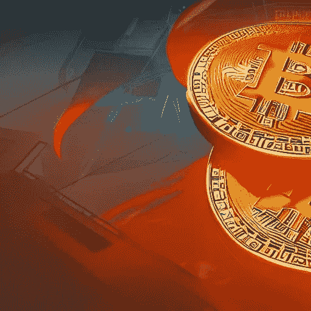

# 美国国税局在其 2022–2023 年优先指导计划中包括了哪些数字资产优先事项？

> 原文：<https://medium.com/coinmonks/what-digital-asset-priorities-did-the-irs-include-in-its-2022-2023-priority-guidance-plan-f7db4d4671ea?source=collection_archive---------45----------------------->

*tldr:2022–2023 IRS 指导计划包括五个“数字资产”指导项目:两个与税务处理有关，三个与经纪人报告要求有关。*

Image created with [https://creator.nightcafe.studio/](https://creator.nightcafe.studio/)

The[2022–2023 国税局优先指导计划](https://www.irs.gov/pub/irs-utl/2022-2023-pgp-initial.pdf)包含 205 个指导项目，这些项目是从 2022 年 7 月 1 日到 2023 年 6 月 30 日分配财政部和国税局资源的优先事项。[【1】](#_ftn1)“指导计划”通过法规、税收规则、税收程序、通知和其他公布的行政指导来确定和优先处理税务问题。

## 这些 2022–2023 年的指导项目中有五个与“数字资产”相关:

> **一般税务问题#** 30。涉及数字资产交易的税务处理指南。[【2】](#_ftn2)
> 
> **一般税务问题#** 31。关于数字资产交易验证的指南，包括标桩。[【3】](#_ftn3)
> 
> **税务管理(发行)#** 3 .6045 下关于数字资产信息报告的规定。[【4】](#_ftn4)
> 
> **税务总局(问题)#** 4。《基础设施投资和就业法案》修订的第 6045A 条中关于转让报告和数字资产的规定。[【5】](#_ftn5)
> 
> **税务总局(发布)#** 5。《基础设施投资和就业法案》修订的 6050I 下的法规，涉及数字资产交易的信息报告。[【6】](#_ftn6)

Image created with [https://creator.nightcafe.studio/](https://creator.nightcafe.studio/)

# **分析**

看到一般税收问题被列在国税局一般税收优先事项的最后一位，我并不感到惊讶。最终，从税务处理的角度来看，性格问题更容易解决。这一切都归结为“人物塑造”。如果美国国税局知道如何描述一项交易的特征，它就知道该如何对待这项交易。唯一不同的税率适用于收益或订单的损失扣除。

同样不足为奇的是税务管理问题#3、#4 和#5，它们与基础设施投资和就业法案对数字资产经纪人的修订有关。这些修正案在很大程度上被证明是把本已模糊的监管环境的水搅浑了。修正案语言中最令人担忧的方面是 IRC 6045(d)中对“任何(出于考虑)负责代表他人提供实现数字资产转移的任何服务的人”的经纪人报告要求的强制规定对这一条款最简单的监管清理，应该把区块链的矿工和股东排除在外。重点应该放在排除参与*真正分散的*服务的人员。[【8】](#_ftn8)

Image created with [https://creator.nightcafe.studio/](https://creator.nightcafe.studio/)

# **补充说明**

还有另外三个 IRS 优先指导项目与“数字商品”和“货币”相关，值得注意:

> **(国际)c .对外交易。(问题)#3。**提议修改 987 下关于 987 合格业务单位的收入和货币损益的法规。最终规定于 2016 年 12 月 8 日公布。通知 2021–59(提供了关于最终法规适用日期的指南，超出了早期通知中的规定)于 2021 年 10 月 25 日发布。[【9】](#_ftn9)
> 
> **(国际)f .采购和费用分配。(问题)#1。**861 下的法规，包括涉及知识产权和提供数字商品和服务的交易中产生的收入的性质和来源。拟议的法规于 2019 年 8 月 14 日公布。[【10】](#_ftn10)
> 
> **(国际)g .其他。(问题)#2** 。关于某些外币合同的条例，包括第 1256(g)(2)条下的外币合同的定义，根据 Wright 诉专员案的裁决，809 F.3d 877(第六巡回法庭)。2016).2012 年 7 月 6 日在法国以注册号 130675–17(NPRM)发布(2012 年 7 月 5 日发布)。[【11】](#_ftn11)

对于数字资产参与者来说，上述三个指导优先事项是无关紧要且争议较少的监管领域。然而，区块链行业的参与者应该知道，美国国税局正在更密切地关注“数字商品”和“货币”的监管。

## 引文

[【纳税人第一幕】，Pub。l . 116–25，133 统计。981](https://www.congress.gov/116/plaws/publ25/PLAW-116publ25.pdf)；*参见* [国内税收署 2022–2023 年优先指导计划](https://www.irs.gov/pub/irs-utl/2022-2023-pgp-initial.pdf)(注意指导计划没有提供完成项目的任何截止日期)；*另请参见* [IRS 通知 2022–21](https://www.irs.gov/pub/irs-drop/n-22-21.pdf)(描述财政部(Treasury Department)和国税局(IRS)如何每年征求建议以纳入下一年的优先指导计划)；

[【2】](#_ftnref2)*同上。*10 点。

*同上。*在 10。

*同前。*在 17； [26 美国法典 6045](https://www.law.cornell.edu/uscode/text/26/6045) —经纪人的回报；[26 CFR 1.6045–1](https://www.law.cornell.edu/cfr/text/26/1.6045-1)—经纪人和易货交易信息的返回；[26 CFR 1.6045](https://www.law.cornell.edu/cfr/text/26/1.6045-2)–2——提供与某些替代付款相关的声明；[26 CFR 1.6045–3](https://www.law.cornell.edu/cfr/text/26/1.6045-3)—获得控制权或资本结构重大变化的信息报告；请注意下一节。在[26 CFR 1.6045–4](https://www.law.cornell.edu/cfr/text/26/1.6045-4)中颁布了与房地产交易相关的 6045 条例，在[26 CFR 1.6045–5](https://www.law.cornell.edu/cfr/text/26/1.6045-5)中颁布了与支付律师费用相关的 6045 条例，但未提及数字资产问题。

【5】*Id。*17 时； [26 美国法典 6045A](https://www.law.cornell.edu/uscode/text/26/6045A) —向经纪人转让相关证券所需的信息；[26 CFR 1.6045 a-1](https://www.law.cornell.edu/cfr/text/26/1.6045A-1)——证券转让所需信息声明。

*Id。*在 17； [26 美国法典 6050I](https://www.law.cornell.edu/uscode/text/26/6050I) —与贸易或业务中收到的现金等相关的回报； [26 CFR 1.6050I-1](https://www.law.cornell.edu/cfr/text/26/1.6050I-1) —与在交易或业务中收到的超过 10，000 美元的现金相关的回报；请注意，26 CFR 1.6050I-0 是一个目录，26 CFR 1.6050I-2 与法院书记员收取的超过 10，000 美元的保释金相关，不涉及数字资产问题。

[【7】](#_ftnref7)[https://medium . com/@ Haley summers/simplizing-the-crypto-provisions-of-infra structure-bill-HR-3684-98 eab 0 F5 C2 b 2](/@haleysummers/simplifying-the-crypto-provisions-of-infrastructure-bill-hr-3684-98eab0f5c2b2)

[【8】](#_ftnref8)[https://medium . com/coin monks/ether eums-proof-of-stake-merge-and-regulatory-enforcement-why-decentralization-matters-DAE 12918 a54f](/coinmonks/ethereums-proof-of-stake-merge-and-regulatory-enforcement-why-decentralization-matters-dae12918a54f)

[【9】](#_ftnref9)*同上。*在 13； [26 美国法典 987](https://www.law.cornell.edu/uscode/text/26/987) —分行交易。

[Id。在 14；](#_ftnref10) [26 美国法典 861](https://www.law.cornell.edu/uscode/text/26/861) —来自美国境内的收入。

*Id。*在 14； [26 美国法典第 1256 章](https://www.law.cornell.edu/uscode/text/26/1256) —第 1256 节合同按市值计价。

> 交易新手？试试[加密交易机器人](/coinmonks/crypto-trading-bot-c2ffce8acb2a)或者[复制交易](/coinmonks/top-10-crypto-copy-trading-platforms-for-beginners-d0c37c7d698c)