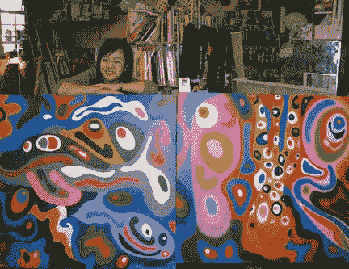

# 传统艺术家如何看待 NFTs？对话加拿大籍香港艺术家程慧敏

> 原文：<https://medium.com/coinmonks/what-do-traditional-artists-think-about-nfts-c1921ae5e2c8?source=collection_archive---------26----------------------->

作者佐伊·周

传统艺术家是为了利益还是为了观众？他们关注的是什么？加拿大-香港艺术家 Vivian Ching 博士讲述了她在版权方面的经历以及她对新兴加密市场的想法，然后分享了她如何将自己的作品带入数字领域。

Photo Credit : Vivian Ching

程慧敏博士不仅是一名商学教授，也是首位将标志性作品“眼镜”送上太空的香港和加拿大女艺术家(见下文)。她是如何获得这样一个太空飞行艺术装置的灵感的，可能需要另一个机会让 Vivian Ching 博士告诉我们——也许可以在 8 月份的香港平价艺术博览会期间在 ARTRACX 问我任何问题。你也可以在 ARTRACX 查看她的作品([点击这里](https://curator.artracx.com/artwork-listing/?aid=1713))

Glasses in space (Photo credit: Vivian Ching)

随着不可替代代币(NFT)和其他形式的加密的兴起，传统艺术家开始感到有必要抓住这一趋势，将他们的艺术数字化，以便在不断扩大的市场上竞争。最近几年已经证明了 NFTs 可以极大地提高艺术品的货币价值，并有助于艺术品的销售，让艺术家和买家“快速而轻松地致富”。总的印象是，艺术家有更容易的方式在全世界传播他们的艺术，为他们的作品增加吸引力，从而使他们的艺术增值。买家可以通过以比购买时更高的价格出售 NFT 而受益。NFT 是有价值的，因为它们以一种不可复制的方式加密，证明了作品的真实性。尽管有好处和上升趋势，但许多传统艺术家仍然犹豫不决，因为他们担心版权问题。程薇薇博士既是一位商学教授，也是一位希望拓展视野、推动艺术事业向前发展的加拿大-香港艺术家。她目前正与 ARTRACX 密切合作，整合智能芯片组和区块链技术的使用，以保护她的创作的知识产权。然而，维维安仍然对 NFTs 的数字化和加入新的“进步”市场持有许多安全相关的担忧。我在一次采访中与她交谈，她分享了她在版权方面的个人经历，并表达了她对 NFTs 的担忧，提供了一个新艺术家在加入 NFT 现场时所面临的斗争的更近的视角；特别是设定她对这些新技术如何帮助像她一样的传统艺术家的期望。

Picture Credit: Vivian Ching

薇薇安的艺术之旅可以追溯到她在弗吉尼亚大学的本科学习，当时她是大学项目委员会的主席。特别是，她有幸邀请到了心灵点滴博士在这所大学发表演讲，他是世界知名的医生，也是免费的“ [Gesundheit Institute](http://patchadams.org/) ”的创始人，这是一所美国医疗机构，它将小丑作为一种治疗方法，其开创性的做法启发了罗宾·威廉姆斯主演的好莱坞大片《心灵点滴》。在他的演讲中，有一个特别令人心酸的时刻，他展示了一个非洲村庄的一小群人兴奋地追逐着绑在帕奇卡车后面的十几个彩色气球的镜头。这些人以前从未见过气球，完全被它们的颜色和形状吓到了。彩色气球能激发如此多的希望，这真的触动了我的心。那天晚上晚些时候，帕奇问她毕业后想做什么。薇薇安梦想通过艺术为世界做出贡献。尽管当时她不知道如何实现这一梦想，因为她正在攻读经济学学位，但她永远不会忘记那个忠实的夜晚帕奇对她说的临别赠言——“记得选择你的梦想。”

> 交易新手？试试[密码交易机器人](/coinmonks/crypto-trading-bot-c2ffce8acb2a)或[复制交易](/coinmonks/top-10-crypto-copy-trading-platforms-for-beginners-d0c37c7d698c)

毕业后，薇薇安开始在纽约从事金融工作。尽管她成功了，但她仍然觉得自己缺少了一部分。大约在那个时候，她开始重读他们相遇那天帕奇给她的那本书。直到那时，她才意识到他在里面给她留下了一个秘密的信息——“选择你的梦想”。这些话给了薇薇安新的鼓励。从那天起，薇薇安致力于用她的艺术天赋积极地改变世界。到 2012 年，薇薇安搬到香港，开始每周在一个艺术工作室进行实验，同时继续她的金融职业生涯，并逐渐形成了她自己的签名风格，称为“快乐艺术”，利用色彩和积极意象的心理学来传递“同类相吸”的力量——快乐是一种选择，用积极的信息包围我们可以吸引更快乐的生活方式。

薇薇安继续平衡作为商业教授和艺术家的学术生涯，并与他人分享她的艺术，希望人们能够欣赏并理解她作品背后的意义。她提到，她很幸运地认识了已经在艺术和娱乐行业工作的人，因此她很感激作为一名新艺术家进入这个领域所获得的所有高调的机会。事实上，她最初尝试工作的工作室是由香港一个男孩乐队的一名受欢迎的前成员共同拥有的，他经常通过鼓励制作人员拍摄她的工作作为他拍摄项目的背景来帮助推广维维安的作品，这吸引了媒体对维维安作品的早期关注。一个偶然的机会，Soho 区 PubArt Gallery 的老板也参观了艺术工作室，并提供了 2012 年她在香港举办首次个展的机会，这正式启动了 Vivian 作为专业艺术家的身份。薇薇安对这个提议很兴奋，因为她知道这对于巩固她作为新兴艺术家的地位有很大的潜力。然而，正是在这次展览上，她也第一次有了侵犯版权的经历。

“当时有一位受欢迎的香港女明星歌手正在该地区拍摄音乐录影带。在听说我的展览并看到我的一些作品后，她决定在画廊拍摄一部分视频。”在正常情况下，由于这一行动的推广价值，这将被视为一种荣誉。然而，关键问题是没有事先请求适当的许可，适当的信贷和归属的意图也处于模糊的位置。这位没有透露姓名的名人一直试图建立一个多才多艺的艺术家的声誉，并在她的音乐视频中展示了薇薇安的作品，就好像她是这些作品的创作者一样。由于她是艺术界的新人，画廊和名人都期望这个问题会被悄悄地容忍，但是预见到版权冲突的风险，Vivian 最终不得不打电话给音乐制作人，以确保她的名字会被正确记录，以确保她创作的艺术作品不会出现混乱。

A video interviewing ARTRACX Founder Daniel Chun with Vivian’s art work shown in background

“当你是一名新艺术家时，总会有抓住任何机会让自己出名的冲动。我建议新兴艺术家无论机会有多大都要小心，因为版权是一个非常大的问题，尤其是当你刚刚起步，需要建立一个记录的时候。2014 年，薇薇安通过与佳能合作将她的“眼镜”再版设计发射到太空，成为第一位在太空展示艺术品的中国艺术家，实现了她艺术生涯中的一个新里程碑。随着她新的公众形象，这实际上使薇薇安的作品遭受了更多的版权侵犯。例如，在她的艺术工作室举行的一场电影会上，她的“无限”画作在没有事先授权和信用的情况下出现在香港的一个电视节目中，而她和工作室老板都不在场。在另一个例子中，中国的一位客户也使用了她的一张艺术重印明信片，在没有适当授权的情况下，将图像扫描成高分辨率，打印在手提包上供个人使用。由于这些事件，程博士咨询了法律专家，并采取了许多措施，以确保她的作品受到保护。她在作品的数字图像上添加了水印，并在与客户和合作者的法律合同中加入了广泛的版权保护政策，同时继续严格记录任何相关事宜。这些只是程博士用来管理工作的许多方法中的一部分。然而，当谈到管理完全数字化的艺术品时，Ching 博士提到，由于她对技术的不熟悉和互联网的浩瀚以及 NFTs 的问题，她不禁感到不确定。

“在互联网上窃取信息的方式多种多样。更不用说还发生过艺术品被盗当 NFT 卖的事件。如果我要进行数字化，我对像 ARTRACX 这样的服务的最低期望是提供安全和版权保护。”对版权的恐惧似乎是阻止像薇薇安这样的传统艺术家加入 NFT 舞台的最大障碍。这对他们可能是有害的，因为 NFT 已经成为网上最普遍的资产之一，是促进一个人工作和经济利益的一种很好的方式。想要加入数字领域的传统艺术家如何确保他们采取正确的措施来保护他们的作品？有哪些服务或渠道可以帮助这些艺术家融入数字艺术和加密市场？这就是像 ARTRACX 这样的组织可以提供帮助的地方。

ARTRACX 是一个旨在帮助艺术家将他们的作品整合到在线数字市场的项目——获得更多收藏家的支持，同时使用智能芯片组和区块链保护他们的知识产权。该在线平台通过提供投资组合管理、出处、真品证书和数字拍卖，帮助艺术家、艺术品经销商和美术馆建立目录。它旨在整合高度安全的芯片组、区块链、智能合同、在线画廊和统一通信技术。到目前为止，该平台一直在与东南亚的艺术家合作，创建他们作品的出处和历史，同时还帮助他们推广各种筹款晚宴。ARTRACX 创建了数字认证证书，并与国际标准组织(如 [Art ID Standard](https://artidstandard.org) )合作，采用分散 ID(DIDs)作为可靠的数字标准来促进贸易。ARTRACX 平台相对较新，正在定期优化以确保最佳性能。

“我开始与 Daniel 和 ARTRACX 合作，拓展我的视野，将我的艺术作品带到另一个层次，”Vivian 说。“我对 NFT 这个地方真的很陌生，但听说这件事让我很好奇，我愿意尝试一下。我总是思想开放，我想探索新事物，看看我能做什么。我认为 ARTRACX 在指导我和完成一些我仍然不熟悉的更技术性的事情方面真的很有帮助。事情一直进展顺利，我想继续与他们合作，将我的作品带给更广泛的观众。”

**关于作者**

Z oe Chow 是一名来自香港的高中生，就读于马萨诸塞州波士顿的菲利普斯学院。她为《南华早报》的《青年邮报》写了几篇文章，并且是她所在学校的政治事务报纸的董事。佐伊希望在大学里从事艺术和技术领域的职业。

**参考**

[https://www . Inc . com/Jeff-haden/can-nfts-create-economic-opportunities-for-artists-Tom-Sachs-rocket-factory-may-provide-perfect-blue print . html](https://www.inc.com/jeff-haden/can-nfts-create-economic-opportunities-for-artists-tom-sachs-rocket-factory-may-provide-perfect-blueprint.html)

[https://www . theartnewspaper . com/2022/02/04/苏富比-凯文-麦考伊-诉讼-量子-nft](https://www.theartnewspaper.com/2022/02/04/sothebys-kevin-mccoy-lawsuit-quantum-nft)

[https://www . the block crypto . com/linked/133359/Nike-sues-stockx-for-trade mark-invision-in-latest-NFT-mint](https://www.theblockcrypto.com/linked/133359/nike-sues-stockx-for-trademark-infringement-in-latest-nft-mint)

[https://www . urieldana . com/arts/art/NFT-art-is-financial-fad/](https://www.urieldana.com/articles/art/nft-art-is-financial-fad/)

**关于 ARTRACX**

ARTRACX 是一个新的平台市场，将使用高度安全的芯片组和 Enecuum 区块链网络来部署艺术品和收藏品来源的跟踪和追踪功能。

ARTRACX 社交链接和网站
[Telegram](https://t.me/artracxcommunity)[Twitter](https://twitter.com/artracx)[Linkedin](https://www.linkedin.com/company/artracx/)[Medium](https://artracx.medium.com/)[ARTRACX . io](https://artracx.io/)