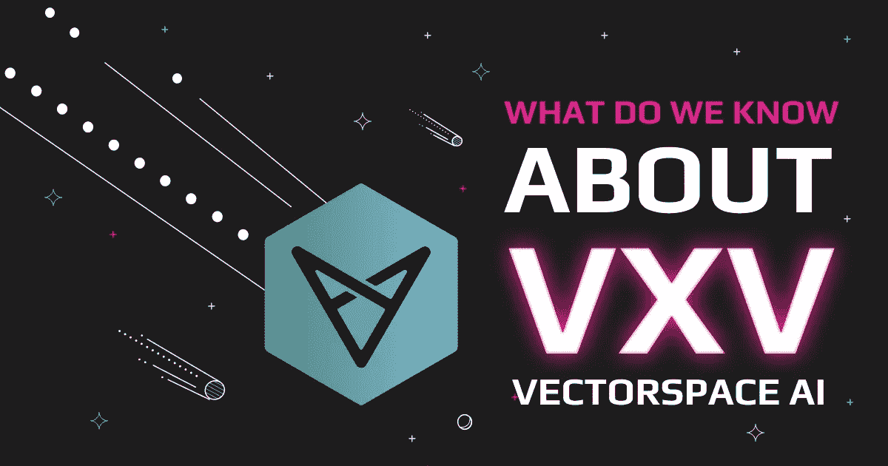

# 我们对 vector space AI(VXV)了解多少？

> 原文：<https://medium.com/coinmonks/what-do-we-know-about-vectorspace-ai-vxv-23c04e7901d5?source=collection_archive---------13----------------------->

Vectorspace AI (VXV)是一个数据驱动的加密项目，主要专注于空间生物科学。

它的同名几乎不言自明。Vectorspace AI 使用机器学习算法生成定性数据集。采用的机器学习方法是自然语言理解(NLU)和自然语言处理(NLP)。它还提供了一个金融信息学解决方案，提供数据集来帮助研究人员使用人工智能(AI)加速项目。明确地说，金融信息学是指存储、处理和传输金融数据的系统的行为。

此外，crypto 项目似乎以金融市场为目标，为数据驱动的交易机会构建了算法。VXV 还被用于几家上市公司的管理以及对冲基金的顾问。关于加密货币，Vectorspace AI 试图在传统和加密市场之间架起一座桥梁。这篇文章将为您提供关于这个基于机器学习的项目的深入信息，包括它如何工作以及它的独特之处。如果你正在考虑投资这个项目，这也可能对你有所帮助。

# Vectorspace AI 是如何工作的？

Vectorspace 通过语言建模和科学数据工程过程网络生成数据集。传统股票市场的主题投资数据也会生成。主题投资需要通过分析宏观经济模式来发现投资的可能性。

最重要的是，Vectorspace AI 的数据集受到 VXV 令牌的保护和支持。购买 VXV 并将其存储在钱包中，可以将其转化为可交易的包装资产，用于各种与数据相关的用途。该实用程序包括数据集设计和创建、机器对机器事务和链上数据治理。此外，可以从彭博等收入分配合作伙伴处检索数据集，并使用支持 VXV 钱包的密钥进行分发。钱包中 VXV 的数量和类型决定了对该平台数百个分层服务级别的访问。还值得注意的是，任何行业的任何个人或组织都可以购买大数据相关令牌。

# Vectorspace AI 创始人

Vectorspace 由首席执行官 Kasian Franks 于 2016 年推出，他是一名经验丰富的数据工程师，也是一名连续创业者。Kasian 之前创办过几家创业公司，包括 Mimvi Inc .和 SeeqPod。这家以数据为中心的公司起源于劳伦斯伯克利国家实验室生物科学部门的一个项目。该项目最初需要为深空飞行开发一个关于乳腺癌、染色体异常和人类寿命延长的识别系统。

接下来，Kasian 的团队将他们学到的东西应用到金融市场中。他们假设人类基因类似于股票或加密货币，然后为对冲基金设计了一个有利可图的系统。

因此，Vectorspace 目前的团队包括生物空间科学、生命科学和金融领域的专业人士，他们都有人工智能应用的经验。首席技术官迈克·马尔登(Mike Muldoon)拥有从开始到完成有效指导大型项目的良好记录。他还拥有超过 20 年的经验，之前曾在 SeeqPod 与 Kasian 共事。著名科学家拉夫·波多斯基博士是该团队的另一名重要成员。

# 是什么让 Vectorspace AI 独一无二？

VXV 的独特之处在于它结合了人工智能、加密、数据和对冲基金。Vectorspace 的主要区别在于它能够为新客户提供强大的数据集。这个项目在人工智能领域极其重要，像微软这样的企业巨头似乎很重视它。

此外，Vectorspace AI 为研究人员提供了非常需要的功能，特别是在使用误差最小的机器进行信息交换时。该项目对投资者和对冲基金特别有吸引力，因为它基本上为他们创造了利润。除此之外，大数据行业前景广阔，是最受欢迎的行业之一。

# 是什么赋予了 VXV 价值？

VXV 在传统市场中用于设计、开发、传播和交易数据集。在项目中持有长期投资的用户会影响 VXV 实用硬币的价值。但是，顶级客户被禁止按要求涌入市场。

代币的功能不一定像证券或货币。相反，它是一个公共交易工具，任何人都可以在全球市场上进行交换或交易。客户还可以获得 VXV 块，并以高于其他客户的价格获得对特定私有数据集的控制权。关于公司的收入第一战略，一半的收入用于在公开市场上购买 VXV。这是因为 VXV 是跟踪数据来源、历史、治理和链上数据所必需的。

# 如何兑换 Vectorspace AI (VXV)？

使用 Swapzone 交换任何加密资产都是轻而易举的事情，swap zone 会比较 15 个以上的交换，以确保您支付较低的交易费用。要用您的硬币购买 VXV，请遵循以下简单步骤:

*   访问 VXV 交流页面。
*   输入您想要兑换的硬币总数。
*   选择最佳汇率。
*   单击“交换”按钮。
*   输入您的钱包地址，以便在您的钱包中接收 VXV。
*   将您的硬币存入生成的地址。
*   等待您的交换被执行。

# 流行配对转换向量空间人工智能

[VXV 到 BTC](https://swapzone.io/exchange/vxv/btc)

[VXV 转 ETH](https://swapzone.io/exchange/vxv/eth)

[VXV 至 LTC](https://swapzone.io/exchange/vxv/ltc)

[VXV 到 BNB](https://swapzone.io/exchange/vxv/bnb)

[VXV 到 BCH](https://swapzone.io/exchange/vxv/bch)

[VXV 到 USDT](https://swapzone.io/exchange/vxv/usdt)

[VXV 到 THETA](https://swapzone.io/exchange/vxv/theta)

[VXV 至 XMR](https://swapzone.io/exchange/vxv/xmr)

[VXV 到 TRX](https://swapzone.io/exchange/vxv/trx)

[VXV 至 BSV](https://swapzone.io/exchange/vxv/bsv)

[VXV 至破折号](https://swapzone.io/exchange/vxv/dash)

[VXV 至 ZEC](https://swapzone.io/exchange/vxv/zec)

> 交易新手？尝试[加密交易机器人](/coinmonks/crypto-trading-bot-c2ffce8acb2a)或[复制交易](/coinmonks/top-10-crypto-copy-trading-platforms-for-beginners-d0c37c7d698c)