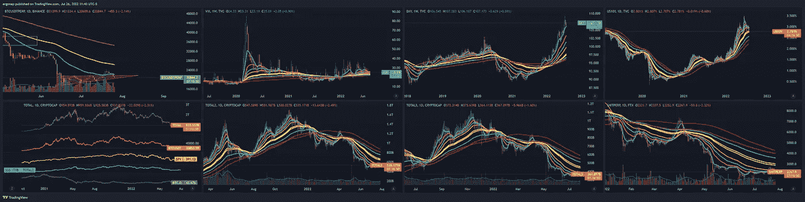

# 你还能指望什么数字下降

> 原文：<https://medium.com/coinmonks/what-do-you-expect-number-goes-down-3fc933515e04?source=collection_archive---------27----------------------->

## 加密货币/比特币分析 7 月 26 日

紧随今明两天的 FOMC 会议之后，市场正在加速大幅下跌。宏观图表时间。下面是我们看到的，从左上顺时针: **BTC** 拒绝了一个重要的均线(200 毫安 4h/34 毫安 1d)——所以我们到目前为止，还没有完成。VIX 正准备爆发，这通常发生在重大经济不确定性期间，并可能在九月到来的[四重魔力](https://www.tradestation.com/insights/2022/02/03/quadruple-witching-dates-2022-trading/)中发挥作用。DXY 在发呆，这没什么好惊讶的。美国 10 年期债券也表现不佳。总市值在下降/BTC 在下降/间谍在下降/总市值 2 在下降/BTC 优势在下降，总市值 2 在下降，总市值 3 在下降，屎币指数在下降。我相信这叫做熊(大 B —🐻)市场。

this is a macro chart — [https://www.tradingview.com/x/iiAAgNip/](https://www.tradingview.com/x/iiAAgNip/)

我已经警告过了。我说副业。我**的确**暂时看好 7 月 24 日的希望，但如果市场转向，我们必须适应。好家伙，我们做到了。我们正处在变好和看涨的尖端，相反，市场把我们摔了下来。这让我们又回到了熊市。所以，如果这就是我们的玩法，那么在 sub $16k 左右再见。

 [## 今天担心是正常的

### 比特币/加密货币分析 7 月 25 日

medium.com](/coinmonks/its-alright-to-be-worried-today-f68c247c1eab)  [## 在这种混乱中拯救自己——是市场上涨的时候了

### 比特币/加密货币分析 7/24

medium.com](/coinmonks/save-yourselves-in-this-mess-its-time-for-market-to-move-up-9ead863c3beb)  [## 想活命就跟我来

### 加密货币/比特币分析 7 月 23 日

medium.com](/@ergonap/come-with-me-if-you-want-to-live-320cf81b238a) 

周刊说有点低，但不确定。我们可以走得更低，如果我们低于 10k，我们会走得更低。这不是我可以肯定地说，但要意识到风险。

if this market is to survive, we need some kind of bottom eventually. It doesn’t look like now. [https://www.tradingview.com/x/P9H1y9DP/](https://www.tradingview.com/x/P9H1y9DP/)

> 交易新手？尝试[加密交易机器人](/coinmonks/crypto-trading-bot-c2ffce8acb2a)或[复制交易](/coinmonks/top-10-crypto-copy-trading-platforms-for-beginners-d0c37c7d698c)