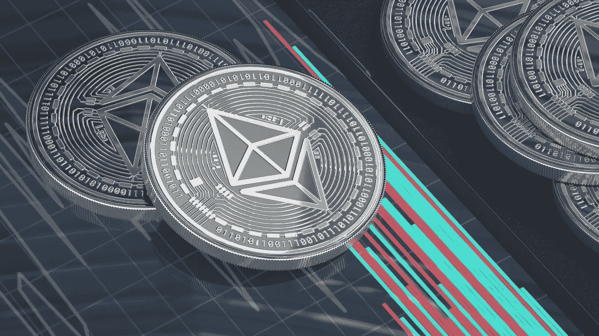
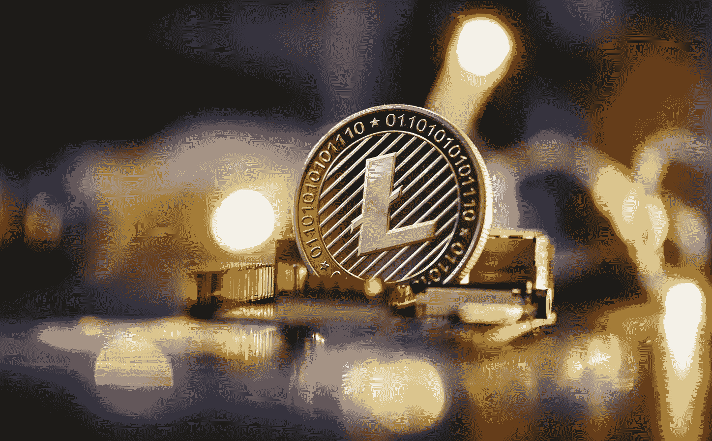
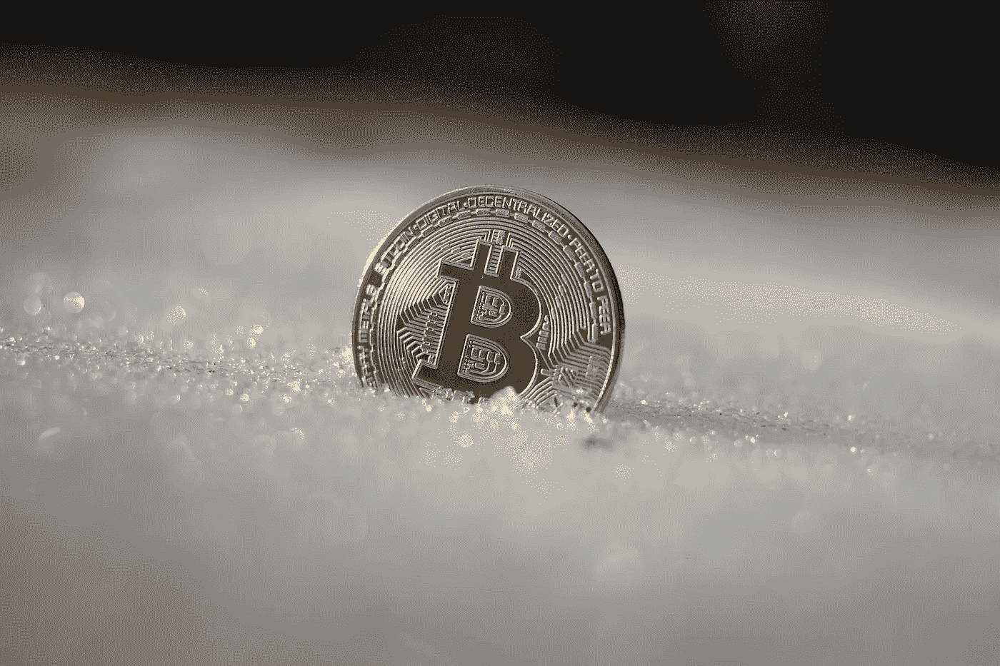

# 投资加密货币之前需要了解什么？

> 原文：<https://medium.com/coinmonks/what-do-you-need-to-know-before-investing-in-cryptocurrencies-c81286e9ed62?source=collection_archive---------55----------------------->

# 介绍

加密货币是数字或虚拟令牌，使用加密技术来保护其交易并控制新单位的创建。加密货币的价值取决于其作为支付手段的功能以及可以创造的单位数量。加密货币是分散的，这意味着它们不受政府或金融机构的约束。比特币是第一种也是最知名的加密货币，诞生于 2009 年。

# 什么是加密货币？

加密货币是一种数字代币，使用加密技术来保护交易安全，并控制新单位的创建。加密货币通常被称为数字黄金或数字白银，因为它们与实物黄金和白银有一些相同的特征。

加密货币基于一种代码，用于创建它们并管理它们的所有权。他们使用加密技术来保护他们包含的数据，防止有人窃取他们的钱，并创建新的单位，可以在参与者之间进行交易。

加密货币的优势包括:

*   它们可以作为一种支付方式。
*   它们可以存放在安全的地方。
*   它们可以在人与人之间交易，不需要金融机构。
*   他们可以创造一个独立于政府或中央银行控制的经济。

# 加密货币不是法定货币。

加密货币不是法定货币，这意味着它们不受传统金融法规的约束。这意味着您不能提取或兑换法定货币，交易不受银行账户或信用卡处理的限制。例如，比特币是一种加密货币，它使用密码学来保护其交易并控制新单位的创建。

# 如何入门加密货币？

比特币是第一种也是最受欢迎的加密货币，被世界各地的许多人使用。想要入门比特币，你需要有一个比特币钱包。比特币钱包是一种软件程序，可以在你的电脑上存储你的比特币交易和文件。

要使用比特币，你需要在比特币基地或 Bitstamp 等网站上注册一个免费账户。一旦你注册了，你就可以把你的比特币发送给其他人或企业来消费。

## **以太坊入门**

以太坊是另一种流行的加密货币，在过去几年里越来越受欢迎。要开始使用以太坊，你需要在像以太扫描这样的网站上创建一个帐户，并输入一些关于你想要的和需要的信息，当涉及到加密货币等数字资产时。一旦您设置了帐户，您就可以开始使用 Etherscan 买卖加密货币了。

## **莱特币入门**

莱特币类似于比特币，但与比特币创建时相比，它使用的数据更少，交易速度更快。你可以在比特币基地或波洛涅克斯注册一个账户，输入一些关于你对加密货币等数字资产的需求和需要的信息，从而开始使用莱特币。建立帐户后，您可以开始使用比特币基地或 Poloniex 买卖莱特币。

## **比特币现金入门**

比特币现金(Bitcoin Cash)是比特币现金和比特币核心(最初版本的比特币)分裂后产生的另一个版本的比特币。要开始使用比特币现金，你需要在比特币基地或双子座创建一个账户，并输入一些关于你对加密货币等数字资产的需求和需要的信息。设置好你的账户后，你就可以开始使用比特币基地或双子星来买卖比特币了。

# 成功投资加密货币的技巧。

为加密货币制定一个深思熟虑的投资计划非常重要，因为它们可能非常不稳定，并且容易受到价格突然变化的影响。为了确保你采取正确的步骤投资加密货币，咨询财务顾问是有帮助的，他们可以为你提供如何最好地投资你的钱的建议。

## **了解投资加密货币的风险**

加密货币通常与比传统股票或债券风险更高的投资相关联。这在一定程度上是由于它们的数字化性质——这意味着它们不容易被传统金融机构监管或监控。因此，你的投资很有可能达不到你的预期，最终你可能会赔钱。

## **请理财顾问帮你投资加密货币**

一个好的财务顾问可以通过提供一个包括加密货币和股票和债券等更传统资产的整体投资组合来帮助你保护自己免受这些风险。这样，你将能够最大化你赚钱的机会，同时最小化你的风险。

# 结论

加密货币是一种数字或虚拟货币，它使用加密技术来保护其交易并控制新单位的创建。加密货币通常在加密货币市场上交易，也可以用于购买商品和服务。由于其分散性，加密货币对传统金融系统构成了威胁，并可能对我们的经济产生重大影响。为了在加密货币方面取得长期成功，制定一个良好的投资计划非常重要。投资前了解风险，并请理财顾问帮助你做出正确的决定。感谢您的阅读！

> 交易新手？试试[加密交易机器人](/coinmonks/crypto-trading-bot-c2ffce8acb2a)或者[复制交易](/coinmonks/top-10-crypto-copy-trading-platforms-for-beginners-d0c37c7d698c)