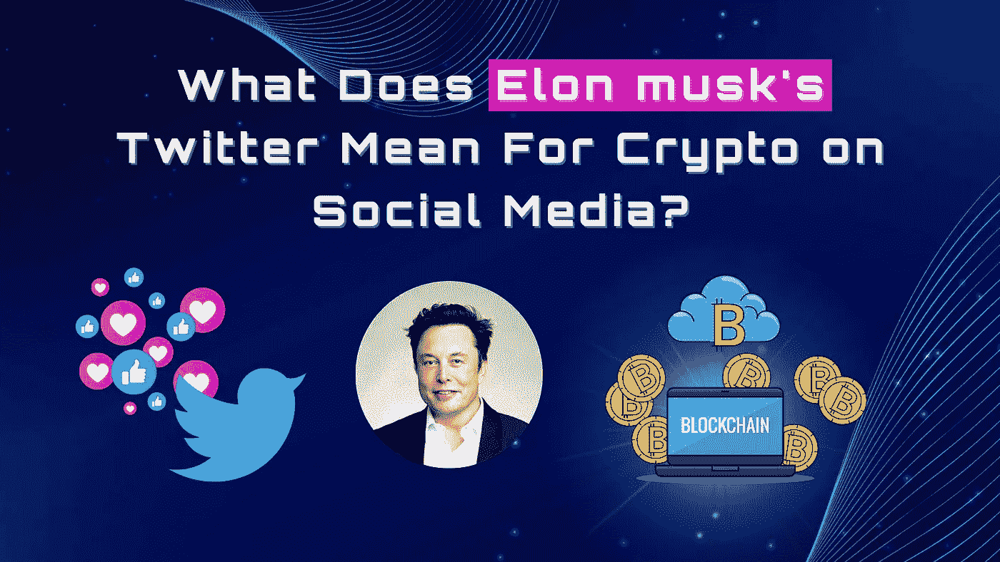
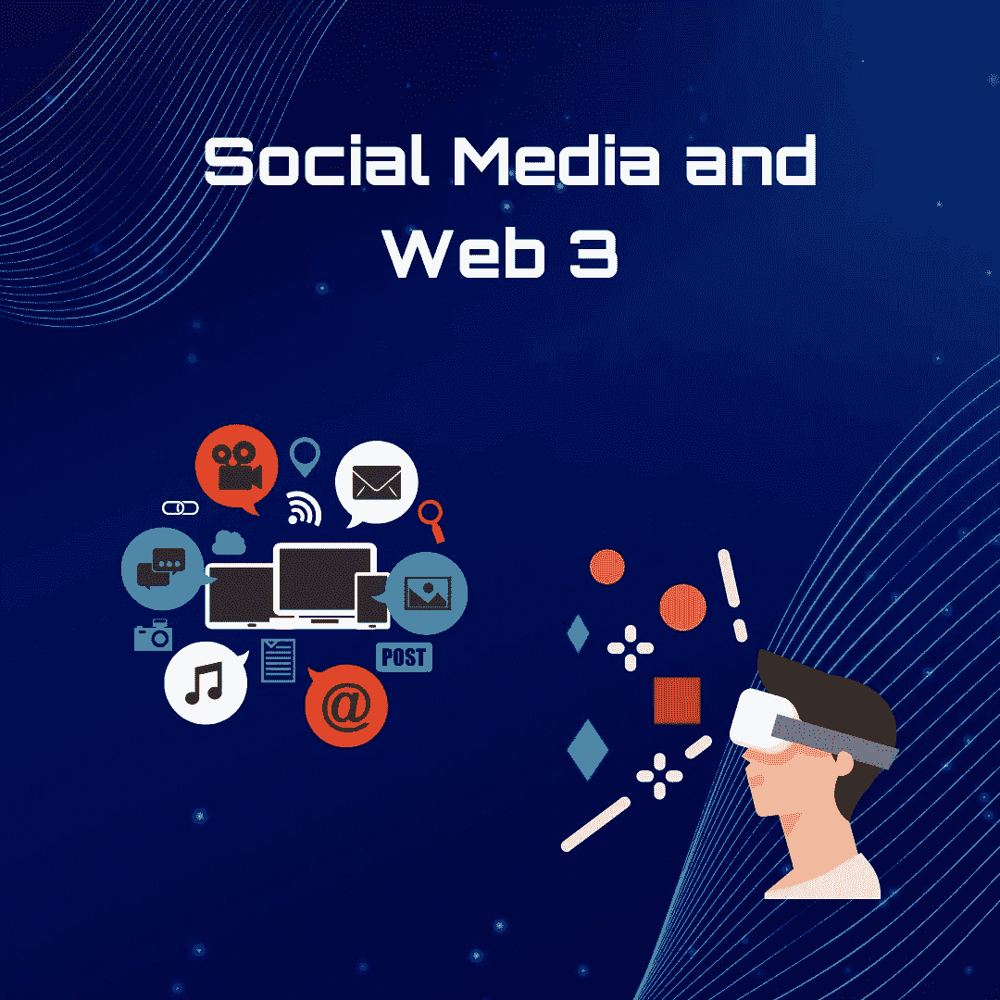

# 埃隆马斯克(Elon Musk)收购 Twitter 对社交媒体上的 Crypto 意味着什么？

> 原文：<https://medium.com/coinmonks/what-does-elon-musks-twitter-takeover-mean-for-crypto-on-social-media-8aa3965e27d1?source=collection_archive---------31----------------------->

10 月 28 日，世界首富完成了他 440 亿美元的收购。他在履行最后期限，以避免 Twitter 提起的诉讼审判，此前他试图退出他在 4 月份签署的协议。随之而来的问题是，社交平台上的加密会受到怎样的影响。

币安创始人兼首席执行官赵昌鹏表示，他愿意协助 Twitter 的新主人埃隆马斯克(Elon Musk)将社交媒体平台带入 Web3。CZ 还表示，他希望确保 crypto 在自由表达问题上有一席之地。然而，他补充说，交易所也可以帮助 Twitter 采用加密作为订阅等支付形式，从而使 Twitter 受益。

埃隆·马斯克(Elon Musk)对加密货币的热情是众所周知的，因此币安的支持应该不足为奇。根据一份[的新分析](https://finbold.com/binance-ceo-says-he-wants-to-help-elon-musk-bring-twitter-into-web3/)，马斯克是前几年加密货币上最受欢迎的推文的作者；但是这预示着社交媒体加密的光明未来吗？

# 社交媒体和网络 3

[Web3 技术](https://ethereum.org/en/web3/)的引入促使基于 Web2 的企业重新考虑改变他们现有的商品和服务。许多大公司正在推广他们的品牌，并使用 Web3 技术，如非伪造令牌(NFT)，展示他们与未来技术的联系。

Web3 最具影响力的另一个领域是社交网络。脸书已经更名为 Meta，它的目标已经从一个社交网络平台转变为元宇宙的未来门户。Meta 拥有的 Instagram 已经开始在应用程序中提供 NFT 铸造和交易服务。网络上有 300 万钱包持有者，另一个流行的社交媒体平台 Reddit 已经成为 NFT 交易的热点。除了 NFTs，Twitter 和 Reddit 等社交媒体巨头也允许用户用比特币给内容提供商小费。然而，大部分社交媒体网络缺乏内置的加密集成。

Web3 的加入仍然落后，必须简化和加速，社交媒体平台可以帮助数十亿用户几乎立即加入 Web3。Reddit NFTs 的成功证明了这一点。根据区块链基础设施平台 Lisk 的首席执行官 Max Kordek 的说法，Web3 是一个过渡。它不是一个自主的互联网生态系统，这些平台最适合加入。

# 来自 Twitter 的期望

据称，Twitter 正在开发其加密货币钱包，随着[埃隆马斯克最近 440 亿美元的收购，](https://www.nytimes.com/2022/10/27/technology/elon-musk-twitter-deal-complete.html)许多人猜测，社交媒体网络很可能很快就会包括一个加密货币钱包。然而，新的传言表明，马斯克暂时暂停了加密钱包的雄心。围绕马斯克员工和节制做法的辩论，让他快速升级 Twitter 服务的承诺黯然失色。

尽管目前在加密钱包整合方面存在障碍，但市场分析师相信，更多以 Web3 为中心的服务将被添加到社交网络平台中。

据加密货币交易平台 adopt 的区块链和加密研究负责人[马丁·希斯贝克](https://www.linkedin.com/in/hiesboeck/)称，Twitter 目前允许加密小费，因此增加加密钱包功能是下一个自然的步骤。他引用道，“加密领域的许多人都在为埃隆·马斯克将如何影响行业做准备，人们的反应出奇的乐观。马斯克显然将推动数字资产与平台的整合。例如，许多平台将提供他们的加密钱包，以保持交易靠近他们的生态系统。Twitter 这样做是社交网络的一个合理步骤，它已经允许用户以加密方式发送提示。”

马斯克收购 Twitter 引发新闻，不仅仅是因为交易的困难，还因为他在社交媒体网络上市近 13 年后将其私有化。由于 Twitter 现在是一家私营公司，马斯克在决策方面有着更重要的影响力，许多人认为这将有助于他在网站上推动更多的加密和 Web3 相关服务。据金融初创公司 Unlimint 的 GateFi 负责人贾保磊称，在过去的 18 个月里，Web2 平台的很大一部分已经集成了 Web3 功能。他认为，在马斯克的掌舵下，Twitter 将会步其后尘。

# Web3 雄心的障碍

社交媒体平台开始与世界各地的人们交流，在 Web2 生态系统中，它们演变成了互联网的一个重要组成部分。然而，随着时间的推移，这些社交媒体平台演变成了数百万用户的统一数据之家，大型品牌和企业依赖这些数据来营销他们的产品。

对社交媒体平台广告的依赖导致了各种社交媒体公司的不当行为。这些平台被发现向营销人员出售用户的敏感数据，薄弱的安全措施也导致了数据泄露和隐私权的滥用。因此，分散发布平台 Koii Network 的联合创始人兼创意总监 Kayla Kroot 认为，从长远来看，这些社交媒体公司的加密野心将损害该行业。Kroot 利用当前围绕 Musk 意图的争议对臭名昭著的“蓝扁虱”实施每月 8 美元的费用

她还提到了对数据自治和用户隐私日益增长的认识，这在区块链群体中受到高度重视。她表示，将加密货币整合到“积极违反社区核心信仰的网络中，将被加密本地人视为现金抢夺。”公众对加密货币的印象可能会糟糕得多，损害其整体认知。"

传统社交媒体平台上的大多数杰出艺术家目前都在产生平台牵引力，但平台通过广告收入而不是创作者从这种牵引力中获益。因此，这些加密集成的大部分是押注于趋势，而不是在新生技术的精神范围内工作。

一方面，将 Web3 技术融入 Web2 社交媒体平台的兴趣越来越大，这是朝着更广泛接受迈出的一步，受到了欢迎。另一方面，Web3 专家认为，社交媒体平台只是依赖于趋势，而不是 Web3 的精神，这可能最终会赶走真正的加密接受，并引用 Meta 及其最近未能重塑自己作为 Web3 品牌的例子。

# 总结

甚至在埃隆·马斯克被收购之前，Twitter 就已经涉足加密领域。该微博平台已经建立了一个 Twitter 加密部门，并允许用户接收比特币和以太币的提示。该平台还为一组精选的创作者提供 NFT 个人资料图片和美元硬币(USDC)稳定硬币支付。

由于马斯克对加密货币直言不讳，此次收购将改变加密市场和社交媒体的游戏规则。这只是时间问题。

> 交易新手？试试[加密交易机器人](/coinmonks/crypto-trading-bot-c2ffce8acb2a)或者[复制交易](/coinmonks/top-10-crypto-copy-trading-platforms-for-beginners-d0c37c7d698c)