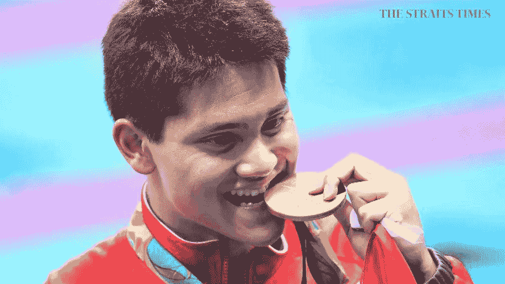
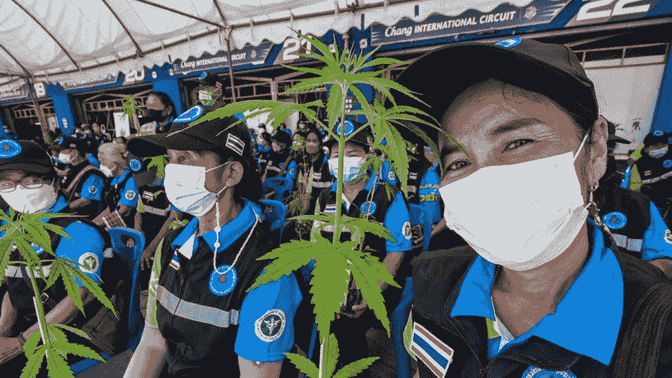
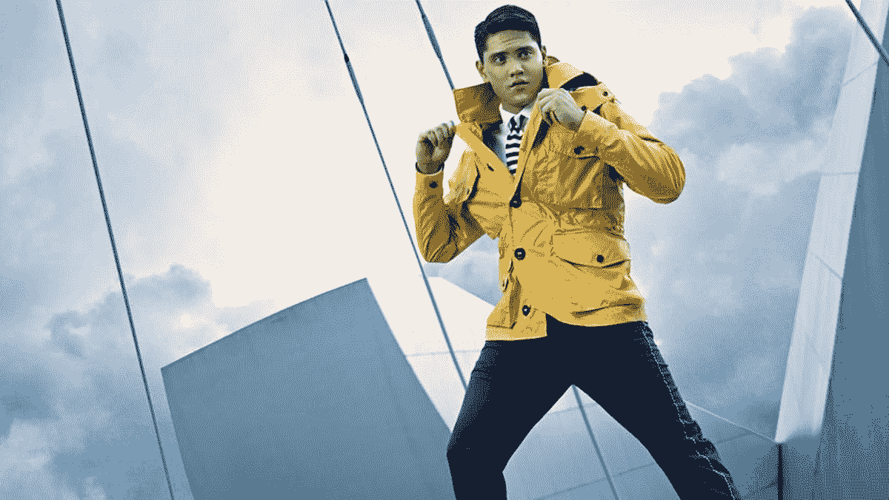

# 约瑟夫·斯库林和迈克·波斯纳有什么共同点？

> 原文：<https://medium.com/coinmonks/what-does-joseph-schooling-and-mike-posner-have-in-common-846a14870b3d?source=collection_archive---------37----------------------->

Joseph Schooling was the **gold medalist in the 100m butterfly** at the 2016 Olympics, achieving Singapore’s first ever Olympic gold medal.

约瑟夫·斯库林和迈克·波斯纳有什么共同点？

两人在海外时都吸食过“毒品”。

Mike Posner 在伊比沙岛服用了一粒药丸(可能是摇头丸),在 Avicii 给他之后，他后悔/享受了那个错误/兴奋的时刻。

奥运会游泳金牌得主、新加坡的约瑟夫·斯库林在河内参加东南亚运动会时拍下了这张照片。

你猜怎么着。

他们中只有一个人有完整的刑法典和法律的全部内容。

显然，赢得一枚奥运金牌并击败迈克尔·菲尔普斯还不足以让你摆脱网民的愤怒和新加坡的高压法律。

停下来想一想。

一枚奥林匹克金牌。

国家的骄傲。

没有一个新加坡人可以说他们做到了。

即使他们这么做了，学校教育也是第一个这么做的。

他击败了迈克尔菲尔普斯，历史上在他的宠物项目中获得最多奖牌的奥运选手！

那么学校教育做错了什么吗？

大麻已经在许多国家合法化了。

Thailand legalised weed on June 2022.

泰国刚刚将其合法化，其他海洋国家也在考虑中。

Snoop Dogg 在虚拟音乐录影带颁奖典礼上和 Eminem 一起表演时抽了一根大众大小的大麻。

吸一支不会让你上瘾。

有人认为它是通向更强效、更容易上瘾的药物的门户，但这可以通过其他方式来控制。

“教育部还表示，鉴于他滥用中断特权，在 NS 期间，学校将不再有资格休假或中断训练或比赛。

这一后果意味着，学校可能会错过明年在柬埔寨举行的东南亚运动会和在杭州举行的亚运会。"

嘣。

我们刚刚又杀了一个天才。

不是一般的天才，而是新加坡体育界的金童，不久前我们还在崇拜他，向全世界炫耀。

我们都经历过。

在海外，参加聚会，享受年轻的成年生活，天空是无限的，世界是你的。

学校说他吸烟，但报告没有说多少次或多少。

他是个成年人，经历了很多。

放他一马，让他做他想做的。

当然，新加坡的法律必须得到尊重。

但是，我们在哪里划分什么是公平和什么是正确的呢？

Since shooting to fame in 2016 with his Olympic gold, several brands including **Hugo Boss, Nestle and Yakult** have placed their support behind Schooling.

对于那些想在这个问题上远离学校教育的赞助商，我说不要太担心。

我认为消费者会变得更有眼光，尤其是有了社交媒体和当前的情绪。

在我脑海中盘旋的问题:

为什么成绩明明是负面的上学还要告白？

除了供词之外没有明确的证据，当局怎么能做出判决或惩罚呢？

是谁暗中破坏他并向当局告密的？

我明白法律面前人人平等，但是考虑到像学校教育这样的人为国家所做的贡献，我们应该给予他们特殊的考虑吗？

嘿，韩国赦免了三星副总裁 Jay Lee，仅仅是为了帮助国家经济恢复元气(至少他们是这么说的)。

我们能原谅学校教育吗？

因为按照我们为我们的运动员所做的(或没有做的)的速度，我很确定新加坡需要另一枚金牌。

-

约瑟夫·斯库林抽烟有错吗？

-

#创业#商业#创业#成长#成功#社交媒体#文化#创业#战略#三星#约瑟夫学校教育#派对#大麻#泰国#新加坡#法律#大麻#吸烟#奥运#金牌

> 交易新手？试试[加密交易机器人](/coinmonks/crypto-trading-bot-c2ffce8acb2a)或者[复制交易](/coinmonks/top-10-crypto-copy-trading-platforms-for-beginners-d0c37c7d698c)