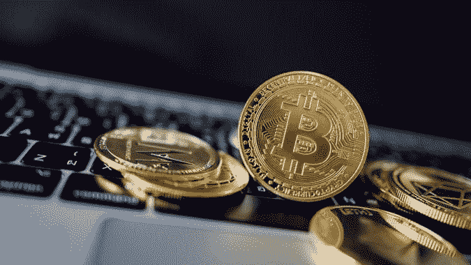

# 那是什么意思……终极密码术语指南

> 原文：<https://medium.com/coinmonks/what-does-that-mean-the-ultimate-crypto-jargon-guide-788604a99545?source=collection_archive---------30----------------------->

我整理了一份每天在加密对话中出现的关键术语和首字母缩略词的列表，以帮助你在这个世界上导航！

我将把本指南分为三个部分(加密货币、NFT 和通信渠道)。

# **加密货币行话**

**比特币(BTC)** 是现金的网络版。你可以用它来购买产品和服务，但它完全是虚拟的。

**稳定货币**是其价值与另一种货币、商品或金融工具挂钩或绑定的加密货币。Stablecoins 旨在为包括 BTC 在内的最受欢迎的加密货币的高波动性提供一种替代选择。与美元挂钩的 USDT 就是稳定货币的一个例子。

替代硬币是除 BTC 以外的任何加密货币，最流行的是以太坊(ETH)或索拉纳(SOL)。

**区块链**是一个分类账，记录加密货币的交易，保存在几台连接在点对点网络中的电脑上。本质上，它允许用户省去政府或银行这样的中介。

**DeFi** 是一个使用区块链网络(又名分散金融(DeFi ))记录、存储、转移和管理资产的金融系统。该体系不同于传统的银行体系，传统的银行体系由一个集团集中控制。

**加密钱包**是一个数字钱包(就像一个银行应用程序)，它显示你拥有什么，并允许加密交易。不像普通的实体钱包，可以容纳实际的现金，加密钱包技术上不存储你的密码。您的资产位于区块链，但只能使用私钥访问。您可以将您的密码发送到 FTX 或比特币基地等交易所，将其转换为英镑/美元/欧元。*注意:随着加密技术的应用越来越多，我们就越不需要兑换回法定货币，因为我们将直接用我们的加密技术支付。*

**熊市**在股票中有类似的含义，当一个市场(在这种情况下是 crypto)经历了长时间的价格下跌。它与投资者对市场的情绪和悲观情绪密切相关。

牛市是指密码价格持续上涨。普遍接受的牛市定义是价格在两次下跌 20%后上涨 20%，但由于波动性，没有一个标准的百分比，而是指价格持续上涨时的积极情绪和乐观情绪。

FUD 代表“恐惧、不确定和怀疑”。这种担忧通常是社交平台上传播的没有实质性证据的坏消息的结果，例如比特币是一个骗局的广泛说法。所有的负面谣言都会引起加密用户的恐惧，并通过社交媒体进行宣传，以对市场产生预期的影响。

**WAGMI** 代表“我们都会成功”。首字母缩写词被加密社区广泛用于建立信心，并鼓励社区在短期/熊市期间不要失去希望。

**HODL** 被认为始于 HOLD 的拼写错误。这个缩写用于表示长期保留您的加密资产的过程，即使市场有利可图。你经常会在社交渠道中听到有人说，这是一个令人鼓舞的首字母缩略词，让人们不要出售他们的密码或 NFT，即使它们的价值在上升，出售它们可以获得巨额利润。这个首字母缩略词通常与“坚持住，亲爱的生命”这个词联系在一起。这将鼓励持有人“hodl”更长一点时间，以检查进一步获利或不亏本出售的可能性。

鲸鱼是大量加密货币和/或 NFT 的大型机构投资者或持有者，他们将大量资金投入到加密中。

# **NFT 行话**

**NFT** 代表不可替代令牌。它表示可以在数字分类帐(帐簿)中记录的特定数据。这些数据通常与资产相关联。这种资产可以是艺术品、电影、音乐或其他数字文件。如今，这些可以包括实物资产，如财产和文件。每个收藏通常有 10k 个 NFT，因此如果它能为持有者提供价值，供求钟摆就会发挥作用。

**市场**是你可以搜索、购买和出售 NFT 的地方。最受欢迎的市场是 Opensea 和 Magic Eden。

**制造**NFT 是指将数字数据转换成加密集合或记录在区块链上的数字资产。换句话说，你用加密货币购买了一个 NFT，加密货币将它从“数据”转移到你的加密钱包中的 NFT“资产”中。

**白名单**提供对 NFT 造币厂的优先访问，人们可以通过参与社交渠道或加密空间内的连接来赢得或获得这些造币厂。如果你被列入白名单，你通常可以以更低的价格获得 NFT。

当一个 NFT 系列被铸造出来时，象征物就出现了。艺术家希望用价值相对于$/的“代币”来奖励持有者。这取决于令牌的用例以及 NFT 收藏的受欢迎程度。

**效用**在 NFTs 中，是指通过持有你的 NFT 而不在市场上出售或上市，你可以接收/赎回并从中受益的任何东西。收藏者经常空投给他们的持有者这些奖励。

**空投**是任何免费存入你的加密钱包的东西。*注意:骗子经常向你的钱包空投“假”令牌/NFT，所以一定要仔细检查你点击的内容，如果有疑问，制作第二个钱包，将你不信任的任何东西放入其中，也称为一次性钱包。*

Alpha 是指某人分享某个收藏的内部消息。人们经常在 Discord/Twitter 上分享 Alpha，根据即将发布的公告/发展来洞察哪一款 NFT 最值得购买。

**底价**是你拥有一个 NFT 或成为一个项目持有人所能花费的最低金额。这也代表了市场中 NFT 的最低价值。与在亚马逊或易贝上购买产品类似，你会在一个系列/系列中搜索产品/NFT 的最低价格版本。

**清扫地板**是指某人/某些人决定以底价购买大量 NFT，然后要么以更高的价格重新上市，要么让它们退出市场，以创造更大的需求>供应分裂。这类似于人们在转售网站上购买音乐门票并赚钱。

**转手**可能发生在扫地或低价买入 NFT，然后高价卖出的时候。

> 交易新手？尝试[加密交易机器人](/coinmonks/crypto-trading-bot-c2ffce8acb2a)或[复制交易](/coinmonks/top-10-crypto-copy-trading-platforms-for-beginners-d0c37c7d698c)

# **通信区域**

不和谐被收集、交易、销售和参与关于非功能性交易的人频繁使用。这是一个受欢迎的地方，以确保白名单(优先访问)铸造 NFT，听取阿尔法和一般使用所有上述缩写。

**Twitter** 是加密原生用户阅读、分享和讨论市场的最受欢迎的平台，无论是关于加密货币、NFT 还是听取这些市场内有影响力的人士的意见。

Twitter 空间是在 Twitter 上与许多人同时进行的实时音频对话。NFT 社区领导和有影响力的人通常使用它来谈论他们的项目、围绕项目的情绪或整个加密市场。

Reddit 是一个由社区主导的论坛，超过 500 万人在这里积极讨论加密和非功能性加密技术。

非常感谢你一直读到最后。我希望你觉得这个行话克星是有帮助的，如果你对列表上应该有什么有其他建议，请在下面留下评论，这样我可以继续更新它！

查理·索尔💫