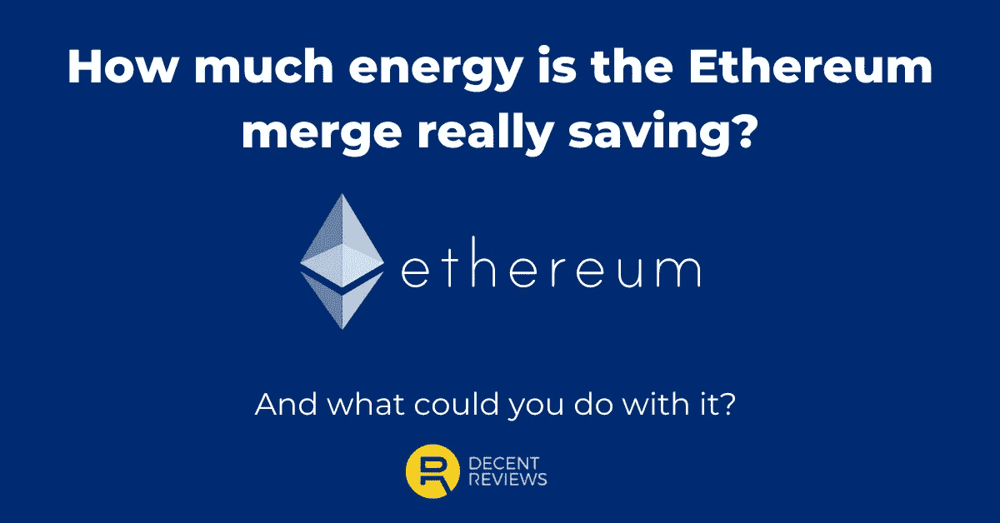

# 以太坊合并对你来说意味着什么？— DecentReviews 博客

> 原文：<https://medium.com/coinmonks/what-does-the-ethereum-merge-mean-for-you-in-real-terms-decentreviews-blog-1f1a3c8b7d34?source=collection_archive---------19----------------------->

ETH 2.0。合并。不管你想叫它什么，现在是现场直播。

合并的进展是过去几个月的头条新闻。

这些故事中的大部分都从较高的层面解释了合并对你的实际意义。或者他们粗略地解释了什么是权力和职位以及…