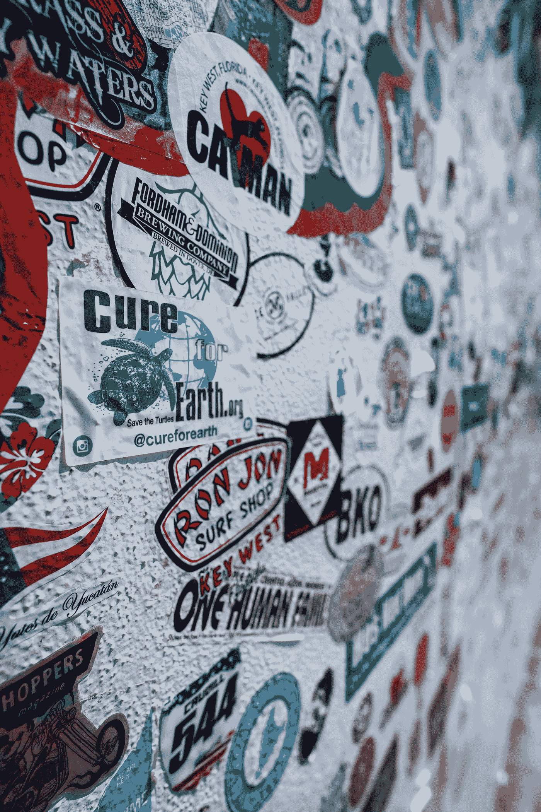

# 最新的史努比·道格-维兹·卡利法圣诞果酱与星巴克和雀巢有什么关系？

> 原文：<https://medium.com/coinmonks/what-does-the-latest-snoop-dogg-wiz-khalifa-christmas-jam-have-to-do-with-starbucks-nestle-707186692976?source=collection_archive---------16----------------------->

Photo by [R.D. Smith](https://unsplash.com/@rd421?utm_source=medium&utm_medium=referral) on [Unsplash](https://unsplash.com?utm_source=medium&utm_medium=referral)

[**【TWB】**](/areas-producers/nestle-starbucks-anticipating-higher-growth-during-a-new-age-of-consumerism-this-christmas-f154af18b06d)【周末简介】灵感来自美国西海岸说唱。史努比狗狗，奈特·道格，沃伦 G，狗狗收容所和维兹·卡利法刚刚推出了一个新的圣诞果酱。我建议你在读《TWB》的时候听听他们的最新歌曲 [**High Christmas**](https://www.youtube.com/watch?v=8uoDb4uztGg) 。

> 从顶级交易者那里复制交易机器人。尝试一下…