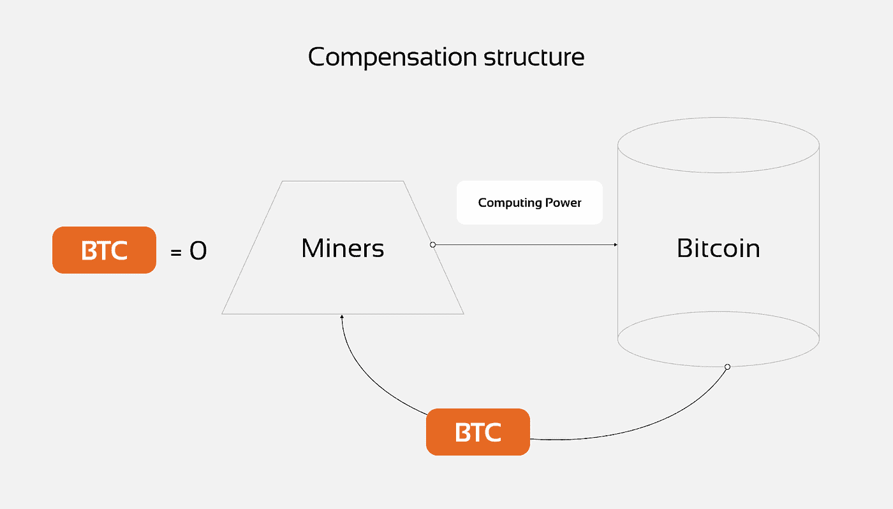

# 密码市场诞生的基础是什么？

> 原文：<https://medium.com/coinmonks/what-does-underlie-the-birth-of-the-crypto-market-b1fa19ef36ef?source=collection_archive---------39----------------------->

***第一次交易所出现在 2010 年 2 月 6 日。1 BTC 的价格是 0.003 美元。它是如何发展的？谁是第一批投资者？让我们来了解一下！***

2010 年 2 月 6 日，【Bitcoinmarket.com】，第一个交易所出现。当时 1 BTC 的价格是 0.003 美元。1 美元可以买 333 个 BTC。Bitcoinmarket.com 是一个现货交易所:人们可以把他们的法定货币放在那里，购买 BTC 并存放在交易所里，或者把它们放入区块链使用

起初，Bitcoinmarket.com 使用贝宝将法定资金存入交易所。2011 年 6 月 4 日，由于多起欺诈交易，交易所停止使用 PayPal。

销售平台不仅是比特币市场交易所，也是作为场外交易平台(场外交易)的易贝。值得注意的是，在易贝，价格往往高于交易所。

# ***回到 2010–2012 期间***

***BTC 的价格:***

一个 BTC 的价格是**$ 0.09**(2010 年 7 月 19 日)和**$ 13.45**(2012 年 12 月 31 日)。当地高点为 **$29.6** (06/09/2011)。2010 年购买比特币的早期用户到 2012 年底的利润大约是 149 倍多。

Bicoinmarket.com 随后输给了 Mt.Gox。它于 2011 年 7 月开业，到 2013 年已占据比特币交易市场约 47%的份额，到 2014 年达到 70%。请在教程系列的下一篇文章中阅读更多关于 Mt.Gox 的内容。

***市场特征:***

–少量用于采矿的计算能力

–区块链的独特优势

–少量用户应用程序

–除 BTC 白皮书外，缺乏任何信息

–第一次减半之前每个区块的最高奖励数(每个开采区块的奖励减半)

# **什么是薪酬结构？**

–矿工通过检查和记录交易块的计算设备维护区块链。为此，他们获得 BTC 代币的奖励。

–BTC 必须对矿工来说值一些真金白银，以维持他们的计算能力并增加他们的数量。这意味着它需要准备购买 BTC 的人和一个买卖双方可以见面的市场。我们已经讨论过这种市场的例子:Bitcoinmarket.com(交易所)和易贝(场外交易)。

# **当时的第一批用户是哪些人？**

–用户相信技术及其前景，并了解区块链的潜在规模。

–看到资产需求及其波动性的用户。他们相信，以矿商为代价的供应流动性会持续存在。矿工有出售 BTC 的直接动机，以补偿维护计算能力的成本，增加计算能力以获得更大的收益，并增加净利润。那时，人们可以在交易所以 10 美元的价格购买 BTC，或者直接从矿工那里购买，然后 T2 以 20 美元的价格卖给不知道交易所或者不知道如何使用交易所的场外交易用户。

–利用匿名转账的用户(当时几乎没有 OpSec 专家可以保存钱包用户的记录)

-由于缺乏技术技能而无法自己开采 BTC 的人

–通过对资产的迁移、供应和需求进行连锁分析，了解如何从价格变化中赚钱的人

# ***3 类买家:***

**1。长期投资者**

这些用户在任何区域购买资产。他们的策略是尽可能长时间留在市场上，不出售资产。他们可以集体上下移动价格。

**2。投机者**

这些用户只能在底层获得职位。他们以价格运动和需求增长来逐渐出售资产。需求水平一降低，他们就开始固定利润。他们不像长期投资者那样影响价格，因为他们通常不会在价格波动时买入。

**3。普通用户**

这些用户只在需要的时候买卖，对价格影响很小或没有影响。

考虑到进一步的价格增长和某些价格波动，*例如从 2011 年 6 月到 2011 年 11 月，价格从 29 美元下降到 3 美元(-90%)* ，我们可以假设:

–大多数早期买家积累了 BTC，直到 2011 年 6 月，大量新买家来到市场，价格开始上涨，早期买家开始卖出更多，以固定超额利润

–然后新买家的流入越来越少，所以早期卖家、矿工和新用户通过他们的销售将价格压低到 3 美元

–很可能在 3 美元的价格水平上，除了矿工之外的所有利益相关者开始再次积极购买，意识到如果更多的用户进入市场，29 美元不是价格的极限

很明显，这个领域的利润将取决于新用户，他们将购买越来越多的资产，并通过他们混乱的购买推高价格，他们混乱的销售不会对价格变动产生太大影响。

对价格影响最大的是没有新用户愿意以市场价购买。目前的卖家也在积极销售，他们没有看到买家的减少。供应变得比需求大得多。它一直持续到 2018 年的秘密冬天，BTC 再也没有进入-90%的修正

# **结论是什么？**

1.  看看目前的市场和以前的市场周期，没有太大的变化。当新用户不想购买或不来时，市场仍然会进入调整期，而当前的卖家不会停止销售。我们在 2018 年的交易历史中看到了这一点，现在也看到了。局部小幅反弹是暂时的，当全球环境推动新用户购买资产，他们将越来越多地进入市场时，新的牛市周期将开始。
2.  BTC 正变得更有市场，因为减半降低了矿商在供应结构中的权力。未来，对资产价格影响最大的将是那些积累了最多资产的人。
3.  确切地说，在 BTC，那些较早进入市场、增加了资产、并且没有损失资产的人影响最大。有近 8 年的不间断增长，加上 2021 年的牛市周期，创下了 69 000 美元的最高价格。
4.  2010 年和 2022 年的 BTC 市场逻辑很可能是相似的，因为目前拥有最多资产的最重要用户在那些日子里形成了某种行为模式，并在后来使用它。
5.  2018 年到 2020 年这段时间可以认为是市场发展的所有阶段中最有趣的。就在那时，资产快速增长的策略没有奏效，价格进入了为期两年的横盘走势。

> 在跟踪更新方面，订阅我们的[媒体提要。](https://medium.com/sunflowercorporation)敬请期待！
> 
> 如果您准备好[继续处理 BTC/USDT 的真实案例](https://sunflowercorp.com/futures/btc-to-usdt)，在我们的交易所获得一份欢迎奖金

> 交易新手？尝试[加密交易机器人](/coinmonks/crypto-trading-bot-c2ffce8acb2a)或[复制交易](/coinmonks/top-10-crypto-copy-trading-platforms-for-beginners-d0c37c7d698c)