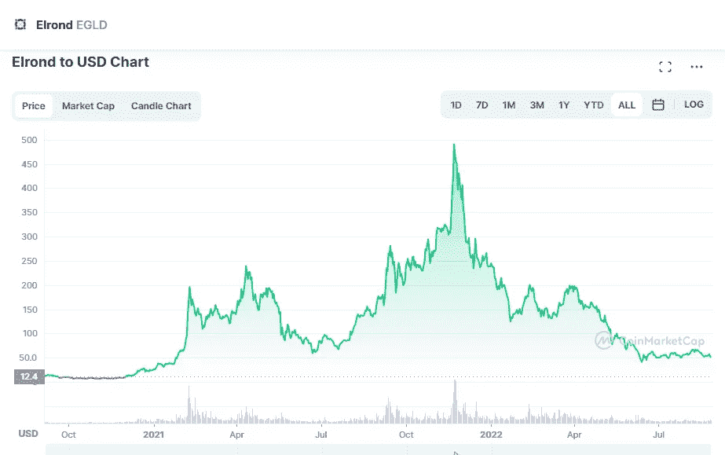

# 什么是埃尔隆德(EGLD)和 2022–2025 年的价格预测

> 原文：<https://medium.com/coinmonks/what-elrond-egld-and-price-prediction-for-2022-2025-e8f6bccb97a3?source=collection_archive---------13----------------------->

Source photo [Elrond price today, EGLD to USD live, marketcap and chart | CoinMarketCap](https://coinmarketcap.com/currencies/elrond-egld/)

# 什么是埃尔隆德？

因为它是一个区块链系统，埃尔隆德渴望提供快速和安全的交易。这是通过分片实现的。凭借其智能合同执行平台，该网络每秒可处理多达 15，000 笔交易。埃尔隆德的本地令牌 eGold (EGLD)是一种在网络区块链上运行的加密货币。