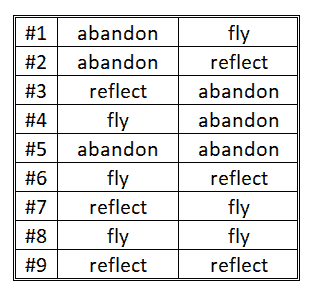

# 你最喜欢的钱包里的种子短语到底是什么，它安全吗？

> 原文：<https://medium.com/coinmonks/what-exactly-are-seed-phrases-from-your-favorite-wallet-and-is-it-secure-68f8679ec744?source=collection_archive---------18----------------------->

你有没有想过有人有可能破解你钱包里的种子？我指的不是有人能找到你放在哪里，而是用数学方法找到它。

知道了你的公开地址，黑客能使用暴力破解你的种子吗？

有人能以这种方式组合单词，从现有的许多钱包中找到一个种子吗？有越来越多的钱包，这增加了随机找到装有资金的钱包的可能性。

如果你知道种子是由“唯一”2048 个单词的组合创建的，你会增加你的恐惧，你可以在 [Github](https://github.com/bitcoin/bips/blob/master/bip-0039/english.txt) 中看到它们，因为它们是 BIP39 协议(比特币改进提案)加密的开放代码的一部分，这是由 Satoshi Labs 团队在 2013 年创建的系统，被大多数钱包使用。

# 什么是密码学？

密码学涉及加密或编码技术，旨在改变语言表达，使未经授权的接收者无法理解。这些技术用于艺术、科学和技术。

对称加密是加密和解密记录的最基本的方法，因为它使用相同的密钥，这就是为什么它不在区块链行业中使用，因为它不可能与第三方共享来执行交易，因为你会失去对加密记录的控制。

区块链使用非对称加密技术。加密的意义是单向的，即它从另一个数据中加密一个数据，所以它使用 2 个密钥。一个密钥是私有的，另一个是公共的，它们在区块链中被称为地址。公有地址是从私有地址创建的。如果我们要进行交易，公共地址是我们必须公开的地址。私钥永远不应该共享，因为它是使资金可用的密钥。

和 Cardano 一样，比特币使用两种哈希算法:SHA-256 算法作为主要的哈希函数，RIPEMD-160 算法用于地址创建。区块链将 Merkle 树用于记录，这允许高效且安全地验证大量数据的完整性和包含性。

Merkle 树是哈希的金字塔结构，其中每个哈希都是对较低哈希应用计算函数的结果，以将它们关联起来，直到它们到达根节点，从而构建树或链。

私钥由 256 位的数字和字母序列组成。例如，它可能是这样的:

213 df 440 BD 38832300 FB 6173 d3c 332623 a 69 c6da 73 f 67 f 55 c 86 e 9873d 7973 aa 2

它们很难记忆或储存，这也是种子被设计出来的原因。

# 种子短语是如何工作的？

在创建钱包时，加密系统随机生成一个私有地址，其中包含公共地址和种子词的组合，种子词是从加密协议中产生的助记短语。

因此，种子或助记短语为用户提供了与他们的私钥进行交互的友好方式。它由一系列单词组成，通常为 12、15 或 24 个，容易识别，当以特定顺序输入时，可以恢复加密钱包的私钥。

之所以称之为“种子”,正是因为它是公有地址及其对应的私有密钥可以确定性地派生出来的根源。

15 个字的种子可能是这样的:

*摇篮能力退休信任声唯实逐戳生态频繁冲击橄榄资源稳定*

甚至一些单词可以重复，但这是由密码决定的，其中在单词的生成中，排列的顺序是必要的和唯一的。

# 一个种子短语能被破译吗？

许多人想知道的是，该组合与另一个较早或较晚生成的钱包相同，或者更糟的是，被黑客破解的可能性有多大。

为了理解组合学背后的数学，我给你一个简单的例子。假设种子只有 2 个字(而不是 12、15 或 24)，标准基数是 3(而不是 2048)。可能的组合公式是 3 = 9。假设词是:*弃，飞，映*，可能性只有这 9:

在[bitcoinviki](https://en.bitcoin.it/wiki/Seed_phrase#BIP39_and_its_flaws)上，他们解释说，一个只包含 12 个单词的种子，找到一个独特钱包的可能组合数将是 2048 = 2，这个短语将有 132 位的安全性。然而，BIP39 短语中的一些数据不是随机的，因此 12 字 BIP39 种子短语的实际安全性降低到 128 位，或者 2 个⁸组合，但是大多数专家认为它足够安全。整数组合的数量如下所示:

340,282,366,920,938,000,000,000,000,000,000,000,000

如果您的种子是 24 个字，可能的随机数数量是 2 ⁵⁶，如下所示:

115,792,089,237,316,000,000,000,000,000,000,000,000,000,000,000,000,000,000,000,000,000,000,000,000,000

根据数学定义，种子包含的单词越多，它就越安全。

[BitCrack](https://bitcointalk.org/index.php?topic=4453897.0) 是一款专门用来破解私钥的软件，参与成员经过多次测试，认为搜索无用。

让我们计算一下，在一台吞吐量为每秒 900 万个地址的机器上，用 12 个字的种子解密一个钱包需要多长时间，这是一个相当高但可能的处理速度。大约是每秒 2 个地址。因此，蛮力每秒将花费 2 ⁸ / 2 = 2 ⁸ =2 ⁰⁵，这相当于处理:

每秒 40，564，819，207，303，303，300，000，000，000，000，000，000，000 个组合，代表 1，286，301，978，922，610，000，000，000，000，000 年来处理它们全部。

在一次竞赛中，闪电网络巨头消息协议的开发者约翰·坎特雷尔(John Cantrell)破解了一个有 12 个单词种子的钱包，其中，正如我所说，可能的组合是 2 个⁸，但当然，有一个技巧，钱包的主人给了他 8 个单词作为“帮助”，从而将组合减少到 2⁴⁰ (~1.1 万亿)个可能的助记符。一个很大的帮助，它明确了加密协议的强度。

# 可以在另一个钱包中使用种子短语吗？

虽然该过程很简单，但它被称为恢复钱包，您可以在任何支持钱包应用程序的设备上执行，您必须考虑以下几个方面:

*   你必须确保两个钱包互相兼容，并且使用相同的生成方案(主要在字数上)。
*   你还应该确保每个钱包支持的货币之间的兼容性，因为例如，你可能会在一个支持多种货币的钱包和另一个只支持比特币的钱包之间出现问题。

# 结论

回答你为什么开始看我的文章的问题，是的，你钱包的种子是安全的，几乎不可能被解密。

你主要关心的应该是保护你的种子:[你的数字资产安全吗？帮助降低风险的最佳实践](http://adapulse.io/are-your-digital-assets-secure-best-practices-to-help-mitigate-risk/)

最后，我提醒你，如果你在托管交易所拥有你的加密货币，你并不拥有你的资金，因为你没有你的钥匙。把你的加密货币放在非保管钱包里。

不是你的钥匙，不是你的密码。

*本文由我署名，原载于*[*AdaPulse*](https://adapulse.io/what-exactly-are-seed-phrases-from-your-favorite-wallet-and-is-it-secure/)*。*

[liberlion.com](http://liberlion.com/)

> *交易新手？试试* [*密码交易机器人*](/coinmonks/crypto-trading-bot-c2ffce8acb2a) *或* [*复制交易*](/coinmonks/top-10-crypto-copy-trading-platforms-for-beginners-d0c37c7d698c)
> 
> *分散加密持股，了解* [*币安替代品*](https://coincodecap.com/binance-alternatives)
> 
> *加入 Coinmonks* [*电报频道*](https://t.me/coincodecap) *和* [*Youtube 频道*](https://www.youtube.com/c/coinmonks/videos) *获取每日* [*加密新闻*](http://coincodecap.com/)

# 另外，阅读

*   [复制交易](/coinmonks/top-10-crypto-copy-trading-platforms-for-beginners-d0c37c7d698c) | [加密税务软件](/coinmonks/crypto-tax-software-ed4b4810e338)
*   [网格交易](https://coincodecap.com/grid-trading) | [加密硬件钱包](/coinmonks/the-best-cryptocurrency-hardware-wallets-of-2020-e28b1c124069)
*   [密码电报信号](/coinmonks/top-3-telegram-channels-for-crypto-traders-in-2021-8385f4411ff4) | [密码交易机器人](/coinmonks/crypto-trading-bot-c2ffce8acb2a)
*   [最佳加密交易所](/coinmonks/crypto-exchange-dd2f9d6f3769) | [印度最佳加密交易所](/coinmonks/bitcoin-exchange-in-india-7f1fe79715c9)
*   [面向开发人员的最佳加密 API](/coinmonks/best-crypto-apis-for-developers-5efe3a597a9f)
*   最佳[密码借贷平台](/coinmonks/top-5-crypto-lending-platforms-in-2020-that-you-need-to-know-a1b675cec3fa)
*   [免费加密信号](/coinmonks/free-crypto-signals-48b25e61a8da) | [加密交易机器人](/coinmonks/crypto-trading-bot-c2ffce8acb2a)
*   [杠杆代币终极指南](/coinmonks/leveraged-token-3f5257808b22)