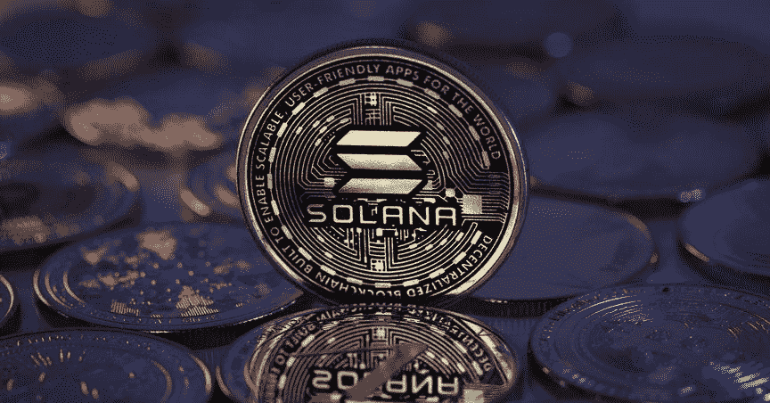

# 索拉纳币(sol)到底是什么？

> 原文：<https://medium.com/coinmonks/what-exactly-is-solana-coin-sol-a76a52ca76f0?source=collection_archive---------27----------------------->

(你需要知道的一切)

# 介绍

Solana Coin，俗称 SOL，是一种去中心化、开源的加密货币，旨在为去中心化应用提供一个高通量的区块链平台。索拉纳币是 2017 年创造的。它被设计成一个快速、可伸缩、安全的区块链平台，用于分散式应用程序。

在本文中，我们将探讨 SOL 的特性和优势，它与其他加密货币的不同之处，它背后的技术，它的采用和使用案例，以及它在加密货币市场的未来潜力。我们还将简要介绍 SOL 开发团队及其对项目的愿景。

# 索拉纳币与其他加密货币有何不同

Solana 是一个区块链平台，旨在实现快速、可伸缩和安全。Solana 区别于其他加密货币的关键特征之一是它使用了一种称为历史证明(PoH)的新型共识算法。

与其他依赖复杂的数学计算来验证交易的共识算法不同，PoH 使用一个简单的时钟来标记每个交易。这使得 Solana 能够在不牺牲安全性的情况下高速处理交易。

Photo Credit: Crypto Solana / Coin market cap

另一个关键区别是索拉纳对权力下放的关注。与许多其他由一小群个人或组织控制的加密货币不同，Solana 建立在由不同用户组运营的独立节点网络上。这确保了平台保持开放，所有人都可以访问。

此外，索拉纳非常重视建立一个充满活力和积极的社区。Solana 团队定期与用户和开发人员接触，收集反馈和想法，他们举办各种活动和项目来鼓励参与和协作。

总体而言，Solana 的快速交易速度、分散化和社区关注的独特组合使其在其他加密货币中脱颖而出。

# 索拉纳硬币的特点和优点

SOL coin 是一种分散的数字货币，为用户提供各种功能和好处。

使用溶胶硬币的一个主要好处是它们的安全性。这种货币基于区块链技术，确保交易安全透明。这意味着用户可以相信他们的资金是安全的，不会轻易被盗或被黑客攻击。

SOL coin 的另一个好处是交易费用低。因为货币是去中心化的，不需要银行等中介来促成交易。这意味着用户可以在不产生高额费用的情况下转账。

此外，SOL coin 为用户提供了快速轻松的交易能力。交易可以在几分钟内完成，用户可以将资金汇往何处也没有限制。这使得它成为需要进行国际支付或想要快速方便地向朋友和家人汇款的人的理想货币。

SOL coin 还为用户提供了通过下注赚取奖励的能力。这意味着钱包中持有 SOL 币并参与网络的用户可以额外获得币，作为对其贡献的奖励。

总体而言，SOL coin 为用户提供了一种安全、低成本、便捷的数字交易方式。无论你是经验丰富的投资者还是加密货币领域的新手，SOL coin 都提供了各种功能和优势，这使其成为任何希望参与数字货币世界的人的一个有吸引力的选择。

# 索拉纳硬币背后的技术

Solana 团队开发了几种独特的技术，使平台能够实现高交易速度和低费用。

Solana 背后的一项关键技术是其历史证明(PoH)共识机制。与传统的工作证明(PoW)或利益证明(PoS)算法不同，PoH 不要求矿商竞争在区块链增加新区块的权利。相反，它使用一个分散的时钟来生成和标记块，从而实现一个更加高效和安全的共识过程。

Solana 使用的另一项重要技术是其海平面虚拟机。这种虚拟机允许开发人员用各种编程语言编写智能合同，从而轻松构建和部署分散式应用程序，而 Gravity 使 Solana 能够为分散式应用程序提供高度可扩展和高效的区块链平台。

# 索拉纳硬币的采用和使用案例

Solana coin 因其处理高交易量的能力而越来越受欢迎，这使其成为需要快速可靠处理的应用的良好选择。

Solana coin 的主要采用驱动因素之一是其在分散金融(DeFi)应用中的使用。DeFi 指的是建立在区块链技术基础上的金融应用程序，允许用户无需中介即可获得金融服务。Solana 的高交易速度使其成为 DeFi 应用的良好选择，因为它可以处理与这些类型的应用相关的大量交易。

除了 DeFi，索拉纳硬币还被用于其他行业。例如，它正被用于游戏行业，为分散式游戏提供动力，以及用于供应链行业，用于跟踪和验证商品的真实性。

总体而言，随着越来越多的人认识到其高交易速度和安全的区块链平台的好处，Solana coin 的采用和使用案例正在增加。随着加密货币和区块链技术的使用不断扩大，索拉纳硬币有望在未来的金融和其他行业中发挥关键作用。

# Solana(硬币)的未来及其对加密货币市场的潜在影响

Solana 是一种相对较新的加密货币，已经在加密社区获得了很多关注。Solana 声称每秒能够处理超过 65，000 笔交易，是世界上最快的区块链平台之一。

Solana 另一个有趣的方面是它专注于提供低成本交易。该平台使用一种被称为“抵制抱怨”的收费模式来激励用户为网络的最大利益而行动。这意味着试图向网络发送垃圾邮件或执行恶意操作的用户将受到惩罚，而那些为网络健康和增长做出贡献的用户将得到奖励。

Solana 对加密货币市场的潜在影响是巨大的。作为一个快速和可扩展的平台，Solana 有潜力与其他高性能区块链(如 Ethereum 和 EOS)竞争。此外，它的低成本交易模型可能使它成为希望构建分散应用程序的企业和开发人员的一个有吸引力的选择。

Photo Credit: [https://www.leewayhertz.com/web3-use-cases-and-applications/](https://www.leewayhertz.com/web3-use-cases-and-applications/)

总的来说，Solana 的未来看起来很光明，它对加密货币市场的潜在影响可能很大。随着该平台继续获得牵引力并发展其技术，观察它将如何塑造加密空间的未来将是一件有趣的事情。

> 交易新手？在[最佳密码交易所](/coinmonks/crypto-exchange-dd2f9d6f3769)上尝试[密码交易机器人](/coinmonks/crypto-trading-bot-c2ffce8acb2a)或[复制交易](/coinmonks/top-10-crypto-copy-trading-platforms-for-beginners-d0c37c7d698c)