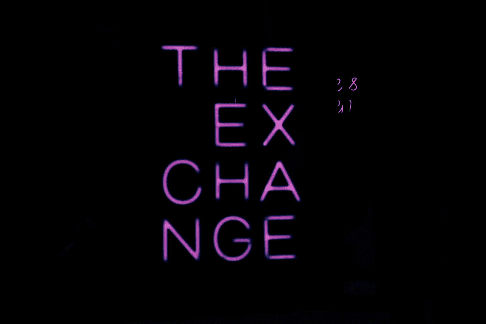

# 用什么交流平台？

> 原文：<https://medium.com/coinmonks/what-exchange-platform-to-use-91afece71859?source=collection_archive---------50----------------------->

交易所是一个允许货币和法定货币交换的平台，所有这一切都是以虚拟的方式进行的，以市场的供求关系为基础。许多交易所也允许股票或金融证券的运作，并被符合它的社区所接受。
该交易所的主要目标是从世界任何地方快速、安全地激活加密货币经济，并且与传统银行业务相比佣金率较低。现在可以将法定货币兑换成密码，反之亦然。

Picture of [Luke White](https://unsplash.com/@dynamite_luke?utm_source=unsplash&utm_medium=referral&utm_content=creditCopyText) in [Unsplash](https://unsplash.com/es/s/fotos/exchange?utm_source=unsplash&utm_medium=referral&utm_content=creditCopyText)

他们诞生于比特币因交易需要而投产之后。到 10 月中旬，fiat 的第一个比特币交易所注册成立，这一行动导致了第一个比特币交易所的成立，即著名的 NewLibertyStandard。从那时起，深化和发展这种包含在密码世界中的国际交流的项目开始出现。
然而，这种增长有起有落，因为他们在开发项目时，安全标准很低，不幸的是，这让投资者的不信任遭受了重大损失(在文章结尾，我留下了一个关于大骗局的链接)。

尽管存在这些问题，加密货币交易所在数量上有所增长，在质量、安全性和服务上也有所改进。直到目前为止，有许多选择，非常明确的是:为世界各地的加密货币交易商提供优质的选择。

Picture of [noodle kimm](https://unsplash.com/@noodlekim?utm_source=unsplash&utm_medium=referral&utm_content=creditCopyText) in [Unsplash](https://unsplash.com/es/s/fotos/exchange?utm_source=unsplash&utm_medium=referral&utm_content=creditCopyText)

交换由钱包管理，可以被用户识别或不被用户识别，而且这些钱包管理可以由你或第三方控制的私人密钥；出于这个简单的原因，我们将在下面提到几种类型的交换:

**集中托管交易所:**
这些是存储加密货币的交易所，不是用户。这意味着这种类型的交换并不允许你完全控制你的资产，尽管看起来可能不是这样。因为你不管理钱包的私人密钥，把全部控制权留给第三方，所以每个用户只能得到关于他自己账户余额的信息。

**优点**

*   用户友好的界面。
*   他们提供支持。
*   他们给你一系列在不同交易所转移和接收资金的可能性(只要他们支持)。
*   许多监控、帮助和知识工具。
*   他们为你提供了一套交易、杠杆、智能合约等工具，帮助你理解和避免由于缺乏知识而导致的错误。

**缺点**。

*   在欺诈的情况下，您的个人数据和资产可能会受到损害。
*   您没有私钥或分配的钱包来检索任何地方的加密货币。
*   您是网络的一部分，但您遵守平台上实施的使用规则和安全策略。
*   您必须提供敏感的个人数据才能在平台上注册。

比如:**币安、比特币基地或霍比。**

**集中非托管交易所。**

非托管交易所允许你以更简单的方式利用加密货币，因为它们只要求目前为交易所商定的资金，所以没有必要提供这么多个人数据。
如果你想兑换法定货币(比索、美元、欧元或其他)，该平台将要求验证你的身份。
作为没有加密货币托管的平台，用户可以向金融科技转移交易所需的资金，保持对资金的控制。即使交易所成为网络攻击的受害者，你的钱也会留在你的钱包里。

**优点:**

*   用户友好的界面。
*   提供支持。
*   遭受攻击时损失资产的风险降低。
*   你只有在必要时才暴露身份。
*   您有一个与您的用户相关联的钱包，因此您有更多的控制权。

**缺点:**

*   在欺诈的情况下，您的个人数据和资产可能会受到损害。
*   你的钱包没有私人钥匙来恢复加密货币。
*   您是网络的一部分，但您遵守平台上实施的使用规则和安全策略。
*   你不处理私人钱包钥匙。

比如: **ShapeShift，Changelly 或者 Alfacash。**

**分散交易所(DEX)。**

在加密货币的托管和管理方面，dex 更加开放。除了用户保持对其资产的控制这一事实之外，这些过程是自动化和匿名的。他们收取的佣金可能会更低。他们甚至会提供更多的工具来操作。
但是，建议具有丰富加密货币知识的高级用户使用分散式交易平台，因为其界面更复杂，且交易仅涉及加密货币。

**优势:**

*   用户拥有钱包和资金。
*   您个人数据的隐私。
*   您已经管理私人密钥，您可以在任何交易所或钱包中恢复您的资产。
*   你可以管理冰冷的钱包。
*   交易费用是实际的或者完全为零，并且通常有更大的安全性，因为开放源码易于审计。

**缺点:**

*   支持很少，有必要专门研究这个课题。
*   他们有许多骗局，在使用他们之前彻底研究他们是重要的。
*   存在大量洗钱活动。

比如:

1.  Uniswap。
2.  MDEX。
3.  SushiSwap。
4.  以太三角洲。
5.  伯格斯瓦普。
6.  煎饼交换。
7.  只是交换。
8.  Bisq。
9.  开阔的海洋。
10.  1 英寸。
11.  蜜糖交换。

**建议**
分散钱包是控制您的加密货币资产的最佳选择，我建议您完全控制您的钱包及其各自的备份，在我看来，我的工作方式是混合的，因为我有 DEX 钱包，我在我持有的硬币项目上下注。另一方面，我有一部分资本在集中交易所，从事培训、杠杆、赌注等工作。在大多数情况下，一旦交易带着我的目标红利执行，它们很可能会回到我传统的分散钱包里。
我还建议你使用冷钱包，我将在接下来的文章中谈到这一点。

[最大的比特币和加密货币盗窃案——Bit2Me 学院](https://academy.bit2me.com/en/los-mayores-robos-de-bitcoin-y-criptomonedas-de-la-historia/)

> 交易新手？尝试[加密交易机器人](/coinmonks/crypto-trading-bot-c2ffce8acb2a)或[复制交易](/coinmonks/top-10-crypto-copy-trading-platforms-for-beginners-d0c37c7d698c)