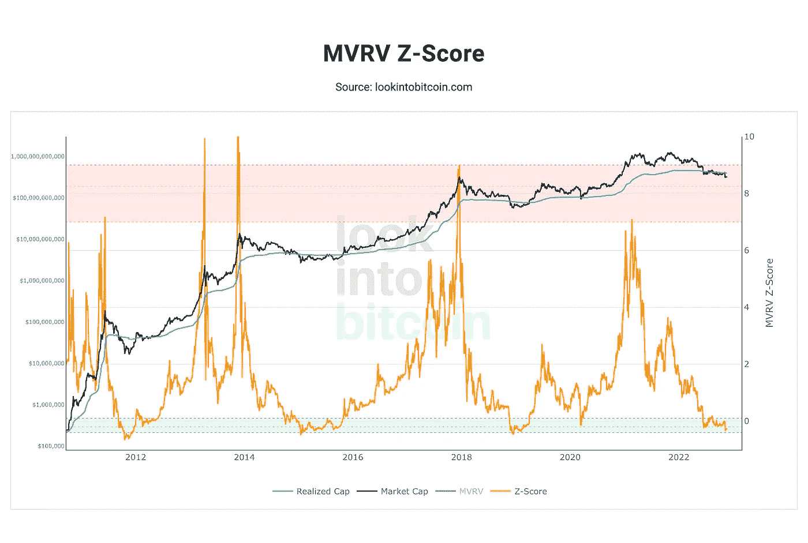
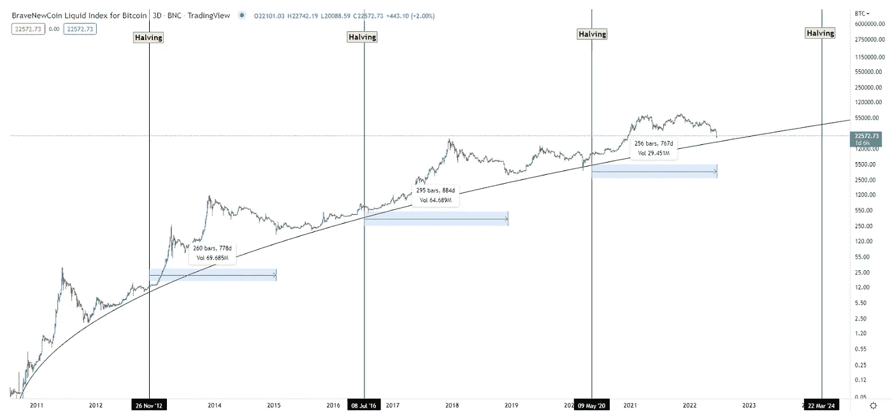
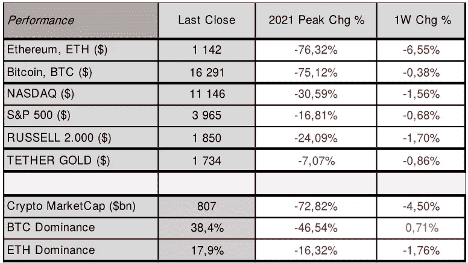
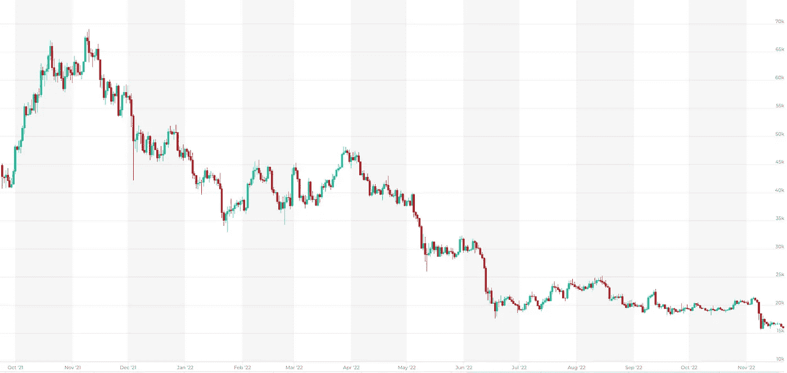
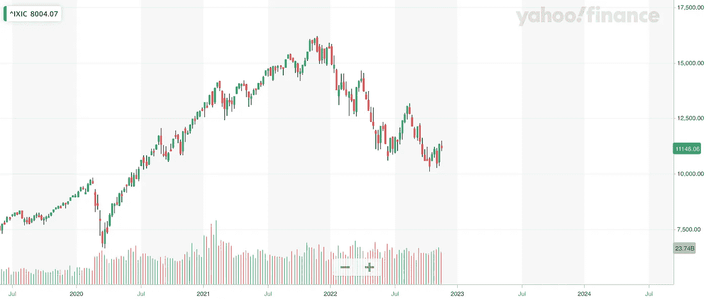

# 上周市场上发生了什么？| BTC 的价格是否在底部？

> 原文：<https://medium.com/coinmonks/what-happend-last-week-on-the-markets-is-price-of-btc-on-the-bottom-a88df8ff7fb6?source=collection_archive---------40----------------------->

**美国股票和数字资产市场在本周结束时表现稍弱，**纳斯达克收盘下跌 **(** [**纳斯达克**](https://finance.yahoo.com/quote/%5EIXIC?p=%5eIXIC&.tsrc=fin-srch)**⬇️1.6%】**收于**11.146 美元**和 **S & P 500** 下跌**(**[**s&p500**](https://finance.yahoo.com/quote/%5EGSPC?p=%5eGSPC&.tsrc=fin-srch)同样，两大顶级数字资产**以太坊**以**(**[**eth**](https://altfins.com/crypto-screener)**⬇️6.6%)**收盘于**1.142 美元**，而**比特币**以[**BTC**](https://altfins.com/crypto-screener)**⬇️0.4%**收盘于**16.291 美元。2022 年 11 月 11 日，当其联合创始人&首席执行官申请破产保护时，由于 FTX 事件的影响，加密市场的价格继续下降。上周加密价格的暴跌反映了与 FTX 中央加密交易所崩溃有关的其他数字资产提供商的一连串失败。**加密市场仍然面临很高的下行风险**，因为社区现在更加关注其他提供商，如 Crypto.com、创世纪交易和灰度比特币信托(GBTC)，这些都是受影响最大的提供商。事实上，对这些或其他大型加密提供商偿付能力问题的另一场全面恐慌肯定会使加密市场价格进一步下跌。**

然而，值得指出的是，数字资产市场的底部可能即将到来，因为一些最受欢迎的长期指标表明了这一结论。看看比特币( [**、BTC**](https://altfins.com/crypto-screener) )减半的轨迹，它的价格距离其最新的历史高点只有几周的时间，将“陷入”一个新的宏观低点。减半模型使用供需定律，随着矿商向市场提供持续压力，它可以直接影响比特币([**【BTC】**](https://altfins.com/crypto-screener))的总供应通胀。

此外，比特币( [**、BTC**](https://altfins.com/crypto-screener) )的 MVRV-Z 得分指标也指向一个新的宏观底部，因为在过去的周期中，每当 Z 得分跌出绿色通道时，比特币( [**、BTC**](https://altfins.com/crypto-screener) )就处于底部，而现在我们正越来越接近那个水平。MVRV-Z 得分是一个图表，它标识了比特币([**【BTC】**](https://altfins.com/crypto-screener))相对于其“公允价值”被极度高估或低估的时期。Z 值是标准偏差，它提取了市场价值和实现价值之间的数据极值。

# **BTC/美元 MVRV Z 值指标**

Source: LookIntoBitcoin

# **BTC/美元减半指标**

Source: TradingView

另一方面，在 FTX 交易所的闹剧中，美国股市基本上没有受到影响。由于 2022 年 11 月 10 日公布的美国 CPI 数据低于预期，美国主要股指在上涨后保持在高位。**美国 CPI 开始出现回调迹象，目前为 7.7%，核心 CPI 为 6.3%，而一个月前为 8.20%和 6.64%。**

如果通胀继续下降，我们将看到股票和数字资产市场风险资产反弹的可能性增加，因此，将于 2022 年 12 月 13 日发布的下一次 CPI 读数将受到密切关注。我们预计 2022 年 11 月美国 CPI 将小幅降至 7.60%，核心 CPI 将徘徊在 6.26%左右。此外，市场认为美国联邦银行将在 12 月的下一次政策会议上开始放松加息，预计他们将上调基金利率 0.50%。

# **性能**

Source: altFINS.com

另一方面，在 FTX 交易所的闹剧中，美国股市基本上没有受到影响。由于 2022 年 11 月 10 日公布的美国 CPI 数据低于预期，美国主要股指在上涨后保持在高位。**美国 CPI 开始出现回调迹象，目前为 7.7%，核心 CPI 为 6.3%，而一个月前为 8.20%和 6.64%。**

**如果通胀继续下降，我们将看到股票和数字资产市场风险资产反弹的可能性增加，因此，将于 2022 年 12 月 13 日发布的下一次 CPI 读数将受到密切关注。**我们预计 2022 年 11 月美国 CPI 将小幅降至 7.60%，核心 CPI 将徘徊在 6.26%左右。此外，市场认为美国联邦银行将在 12 月的下一次政策会议上开始放松加息，预计他们将上调基金利率 0.50%。

# 比特币价格

Source: altFINS

# 纳斯达克

数字资产市场情绪( [**加密恐惧&贪婪指数**](https://alternative.me/crypto/fear-and-greed-index/) )进一步下降至 **⬇️21/100，**表明**极度恐惧**，在不断增长的 FTX 危机中，该领域一直处于领先地位。加密货币市场总市值 进一步下降，周日收盘时约为**8070 亿**，比一周前低了 **⬇️4.5%** 左右。**以太坊(**[**eth**](https://altfins.com/crypto-screener)**)的统治地位**下降到**的 17.9%** ，比 **⬇️1.8%** 低了不止，而**比特币(**[**BTC**](https://altfins.com/crypto-screener)【t40)的统治地位则由 **⬆️0.7%** 上升到**的 38.4%**

**看点:**美联储下一次货币政策会议:2022 年 12 月 13 日至 14 日欧洲央行下一次货币政策会议:2022 年 12 月 15 日；美国 2022 年 11 月 CPI 将于 2022 年 12 月 13 日发布。

> 交易新手？尝试[加密交易机器人](/coinmonks/crypto-trading-bot-c2ffce8acb2a)或[复制交易](/coinmonks/top-10-crypto-copy-trading-platforms-for-beginners-d0c37c7d698c)