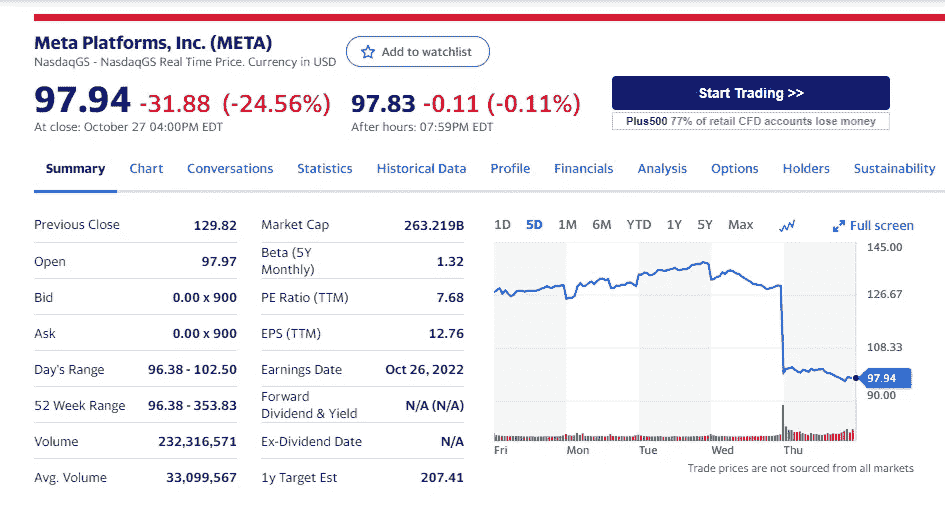

# 一天内下跌 24%的 Meta 股票发生了什么？

> 原文：<https://medium.com/coinmonks/what-happened-to-meta-stock-that-fell-24-in-1-day-59e55ddf84cf?source=collection_archive---------20----------------------->

Source photo [Meta Platforms, Inc. (META) Stock Price, News, Quote & History — Yahoo Finance](https://finance.yahoo.com/quote/META?p=META&.tsrc=fin-srch)

凭借 20 亿 dau 和 30 亿 mau，该公司的用户群已经在脸书、Instagram、Messenger 和 WhatsApp 上持平。在过去的十年里，这些用户群一直以每年 5%到 10%的速度增长。再也不会了。毫无疑问，每个想要脸书账户的人都已经有了。一些用户甚至从成熟的平台迁移到更新的平台，如抖音、Snap (SNAP)…