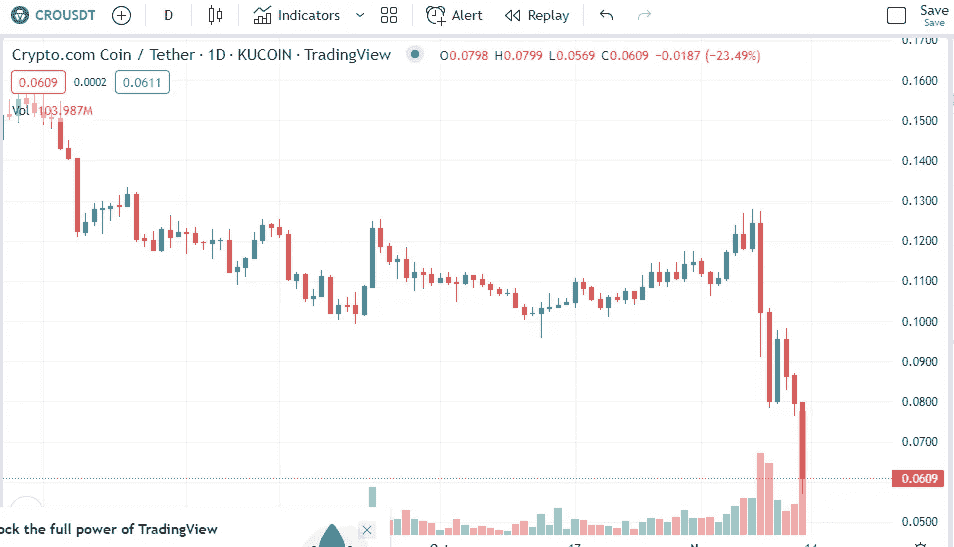

# Crypto.com 的加密货币 CRO 怎么样了？

> 原文：<https://medium.com/coinmonks/what-happened-with-cro-2a81b47fc239?source=collection_archive---------5----------------------->

Source photo [CROUSDT 0.0611 ▼ −23.24% (tradingview.com)](https://www.tradingview.com/chart/?symbol=KUCOIN%3ACROUSDT)

在上周 FTX 遭遇惨败后，币安已要求所有参与的交易所公布各自的全球投资组合。crypto.com 透露了储备的比特币，其中更有趣的细节是，根据这些报道，他们拥有大量的比特币(约 53000 枚)，但他们持有量第二大的比特币是柴犬币(这占了…