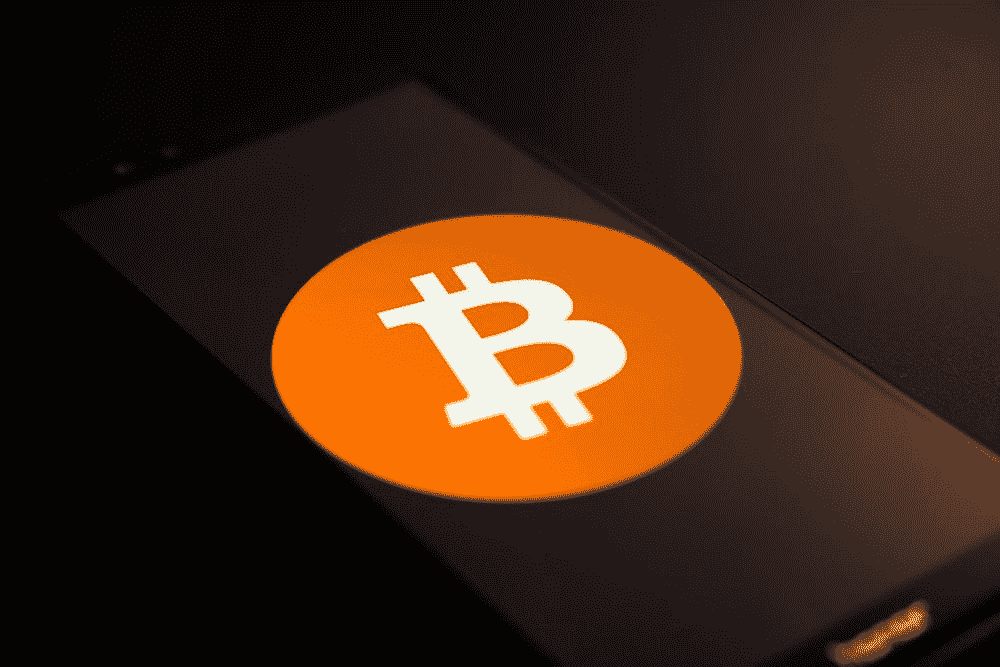

# 如果比特币崩溃到零会怎么样？

> 原文：<https://medium.com/coinmonks/what-happens-if-bitcoin-crashes-to-zero-7b8edcf1f958?source=collection_archive---------4----------------------->

我们都很熟悉加密货币市场的不可预测性和可变性。在很短的时间内，一枚硬币可能会大幅升值，下一秒它可能几乎一文不值。如果市场上最稳定、最有价值的资产比特币突然变得一文不值，会发生什么？

# 波动性和稳定性