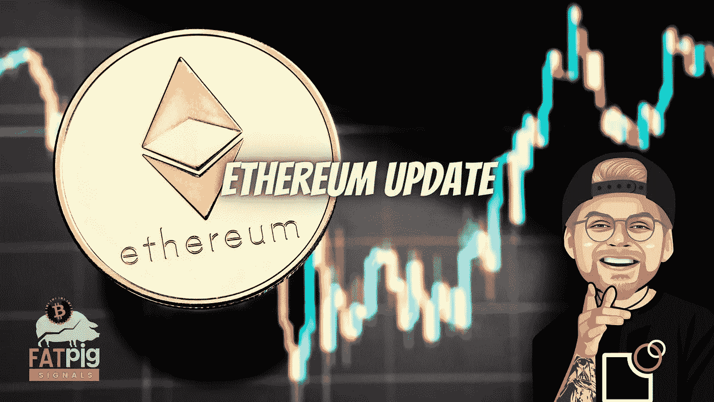

# 合并事件后以太坊会发生什么？

> 原文：<https://medium.com/coinmonks/what-happens-to-ethereum-after-the-merge-event-d3ae2c0bd6e2?source=collection_archive---------7----------------------->

以太坊的价格回升使得硬币重新获得了对稳定硬币的统治地位。以太坊的市值目前超过 430 亿美元。

投资者减少头寸的最简单方法之一是转向稳定的债券。集中稳定的硬币，不像它们的算法对应物，能抵抗波动，即使在最激烈的…