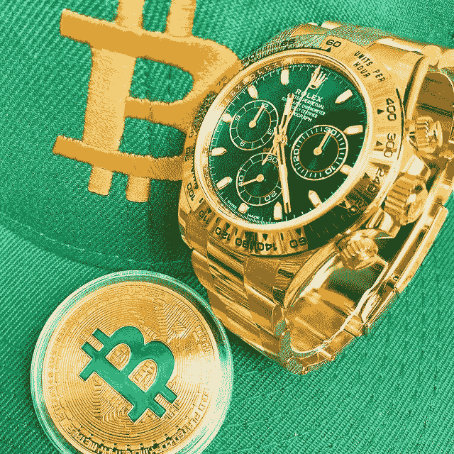
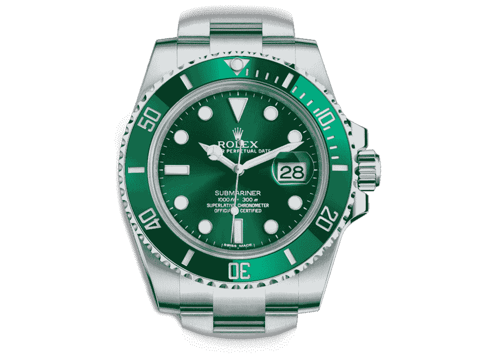

# 劳力士和豪华手表与密码价格下跌有什么关系？

> 原文：<https://medium.com/coinmonks/what-has-rolexes-and-luxury-watches-got-to-do-with-falling-crypto-prices-599e83539a8c?source=collection_archive---------31----------------------->

Was never a watch guy, but I have to admit some of the time pieces are remarkable work of engineering and artistry!

奢侈手表和秘密价格。

供求关系。

有趣的动态。

当加密技术蓬勃发展，硬币价格高得离谱的时候，人们在赚钱。

更多的百万富翁诞生了，有了新的财富，他们寻求购买生活中更好的东西。

毫不奇怪，豪华手表是首要目标。

在过去几年里，当加密货币在牛市中蓬勃发展时，劳力士和百达翡丽等奢侈手表的价格也攀升到了荒谬的水平。

像劳力士“浩克”这样的标志性设计在去年达到历史最高水平时，价格几乎翻了一番。

“根据瑞士钟表业联合会的数据，市场规模在过去二十年中翻了一倍多，从 2000 年的 12.97 亿瑞士法郎增长到 2021 年的 223.02 亿瑞士法郎。”

可能是由于富裕的中国买家的涌入，手表的受欢迎程度普遍逐年增加，以及人们希望放弃他们所获得的一些秘密利润。

Can you guess why the Hulk, a pretty sought after Rolex, is named as such?

但是随着繁荣而来的是萧条。

市场周期被称为周期是有原因的:上涨的必然下跌。

似乎价格调整正在形成。

“事实上，现在手表销售平台 Chrono24 上有超过 87，000 只劳力士手表，这告诉彭博，像劳力士这样的手表供应现在比过去几年“多得多”

Chrono24 是世界上最大的专业二手手表零售商和市场之一，目前在其网站上拥有超过 50 万只手表。

更多的供应意味着价格将不可避免地下降。

按照目前的价格，大多数劳力士的价格比峰值低 25%。

市场终究会自我修正。

也许人们需要卖掉手表来获得现金以弥补损失或偿还贷款？

也许 crypto 抹去了他们的投资和储蓄，他们需要现金来支付生活费用？

这告诉我什么？

Ultra luxury brands like LV made a killing during the pandemic and still held well despite the economic downturn.

在牛市期间开始经营奢侈品行业，瞄准那些从繁荣中赚钱的人，囤积现金。

当熊市和价格下跌时，用现金低价买下所有的供应。

等待下一轮牛市，卖出获取巨额利润。

冲洗并重复。

欢迎来到 3 逗号俱乐部！

我希望事情能这么简单。

不管怎么说，对于那些已经买不起新劳力士或欧米茄的人来说，现在可能是时候买些好东西了。

非常时期需要非常手段，卖家可能会卖掉自己的手表来赚快钱。

不管怎样，劳力士和百达翡丽这样的奢侈手表是长期投资的好资产吗？

-

劳力士是一个好的长期投资吗？

-

#创业#商业#创业#成长#成功#社交媒体#文化#网络 3 #战略# eth # btc #加密#劳力士#浩克#百达翡丽#欧米茄#奢侈品手表#钟表#投资#手表#金钱#奢侈品

> 交易新手？试试[加密交易机器人](/coinmonks/crypto-trading-bot-c2ffce8acb2a)或者[复制交易](/coinmonks/top-10-crypto-copy-trading-platforms-for-beginners-d0c37c7d698c)