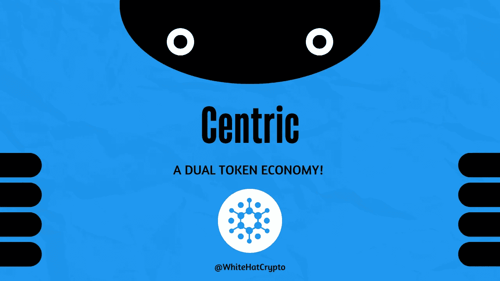

# 如果一个密码既稳定又不稳定会怎样？

> 原文：<https://medium.com/coinmonks/what-if-a-crypto-is-both-stable-volatile-5794af4b65b4?source=collection_archive---------47----------------------->

Centric 的双令牌模型的故事！

Centric Dual Token Economy

我们都听说过加密货币的波动性。然而，也有一些稳定的代码依赖于现实世界的价值来保持冷静。

事实是，随着稳定而来的是有限的潜在上升空间，这意味着更少或没有利润。然而，随着波动而来的是风险因素，因为这类货币可能会大幅上涨，或者更重要的是大幅下跌。

但是，如果同一个发展中的公司既提供稳定的硬币又提供不稳定的硬币呢？

先搞清楚我们针对的是谁！

# **什么是中心主义？**

[Centric](https://www.centric.com/) 是基于强大经济原则的突破性双令牌数字货币和去中心化区块链系统。Centric 的双令牌架构通过自我调节令牌生产来满足不断变化的需求，从而鼓励采用并随着时间的推移保持稳定。

**Centric Rise** (CNR)和 **Centric Swap** (CNR)是组成 Centric 双令牌概念(CNS)的两个令牌。CNR 的不同寻常之处在于，它以固定价格交易，并产生每小时的增长，而 CNS 是一种传统的加密货币，以市场价格交易。Centric Rise 可以随时兑换为 Centric Swap，反之亦然。

# **什么是中心崛起** (CNR)？

CNR 是一种低波动性的加密货币，利润可预测。每一个中心上涨单位都被设定为以一个预先定义的价值交易，并随着时间的推移而上涨，以美元计价。这种方法类似于央行货币政策，只是它是一种协议强制算法，经济学家首先充当区块链的先知，并提前一年透明地固定价格。

Centric Rise 是一种不同于现有货币或稳定货币的新型数字货币。它不是完全自由交易的代币，也不符合稳定硬币的传统定义。Centric 的名义价值是稳定的，但其“功能”价格会因其可交易的生态系统令牌 Centric Swap (CNS)而波动。

# 什么是中心互换(CNS)？

Centric Rise 发布了一种名为 Centric Swap 的自由交易加密货币，以在早期阶段在公开市场上提供流动性。Centric Swap 是一种低波动性的零和密码，按需发行和销毁，以帮助 Centric Rise 的流动性。

用户可以通过从许可的经纪人或平台购买 Centric Swap，或者通过利用分散的 Centric convert 协议交换 Centric Rise to Centric Swap。Centric Swap 与转换协议中价值 1.00 美元的 Centric Rise 相关，但没有任何资产支持，这与 stablecoins 不同。

# 为什么选择双令牌模式？

价格波动被视为加密货币广泛采用的最大障碍。与法定货币不同，加密货币没有一个中央机构来执行旨在稳定购买力的货币政策。结果，需求的变化导致了巨大的价格波动。

价格发现的去中心化机制将现有加密货币的大部分简化为股票或商品，根据情感进行估值，在不受控制的股票交易所进行交易，容易受到操纵。

因为波动性是要花钱的，缺乏定价稳定性抑制了信贷和债务市场的形成。当该行业的其他公司专注于交易吞吐量和智能合同时，Centric 专注于价格稳定性，以实现区块链带来的经济优势。

Centric 的一个令牌解决了这个稳定性问题，而另一个令牌则回应了投资者从加密货币波动中受益的愿望！

# 为什么他们说中心是不同的？

根据官方网站，Centric 在以下四个方面有所不同:

**治理** : Centric 由 Centric 基金会控制，这是一个非营利组织，其使命是通过建立合作伙伴关系和资助增强 Centric 可用性的创造性项目来增加采用率。

**详细路线图**:自 2017 年 12 月以来，Centric 一直在实现其路线图。Centric Foundation 正在规划产品、服务、协作和法规遵从性的 10 年路线图。

**奖励采用**:在中心经济体中，中心互换和中心崛起之间的汇率每小时上升一点点。这表明，举行中心崛起是有利的。项目早期的增长率较高，并将逐渐降低到每年 4%的目标值。

维持稳定:Centric 的双令牌概念为合成稳定货币奠定了基础。Centric 协议稳定地调节 Centric Rise 的供应，以便将 Centric 掉期的市场利率提高到 1 美元。

# 底线

Centric 看起来是一个可行的概念，旨在保持稳定，同时回报投资。然而，我们最近目睹了一种算法稳定币的消亡，它以 Terra Luna 的形式出现。这一失败引发了关于稳定的货币经济结构的几个问题。尽管 Centric 将自己定位为独一无二的，但它在很大程度上仍然是理论性的，需要在任何考虑之前进行严格的检查。

这篇文章中提供的内容不是赞助的，据我所知是正确的。这篇文章不是金融建议，我们不对针对这篇文章采取的任何行动负责！

请随时查看我们的社交平台，了解每日加密更新:

[YouTube](https://www.youtube.com/channel/UCjfinzatswbVaRd89zn5kJQ/featured)

[推特](https://twitter.com/whitehatcrypto)

[Instagram](https://instagram.com/white.hatcrypto?igshid=YmMyMTA2M2Y=)

> 交易新手？尝试[加密交易机器人](/coinmonks/crypto-trading-bot-c2ffce8acb2a)或[复制交易](/coinmonks/top-10-crypto-copy-trading-platforms-for-beginners-d0c37c7d698c)