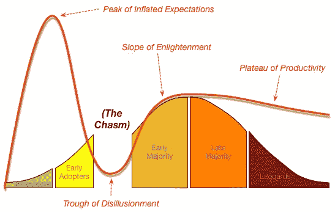

# 如果 crypto 最终不再是一个利基产品会怎样？

> 原文：<https://medium.com/coinmonks/what-if-crypto-never-ends-up-as-more-than-a-niche-product-679a857c5c69?source=collection_archive---------56----------------------->

George Moore’s five steps of tech adoption

与其他资产类别相比，加密货币的市场规模适中，这是多头用来暗示巨大额外上行空间的一个论点。

考虑到加密市值的市场价值有限，因此出现了一个防御性的论点，即“加密已经成为一个利基产品”。

一位有趣的作者，摩尔先生，阐述了他对创新技术如何被公众接受的看法。

杰弗里·摩尔解释说，颠覆性技术必须经过五个不同的采用阶段。

在他 1991 年出版的《跨越鸿沟》一书中，他通过提到相关人员和阶段来解释这五个采用阶段:

*   第一阶段是创新者和修补者
*   第二阶段是早期采用者和乐观主义者过来的时候
*   第三阶段是早期的大多数登船
*   第四阶段是晚期多数加入的时候
*   第五阶段是怀疑论者和落后者蜂拥而至的时候

第三和第四阶段是两个最大的群体。

第二阶段和第三阶段之间存在“鸿沟”。

这个鸿沟是区分和选择早期采用者和早期大多数的一个鸿沟。

这是因为这两个群体的愿望、抱负和需求属于不同的类别。

早期采用者是“未来主义者”，他们寻找未来，是乐观的幻想家，喜欢新奇的事物，这些事物本身就有一种旋转的乐趣。

这群人有耐心和意愿去经历一个阶段的改革，尴尬和发现“这个新奇的东西”做什么。

主要是通过玩，用，交换，他们觉得很酷。

现在，早期和晚期的大多数人更关注三个重要特征:

1)功能性

2)易用性

3)明确问题/解决方案的契合度

无法跨越鸿沟的技术进步和新奇事物…仍然只是小众，或者消亡！

看到下图，是不是 2017 年发生了图形的绿色部分，2021 年发生了黄色部分？

还有一个更难的问题(这里没有简单的答案):

绿色部分是在 2025 年到 2030 年，还是密码行业会跌入深渊？

除非加密货币变得更加面向消费者、可互操作和无意识地使用，否则问题依然存在。

目前，加密似乎是在鸿沟。

通过使用 Web3 作为下一个可用性和应用程序探索阶段的载体，它能到达彼岸吗？

只有时间会证明一切！

> 交易新手？试试[加密交易机器人](/coinmonks/crypto-trading-bot-c2ffce8acb2a)或者[复制交易](/coinmonks/top-10-crypto-copy-trading-platforms-for-beginners-d0c37c7d698c)