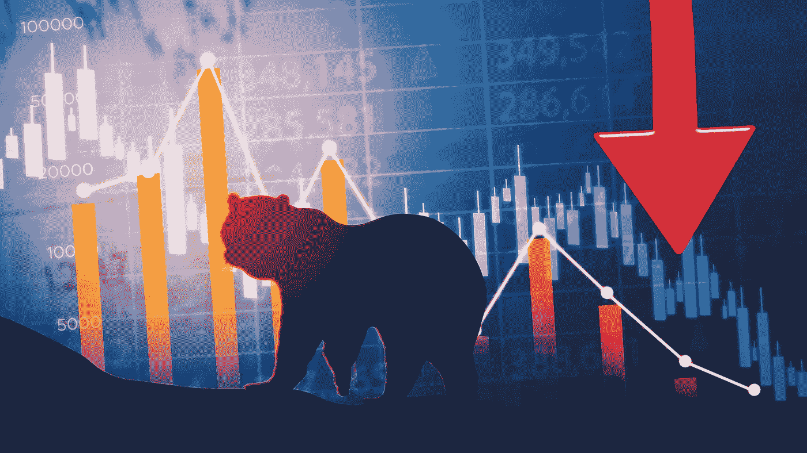

# 没有熊市怎么办？

> 原文：<https://medium.com/coinmonks/what-if-there-is-no-bear-market-1a5dda1e53a8?source=collection_archive---------45----------------------->

对于所有加密投资者来说，2022 年并不是一个好年景。从二月份开始，隐秘的熊市开始悄悄来临，现在是年底，持续的市场下跌还看不到尽头。

一轮又一轮，一个接一个，秘密空间中的几个家庭项目已经崩溃，有些甚至摇摇欲坠，无法修复。花一分钟时间回顾一下那些倒下的英雄——3 箭之都、[摄氏度](https://www.coindesk.com/markets/2022/07/15/the-fall-of-celsius-network-a-timeline-of-the-crypto-lenders-descent-into-insolvency/)和[露娜](https://www.coindesk.com/learn/the-fall-of-terra-a-timeline-of-the-meteoric-rise-and-crash-of-ust-and-luna/)只是已经屈服于熊市力量的一些项目。

然而，事情并没有就此结束。

骗局和欺诈也有所上升。桥牌黑客和协议盗窃的消息也席卷了加密市场的各个角落，就连强大的币安也无法躲过它的子弹。

然而，问题依然存在——如果没有熊市，情况会怎样？

# 会是什么呢？

就像白天和黑夜一样，2021 年和 2022 年对于加密空间来说是截然不同的。2021 年的特点是资产价格飙升和巨额融资。与此同时，即使没有可行的产品，新项目也可以筹集资金。2021 绝对像一个童话故事…或者可能是一个梦想成真。这标志着密码领域的重大突破。

然后 2021 结束了。2022 年不可能有更大的反差——骗局、欺诈、黑客、崩溃，随便说一说。

有那么一会儿，我们可以退居二线，想象一下如果没有这个隐秘的冬天会是什么样子。好吧，从我的角度来看，我相信现在加密空间已经变得膨胀——一个即将破裂的泡沫。我们会继续庆祝巨大的资金筹集，而不一定庆祝生产力。整个空间将被没有实际价值的平庸项目填满。最重要的是，我们庆祝的是虚假的深度，而不是实质。或者，我们还能如何描述一个基础差、路线图不完善、没有计划的令牌组学的项目？

# 熊市是福

熊市是一个重置的机会。这是重建和奠定坚实基础的完美氛围。

首先，现在市场下跌看不到尽头，我们开始看到长期的项目。如今，筹款的特点是实质而非承诺。因此，假的项目团队没有额外的动机去创造，因为金钱不能被随意收获。

熊市也暴露了建立在粘土和虚假借口上的项目。熊市是一个觉醒的时期——糟糕的项目暴露出来，只有那些背景坚实的项目才能渡过难关。

认真的项目团队也有机会在这个时期脱颖而出。尽管市场可能很糟糕，但投资者仍在不断寻找优秀的项目来支持。虽然建设成本相对较低，但严肃的项目可以扩大规模，吸引投资者，并为下一轮牛市做好准备。

在我看来，持续的熊市是一个及时的提醒，价值和实质是经得起时间考验的东西。尽管它可能具有毁灭性，但它的积极方面不能被忽视。熊市是因祸得福，为重大项目提供了机会，并为创新奠定了完美的基础，从而引领下一轮牛市。

> 交易新手？试试[加密交易机器人](/coinmonks/crypto-trading-bot-c2ffce8acb2a)或者[复制交易](/coinmonks/top-10-crypto-copy-trading-platforms-for-beginners-d0c37c7d698c)