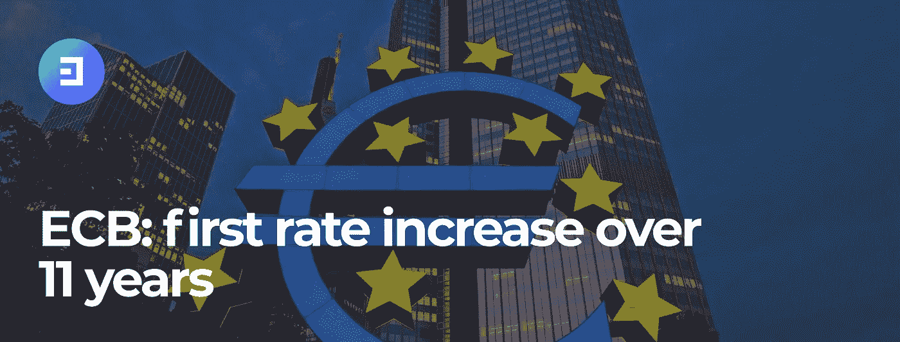

# 欧洲央行加息对加密货币有什么影响？

> 原文：<https://medium.com/coinmonks/what-impact-does-the-ecb-rate-hike-have-on-cryptocurrencies-2c89d65a6e9e?source=collection_archive---------67----------------------->

对欧洲央行来说，这是 11 年来的第一次。第一，标志着始于 2014 年的负利率时代的结束。但由于美联储的行动，这次加息对欧盟来说几乎是强制性的。

尽管市场共识似乎建议加息 25 个基点，但欧洲央行将三个关键利率上调了 50 个基点。因此，存款利率降为零，主要再融资操作的利率升至 0.5%。保证金信用额度提高至 0.75%。

在大西洋的另一边，央行的目标是一样的:抗击通胀。今年 6 月通胀率达到 8.6%，未来几个月可能继续上升。至少，克里斯蒂娜·拉加德是这么认为的，她预计未来几个月通胀将相当高。这位欧洲央行行长还指出，价格压力目前正对许多行业产生影响。据她所说，欧元疲软也是欧元区通胀压力的一个原因。

# 美国货币政策的复制粘贴？

大问题需要大解决方案。目前，欧洲大陆和山姆大叔的国家显然面临着同样的通胀压力。根据最新公布的数据，欧洲为 8.6%，美国为 9.1%。

然而，在美国，加息政策开始得更早，是在 3 月份。许多周以来，欧洲一直躲在短暂通胀的概念后面。现在她别无选择。在大西洋的另一边，预计在本月底的下次会议上将加息 75 个基点。

虽然美联储似乎在引领潮流，但其他国家并没有跟随这一趋势。这对日本来说尤其如此，尽管日本可能遭受高通胀，但其货币政策非常宽松。

# **对数字资产有什么影响？**

自从美联储开始推行加息政策以来，加密货币市场已经感受到了这一政策的后果。但是从更广泛的意义上来说——在像股票这样的风险市场中。

今天，加密市场似乎已经“抓住”并整合了这种速度增长的动力。但为了不过度冲击市场，现在重要的是加息不要太剧烈。

迄今为止，根据 Coinmarketrate.com 提供的数据，加密货币市场已经下跌了 4.94%，其总市值略高于 1 万亿美元。比特币的价格也下降了相同的幅度。这可能是由于特斯拉宣布在第二季度出售 75%的比特币，以及不可避免的欧洲央行加息政策。

欧洲当局的反应时间可能会引起人们对欧洲利率快速上升的怀疑。这可能被证明是风险市场的一个破坏性因素。

> 交易新手？试试[加密交易机器人](/coinmonks/crypto-trading-bot-c2ffce8acb2a)或者[复制交易](/coinmonks/top-10-crypto-copy-trading-platforms-for-beginners-d0c37c7d698c)