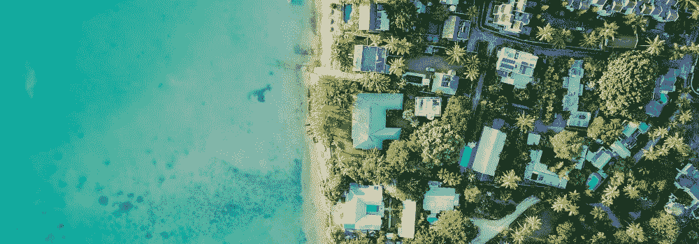

# 投资者需要了解的房地产风险

> 原文：<https://medium.com/coinmonks/what-investors-need-to-know-about-real-estate-risks-3915dcdb6141?source=collection_archive---------24----------------------->

“风险越大，回报就越大，”这是一句老话，但任何投资者都知道，取得平衡对于有效管理你的投资组合至关重要——尤其是在房地产领域。谈到房地产投资，令人欣慰的是，你投入到一个项目中的每一美元都有房地产担保，但这并不意味着它没有风险。

无论你是房地产投资新手，还是正在考虑自己管理更多投资，现在都是深入研究房地产相关风险并了解如何管理风险的好时机。我们开始吧！

# 一般市场风险

一般市场风险被认为是最基本的风险，无论你投资哪个领域，它都存在。就房地产而言，总体市场风险直接反映在全国就业和利率趋势以及当地建筑、租金价格和销售价格趋势上。

市场总是会带来风险，但在进行房地产交易之前，如果没有在地方和国家层面考虑这些风险，你可能会付出巨大的代价。花些时间了解房地产周期，这将有助于你确定何时可能是购买或出售房产的好时机。

同样，许多房地产投资者通过拓展新市场获得成功。房地产的伟大之处在于，你可以在全国各地拥有房产，甚至在你从未涉足的城镇和州。然而，要管理那里的风险，你应该找到有信誉的当地资源，以确保你选择了正确的时间，选择了最好的地区，并且没有为房产支付过高的价格。

# 资产类型风险

普通的房地产投资者寻求分散他们的投资组合，包括地理位置和资产类型。然而，当考虑与给定资产相关的风险时，您必须考虑不同的市场情景将如何影响您的回报。例如，[多户型房产](https://blog.ark7.com/blog/memphis-multifamily/)被认为风险较低，因为你只有一笔抵押贷款，但有多个租户帮你支付。

由于多户住宅的租金也较低，所以即使在经济不景气的时候，也更容易保持满员。与此同时，在经济动荡时期，独栋住宅可能更难入住。[对度假者最有吸引力的短期租赁甚至更具风险。此外，租户之间的差距会大大减少你的房产年回报。](https://blog.ark7.com/blog/short-term-rental-philly/)

如果你投资商业地产，也有不同之处。鉴于过去十年的趋势，购物中心将被视为相当大的风险，如果经济受到打击，任何类型的零售商店都将更难填补。与此同时，办公楼的风险较小，但回报也较低。

# 特定财产风险

特质风险，你也可以称之为财产特定风险，包括给定项目中可能影响你回报的所有变量。例如，购买一栋需要维修的独栋房屋比购买一栋准备原样出租的同类房屋风险更大。

增加特质风险的一些因素包括你需要等待多长时间才能开始实现回报(例如，维修、建设)以及你必须在房产上投资的金额(例如，改善、融资方式、理想的社区)。

考虑到这些因素，高特质风险几乎总是伴随着更高的潜在回报。例如，在一个非常理想的社区购买一套房子会花费更多，但可以让你在租金或最终销售价格上多得多。同样，投资改善项目会增加房产的价值，可能会让你带着丰厚的回报离开。

# 流动性因素

当你作为房地产投资者考虑所有的风险时，你需要考虑的最后一个因素是流动性。流动性指的是你出售财产的能力，这样你就可以带着现金离开。高流动性房产是指可以快速出售的房产(即，它位于非常理想的区域)，而非流动性房产是指需要更长时间才能出售才能获利的房产(即，它已经破旧或正在建设中)。

许多房地产投资者乐于接受中高风险的房产，只要他们相信流动性因素很高。所以，你可能会同意购买豪华租赁物业，因为你紧跟当地趋势，你觉得你可以在市场低迷并威胁到你的租金价格之前卖掉它来获利。

当然，关于流动性因素需要注意的一点是，它会随着时间而变化。如果你未能“把握好市场时机”，抛售你认为流动性很高的投资，你可能最终不得不等待，因为在经济动荡时期，豪宅变得不那么受欢迎了。这就是为什么了解你的市场是关键。

# 了解一项投资

新投资者很容易被与房地产相关的巨大风险压垮，但这不应该掩盖潜在的回报。就像任何其他投资工具一样，有一个绝佳的机会来分散你的投资组合，并在最适合你的水平上管理风险。

涉足房地产最重要的是做好你的研究。知道如何运行数据，检查当地市场，寻找国家趋势，以决定什么最适合你的投资组合。此外，不要一次性购买一处房产，考虑使用部分房地产投资，以较少的前期资本参与多个项目。

最后，如果你正在使用一个[部分房地产投资平台](https://blog.ark7.com/blog/what-is-fractional-real-estate/)，确保它是一个提供透明度的平台。作为投资者，了解和理解所有风险很重要，这样你才能做出明智的决定。这就是 Ark7 为平台上的每一处房产提供完整文档和详细信息的原因。

# 最后的想法

投资者永远无法完全避免风险，但学会如何识别和减轻风险对于房地产或任何投资工具的成功至关重要。作为一名房地产投资者，最重要的是要记住，通常存在的风险比第一眼看到的要多，包括房地产特有的风险，如你将与之合作的租户的数量和类型。

对于新的房地产投资者来说，最重要的是，他们仔细审视整个市场，了解当地和全国的市场因素，同时也仔细研究每一个出现在他们面前的机会。通过以这种方式花时间评估风险，你将为自己一生的有利可图的投资做好准备，同时在下次处理交易时给自己增加信心和安心。

> 加入 Coinmonks [电报频道](https://t.me/coincodecap)和 [Youtube 频道](https://www.youtube.com/c/coinmonks/videos)了解加密交易和投资

# 另外，阅读

*   [币安期货交易](https://coincodecap.com/binance-futures-trading)|[3 commas vs Mudrex vs eToro](https://coincodecap.com/mudrex-3commas-etoro)
*   [如何购买 Monero](https://coincodecap.com/buy-monero) | [IDEX 评论](https://coincodecap.com/idex-review) | [BitKan 交易机器人](https://coincodecap.com/bitkan-trading-bot)
*   [CoinDCX 评论](/coinmonks/coindcx-review-8444db3621a2) | [加密保证金交易交易所](https://coincodecap.com/crypto-margin-trading-exchanges)
*   [红狗赌场评论](https://coincodecap.com/red-dog-casino-review) | [Swyftx 评论](https://coincodecap.com/swyftx-review) | [造币厂评论](https://coincodecap.com/coingate-review)